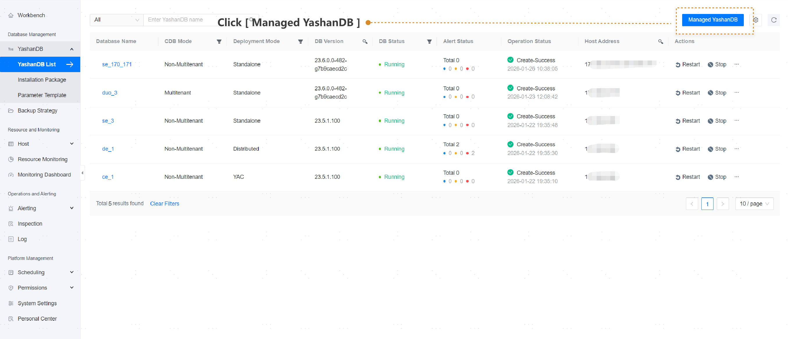
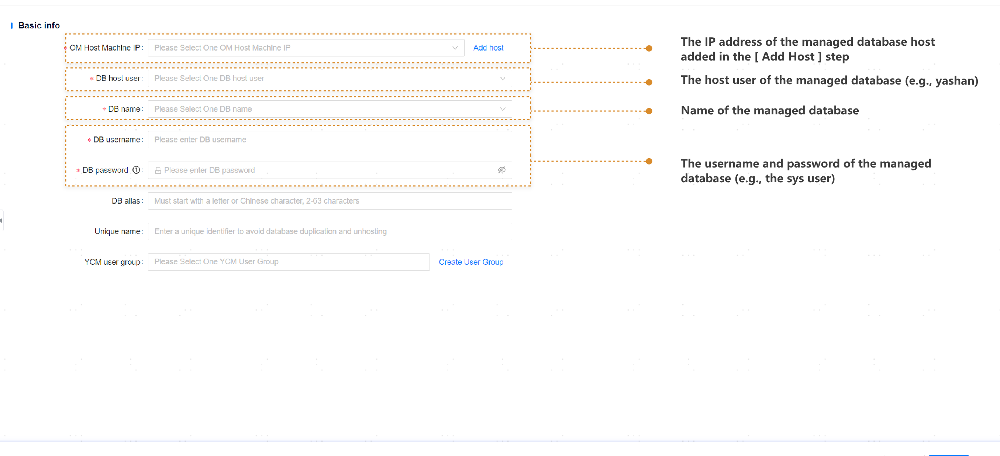
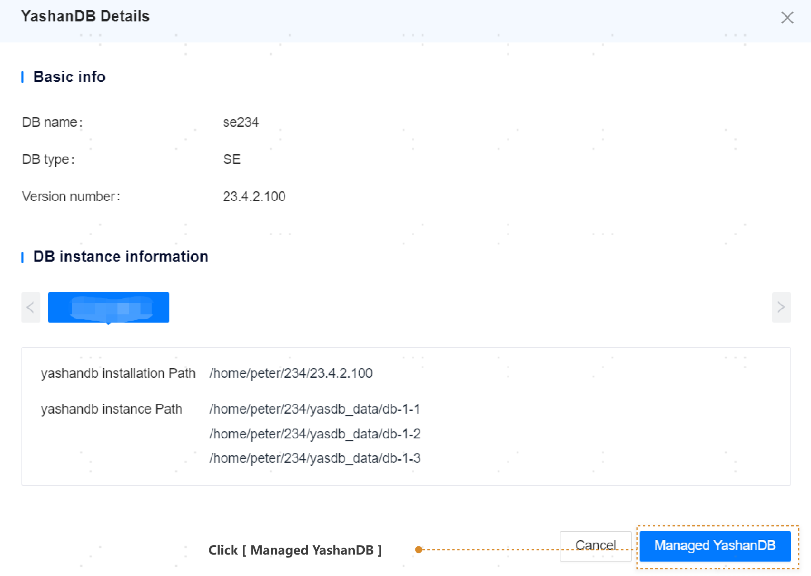

## Hosting Database

**Web Path**: **[ YashanDB ]** > **[ YashanDB List ]** > **[ Managed YashanDB ]**

**Functionality Overview**

Supports hosting databases deployed with yasboot on the management platform, and then performing routine operations on the database server within the platform.

1. Please click the **[ Managed YashanDB ]** button.

2. Fill in the basic YashanDB information and database instance details, then click **[ Check ]**.

3. click **[ Managed YashanDB ]**. The database is now managed successfully.

