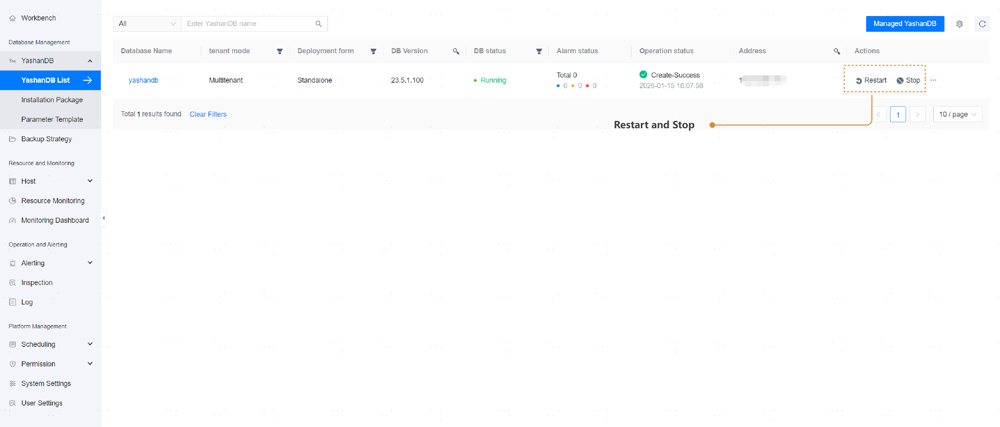

## Database Operations

**Web Path**: **[ YashanDB List ]** > **[ Actions ]**

**Functionality Overview**

After successfully adding the database, you can view its basic information and running status on the YashanDB list page. You can also perform the following operations on the entire database:

- **Restart**: Restart all instances of the database.
- **Stop**: Stop all instances of the database.

