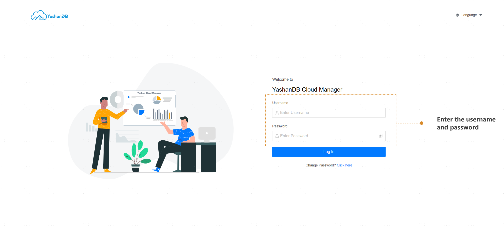

This guide demonstrates how to quickly manage YashanDB using YashanDB Cloud Manager through hosting and deployment examples.

Before you begin, ensure that you meet the following requirements:

YashanDB Cloud Manager is installed. See the installation guide for details.

## Access Management Platform

Open a browser and navigate to `HTTP(S)://IP:9060`. Sign in with the default credentials: username admin, password admin.

