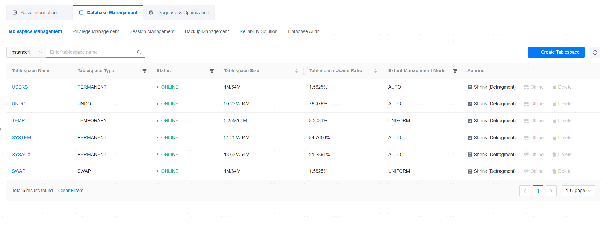
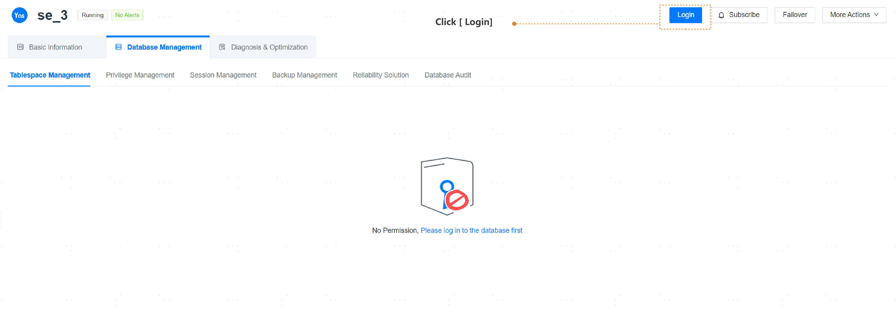
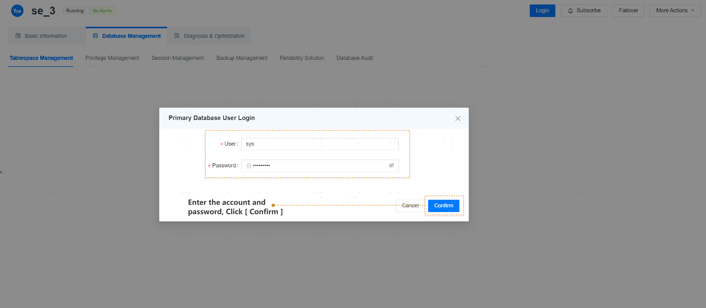
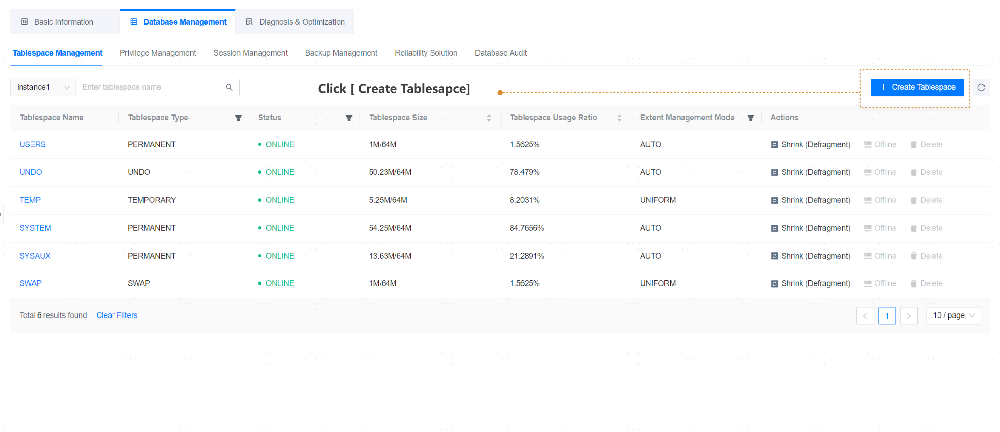
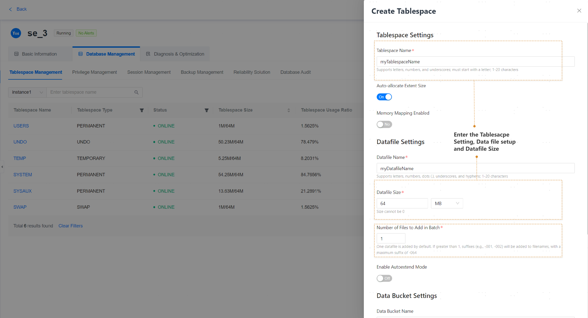

**Web Path**: **[ YashanDB ]**>**[ YashanDB List ]**>**[ DB name ]**>**[ Database Management ]**>**[ Tablespace Management ]**

## Tablespace Management

**Functionality Introduction**

The management platform provides functionality for quick management of tablespaces, including creating new tablespaces.

1. Please click the **[ Login ]** button.

2. Enter the SYS username and password, then click **[ Confirm ]**.

3. Click the **[ Create Tablespace ]** button.

4. Enter the tablespace name and data file name, then click the **[ Confirm ]** button. The tablespace will be created successfully.

