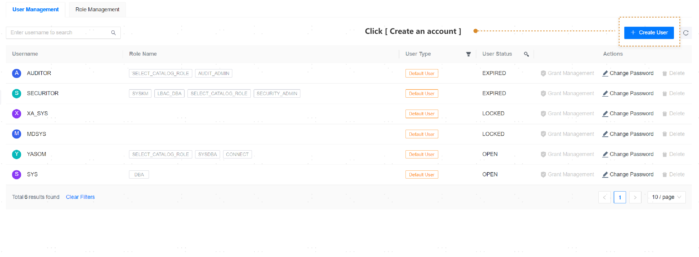
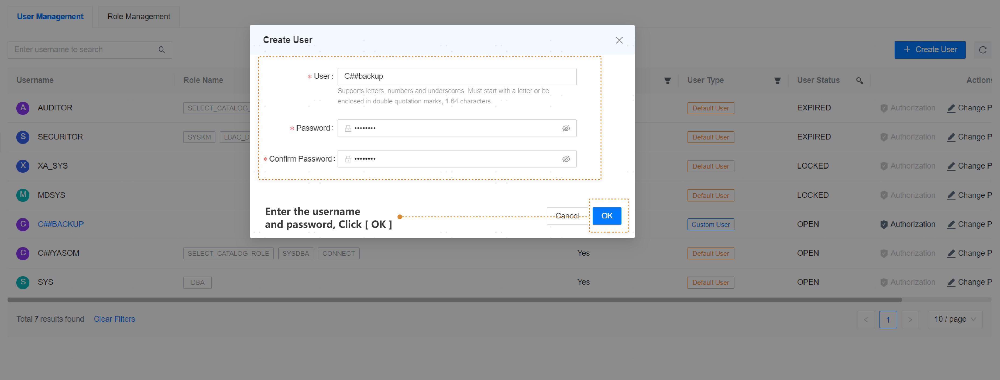

**Web Path**: **[ YashanDB ]**>**[ YashanDB List ]**>**[ Database Name ]**>**[ Database Management ]**>**[ Privilege Management ]**

## User Management

**Functionality Introduction**

In User Management, you can perform operations such as creating database users, managing authorizations, and modifying passwords.

1. Please click the **[ Create User ]** button, enter the username and password, then click **[ Confirm ]**.

