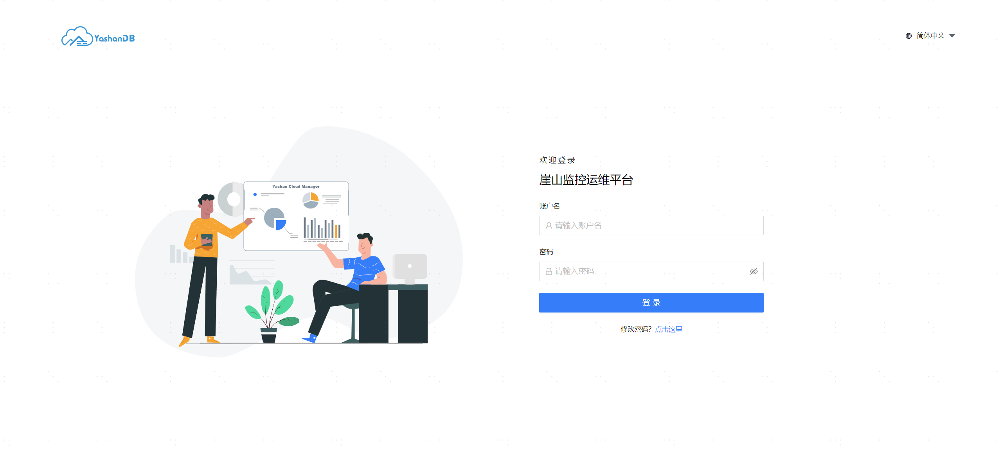
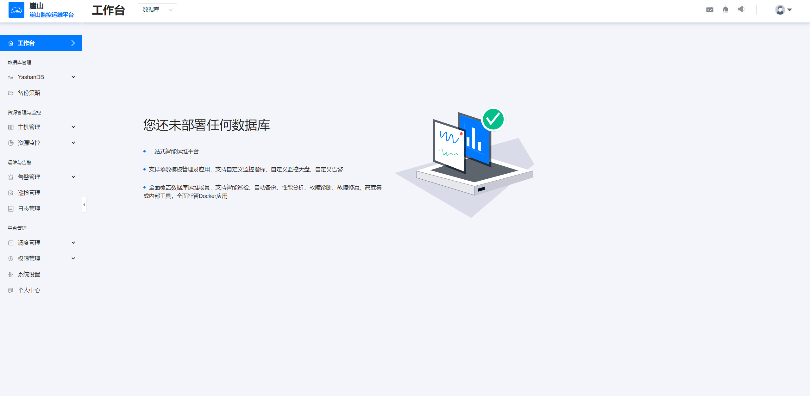

## 登录管理平台

平台提供初始的管理员账号用于登录系统，用户名称为admin，初始密码为admin，为保证信息安全，首次登录需要修改密码。

密码限制如下：

- 密码长度必须在8~30位
- 密码必须包含数字，字母和特殊字符`~!{'@'}#{'$'}%^&*()_-+={'{'}{'['}{']'}{'}'}\\{'|'}:;\"'<,>.?
- 密码不能包含用户名
- 同一个字符不能重复三次及以上
- 连续数字，字母不能达到三个及以上，如abc、123，倒序亦不可

密码修改完成之后即可进入管理平台。

## 平台布局说明

**顶部导航栏**

位于页面最上方，提供系统的全局导航功能。导航栏中包含管理平台的logo、主要功能模块的链接、语言切换、用户信息等。

**侧边栏**

按照功能模块进行划分，方便用户快速定位到所需的功能页面。

**主内容区**

位于页面中央，是用户进行业务操作的主要区域。主内容区会根据用户选择的侧边栏菜单项来加载相应的页面或数据。

## 平台配置管理

系统管理员需要进行一些初始设置，例如创建管理平台的使用用户、配置通知邮箱等，请参考[平台管理](../../平台管理/系统设置/00系统设置)了解提供的配置功能。

## 资源配置管理

系统管理员需要将服务器、YashanDB等纳入平台管理和监控的范围内，并在不再管理时将这些资源删除，请参考[资源管理](../../平台管理/资源管理/00资源管理)进行操作。

完成上述配置后，即可开始对YashanDB进行各类运维和监控操作。
