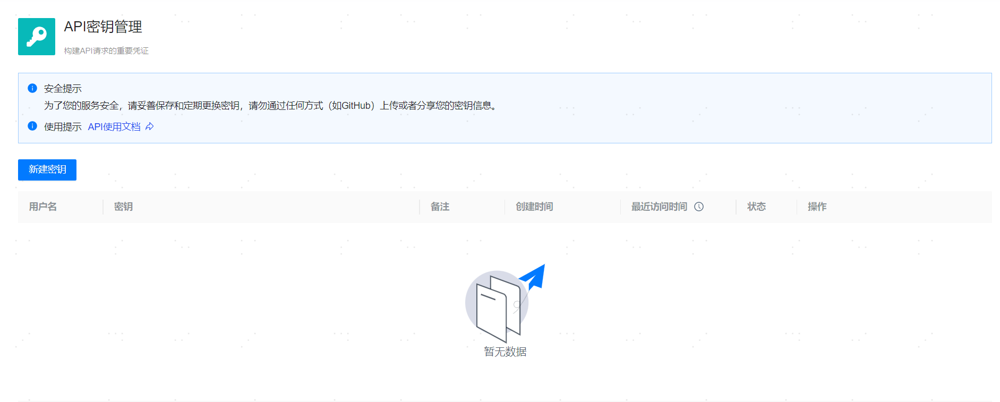

**网页路径**：【个人中心】>【API密钥管理】



**功能介绍**

管理平台支持创建API密钥用于鉴权和授权，用户可以使用`AK(Access Key Id)/SK(Secret Access Key)`签名认证方式调用平台开放的API。

在使用API密钥管理功能时，需要注意以下事项：

- 每个用户最多创建2个访问密钥，密钥拥有的API权限和创建用户保持一致。
- 用户只能查看编辑自己创建的密钥。
- 密钥默认是开启状态，只能删除禁用状态的密钥。
- 密钥的备注信息上限为100个字符。
- 密钥访问记录不会保存GET请求方法。
- 不支持本地上传安装包的接口`/api/pkg/version/local [POST]`。

**主要内容解释**

**【最近访问时间】**：最近通过密钥访问平台的时间。

**【禁用密钥】**：停止使用密钥，禁用密钥后，管理平台将拒绝此密钥的所有请求。

**【删除密钥】**：删除密钥，删除密钥后无法再恢复，管理平台将永久拒绝此密钥的所有请求。

**【更多访问记录】**：查看密钥访问平台的记录。

**客户端签名调用示例**：以下展示Go和Python两种语言通过AK/SK生成签名，并调用平台API的示例。

**Go示例**

```go
package main

import (
	"bytes"
	"crypto/hmac"
	"crypto/sha256"
	"crypto/tls"
	"encoding/base64"
	"fmt"
	"io"
	"log"
	"net/http"
	"net/url"
	"strconv"
	"time"
)

// 配置 AK 和 SK
const (
	AccessKey   = "72bd7009********"                 // 替换为实际的 AK
	SecretKey   = "53c2d2dade1a4545bb63afb9********" // 替换为实际的 SK
	ContentType = "application/json"
)

// 生成签名
func genSignature(method, path, queryString, body, timestamp string) string {
	// 创建要签名的字符串
	signingString := fmt.Sprintf("%s\n%s\n%s\n%s\n%s\n%s\n%s", method, path, queryString, body, timestamp, AccessKey, ContentType)

	// 使用 SK 生成签名（HMAC-SHA256）
	hmacSigner := hmac.New(sha256.New, []byte(SecretKey))
	hmacSigner.Write([]byte(signingString))

	// 获取签名并进行 Base64 编码
	signature := base64.StdEncoding.EncodeToString(hmacSigner.Sum(nil))
	return signature
}

// 生成时间戳
func genTimestamp() string {
	return strconv.FormatInt(time.Now().Unix(), 10)
}

// 创建并发送请求，GET请求方法
func sendGETRequest() {
	// 获取当前时间戳（秒）
	timestamp := genTimestamp()

	// 设置请求的参数（如 query 参数）
	queryParams := url.Values{}
	queryParams.Add("pageNo", "1")
	queryParams.Add("pageSize", "10")
	queryParams.Add("filter", `{"cloudPlatformFirm":"selfAdd"}`)
	queryParams.Add("search", `{"hostName":"AchorBase"}`)

	// 请求体
	body := "" // 空 JSON 对象，视实际情况填写

	// 服务端 API 地址
	apiUrl := "http://localhost:9060/api/hosts"

	// 请求方法
	method := http.MethodGet

	// 构建请求 URL
	fullURL := fmt.Sprintf("%s?%s", apiUrl, queryParams.Encode())

	// 创建 HTTP 请求
	req, err := http.NewRequest(method, fullURL, bytes.NewBuffer([]byte(body)))
	if err != nil {
		log.Fatal(err)
	}

	// 生成签名
	signature := genSignature(method, req.URL.Path, queryParams.Encode(), body, timestamp)

	// 设置请求头
	req.Header.Set("X-Access-Key", AccessKey)
	req.Header.Set("X-Signature", signature)
	req.Header.Set("X-Timestamp", timestamp)
	req.Header.Set("Content-Type", ContentType)

	// 发送请求并获取响应
	tr := &http.Transport{
		TLSClientConfig:   &tls.Config{InsecureSkipVerify: true},
		DisableKeepAlives: true,
	}
	client := &http.Client{Transport: tr}
	resp, err := client.Do(req)
	if err != nil {
		log.Fatal(err)
	}
	defer resp.Body.Close()

	// 读取响应数据
	bodyBytes, err := io.ReadAll(resp.Body)
	if err != nil {
		log.Fatal(err)
	}

	// 打印响应状态和内容
	fmt.Printf("Response Status: %s\n", resp.Status)
	fmt.Printf("Response Body: %s\n", string(bodyBytes))
}

// 创建并发送请求，POST请求方法
func sendPOSTRequest() {
	// 获取当前时间戳（秒）
	timestamp := genTimestamp()

	// 请求体
	body := `{"name": "Department_A","description": "Department_A","clusterIds": [],"roleIds": [1]}`

	// 服务端 API 地址
	apiUrl := "http://localhost:9060/api/groups"

	// 请求方法
	method := http.MethodPost

	// 构建请求 URL
	fullURL := apiUrl

	// 创建 HTTP 请求
	req, err := http.NewRequest(method, fullURL, bytes.NewBuffer([]byte(body)))
	if err != nil {
		log.Fatal(err)
	}

	// 生成签名
	signature := genSignature(method, req.URL.Path, "", body, timestamp)

	// 设置请求头
	req.Header.Set("X-Access-Key", AccessKey)
	req.Header.Set("X-Signature", signature)
	req.Header.Set("X-Timestamp", timestamp)
	req.Header.Set("Content-Type", ContentType)

	// 发送请求并获取响应
	tr := &http.Transport{
		TLSClientConfig:   &tls.Config{InsecureSkipVerify: true},
		DisableKeepAlives: true,
	}
	client := &http.Client{Transport: tr}
	resp, err := client.Do(req)
	if err != nil {
		log.Fatal(err)
	}
	defer resp.Body.Close()

	// 读取响应数据
	bodyBytes, err := io.ReadAll(resp.Body)
	if err != nil {
		log.Fatal(err)
	}

	// 打印响应状态和内容
	fmt.Printf("Response Status: %s\n", resp.Status)
	fmt.Printf("Response Body: %s\n", string(bodyBytes))
}

func main() {
	sendGETRequest()
	sendPOSTRequest()
}

```

**Python示例**

```python
import urllib.request
import urllib.parse
import urllib.error
import hashlib
import hmac
import time
import base64
import json

# 配置 AK 和 SK
AccessKey = "72bd7009********"                 # 替换为实际的 AK
SecretKey = "53c2d2dade1a4545bb63afb9********" # 替换为实际的 SK
ContentType = "application/json"

# 生成签名的函数
def genSignature(method, path, queryString, body,  timestamp):
    # 拼接签名字符串
    signingString = f"{method}\n{path}\n{queryString}\n{body}\n{timestamp}\n{AccessKey}\n{ContentType}"
    
    # 使用 HMAC-SHA256 算法生成签名
    signature = hmac.new(SecretKey.encode('utf-8'), signingString.encode('utf-8'), hashlib.sha256).digest()
    
    # 返回 Base64 编码的签名
    return base64.b64encode(signature).decode('utf-8')

def sendGETRequest():
    # 服务端 API 地址
    url = "http://localhost:9060/api/hosts"  

    # 请求方法和相对地址
    method = "GET"
    path = "/api/hosts"
   
    # 获取当前时间戳（用于签名）
    timestamp = str(int(time.time()))  # UNIX 时间戳

    # 请求query参数
    params = {"pageNo": "1","pageSize":"10","filter":'{"cloudPlatformFirm":"selfAdd"}',"search":'{"hostName":"AchorBase"}'}
    sorted_params = sorted(params.items())
    query_string = urllib.parse.urlencode(sorted_params)

    # 生成签名
    signature = genSignature(method,path,query_string,"",timestamp)

    # 创建请求头
    headers = {
        "X-Access-Key": AccessKey,
        "X-Signature": signature, 
        "X-Timestamp": timestamp,
        "Content-Type": ContentType,
    }

    # 创建请求对象
    request = urllib.request.Request(f"{url}?{query_string}", headers=headers, method=method)

    # 发送请求并获取响应
    try:
        with urllib.request.urlopen(request) as response:
            response_data = response.read()
            print("Response Code:", response.getcode())  # 打印响应状态码
            print("Response Body:", response_data.decode('utf-8'))  # 打印响应内容
    except urllib.error.HTTPError as e:
        print("HTTP Error:", e.code)
        print("Error Details:", e.read().decode())
    except urllib.error.URLError as e:
        print("URL Error:", e.reason)

def sendPOSTRequest():
    # 服务端 API 地址
    url = "http://localhost:9060/api/groups" 

    # 请求方法和相对地址
    method = "POST"
    path = "/api/groups"
   
    # 获取当前时间戳（用于签名）
    timestamp = str(int(time.time()))  # UNIX 时间戳

    # 请求体
    body = '{"name": "Department_A","description": "Department_A","clusterIds": [],"roleIds": [1]}'
    data=body.encode('utf-8')

    # 生成签名
    signature = genSignature(method,path,"",body,timestamp)

    # 创建请求头
    headers = {
        "X-Access-Key": AccessKey,
        "X-Signature": signature, 
        "X-Timestamp": timestamp,
        "Content-Type": ContentType,
    }

    # 创建请求对象
    request = urllib.request.Request(url,data=data, headers=headers, method=method)

    # 发送请求并获取响应
    try:
        with urllib.request.urlopen(request) as response:
            response_data = response.read()
            print("Response Code:", response.getcode())  # 打印响应状态码
            print("Response Body:", response_data.decode('utf-8'))  # 打印响应内容
    except urllib.error.HTTPError as e:
        print("HTTP Error:", e.code)
        print("Error Details:", e.read().decode())
    except urllib.error.URLError as e:
        print("URL Error:", e.reason)

# 主函数
if __name__ == "__main__":
    sendGETRequest()
    sendPOSTRequest()
```
