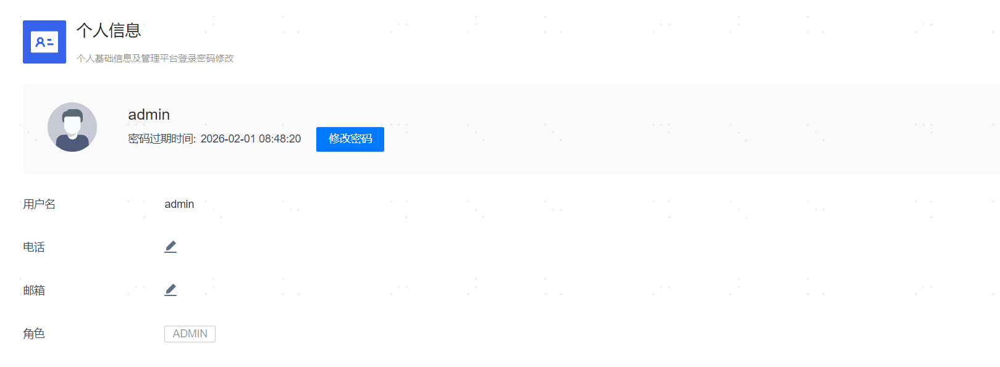

**网页路径**：【个人中心】>【个人信息】

**功能介绍**

个人信息页面展示了平台用户的相关信息，包含用户名、电话（手机号码）、邮箱和角色，您可以按需修改手机号码和邮箱。

**主要内容解释**

**【密码过期时间】**：当前用户的登录密码的过期时间，有效期为60天，若密码过期未及时修改，过期后首次登录时需先更新密码才能进入管理平台。

**【查看动态口令】**：仅当开启了[TOTP口令密码认证](../系统设置/平台信息设置/登录安全设置.html#TOTP)时，存在该操作，单击【查看动态口令】可以查看用户动态口令二维码。

**【修改密码】**：修改当前用户的登录密码。

**【电话】**：可选参数，无需填写国家区号（例如86、+86），直接填写11位数字号码即可。

**【邮箱】**：可选参数，仅校验邮箱格式，不校验邮箱的真实性。
