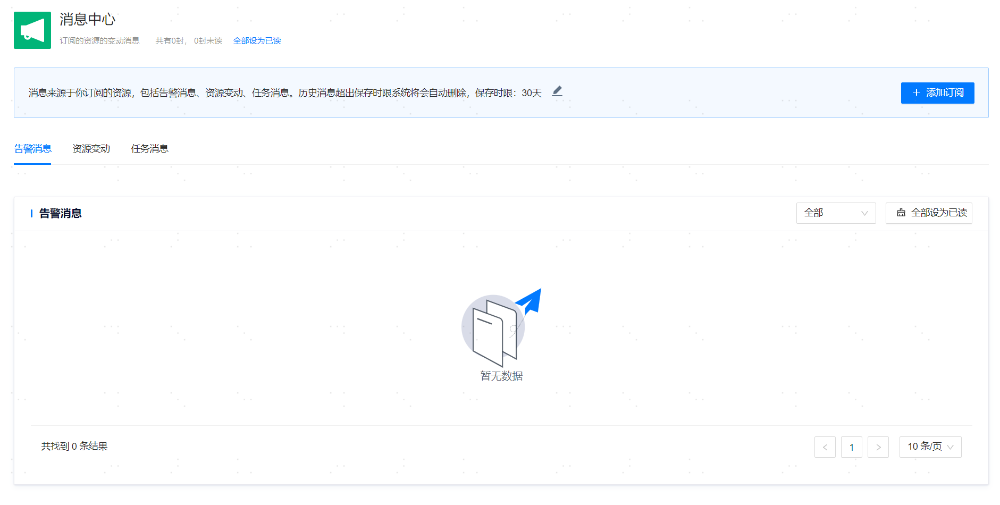

**网页路径1**：【个人中心】>【消息中心】

**网页路径2**：【右上角个人头像】>【消息中心】

**网页路径3**：【右上角站内消息图标】>【查看更多】>【消息中心】

**功能介绍**

用户[订阅资源](资源订阅)后，相应资源产生告警、资源变动以及任务时都将通过站内消息提醒用户。您可以在消息中心查看所有新消息和保存时限内的历史消息。

**主要内容解释**

**【保存时限】**：消息保存的时限，默认值为30天，可选30天、90天、180天或360天，超出时限后消息将会被自动删除。

**【告警消息】**：启用[告警策略](../../监控与告警/告警定义及展示/告警策略)后，资源对象触发某一告警项后管理平台会发出告警提示并通知订阅该资源的用户。

**【资源变动】**：资源移除托管后，管理平台会通知订阅该资源的用户。

**【任务消息】**：执行资源相关的[任务](../平台运维/调度管理/任务管理)后，管理平台会通知订阅该资源的用户。
