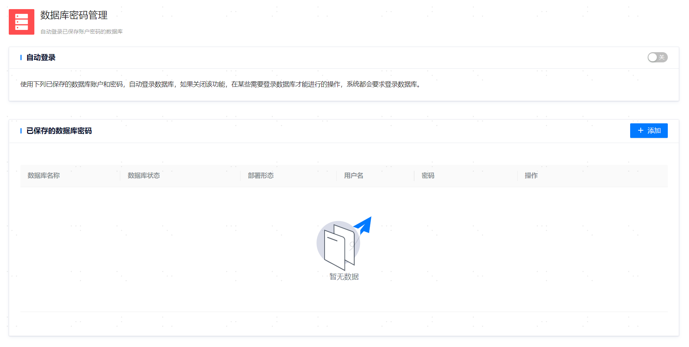

**网页路径1**：【个人中心】>【数据库密码管理】

**网页路径2**：【右上角个人头像】>【数据库密码管理】

**功能介绍**

平台支持保存数据库用户名和密码、并支持基于已保存的密码配置自动登录数据库。

如果配置了自动登录，在执行某些需要登录数据库才能进行的操作时流程会更顺畅，否则系统会要求先手动登录数据库再继续后续的操作。

数据库用户密码保存需要该用户具有创建会话的权限。

**主要内容解释**

**【已保存的数据库密码】**：数据库密码列表中可以查询所有已添加数据库及其用户信息，可按需对已保存的信息进行修改和移除。

**【自动登录】**：开启自动登录后，用户对登录环节无感知。
