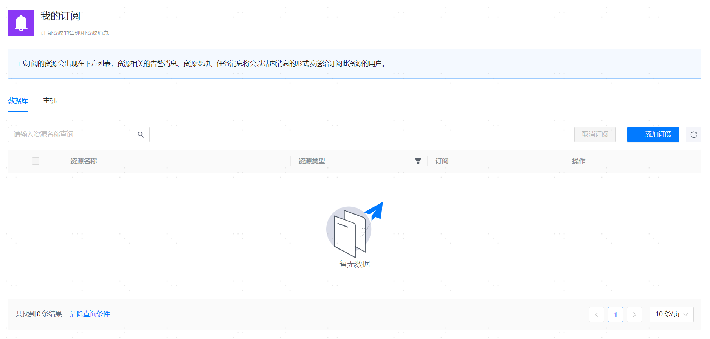

**网页路径1**：【个人中心】>【我的订阅】

**网页路径2**：【个人中心】>【消息中心】>【添加订阅】

**网页路径3**：【右上角个人头像】>【我的订阅】

**网页路径4**：【工作台】>【自定义收藏】

**功能介绍**

完成[资源托管](../资源管理/00资源管理)后，您可以按需订阅需要重点关注的数据库或服务器。

添加订阅后，目标资源相关的告警消息、资源变动和任务消息都将会以[站内消息](消息中心)的形式通知您。

在【工作台】>【自定义收藏】收藏对应数据库或服务器时会自动订阅该资源，但取消收藏与取消订阅不会相互影响。
