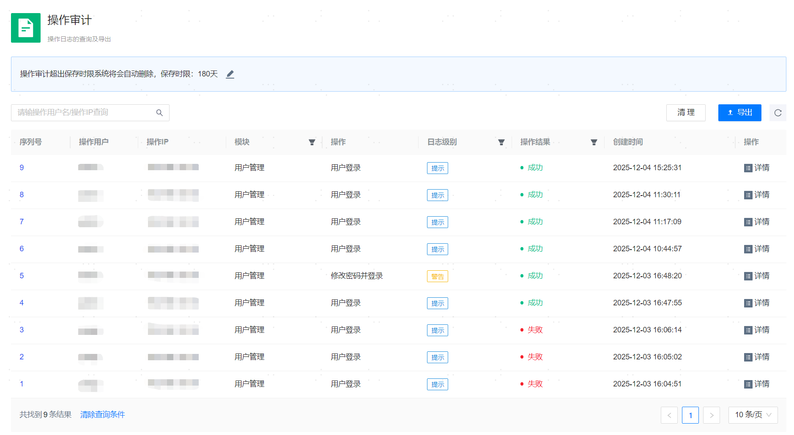

**网页路径**：【系统设置】>【操作审计】

## 操作审计列表

**功能介绍**

系统操作审计功能记录了管理平台Web页面上进行的全部操作，包括托管资源管理、备份管理、日志收集和平台用户管理等。所有操作有迹可循，方便在出现使用问题时查看记录、定位并复盘问题。

**主要内容解释**

**【保存时限】**：操作记录保存的期限，支持30天、60天、90天或180天，超出时限后系统将会自动删除相关记录。

**【操作用户】**：执行操作的平台用户。

**【操作IP】**：发起操作的IP地址，即使用者访问管理平台的终端IP地址。

**【模块】**：操作所属模块，可筛选查看相应模块的所有操作记录。

**【操作】**：执行的具体操作。

**【日志级别】**：操作记录对应的日志级别，包括提示、警告和严重。

**【操作结果】**：此次操作的结果，成功或失败。

**【创建时间】**：发起操作的时间。

## 操作审计详情

**网页路径**：【详情】

**功能介绍**

在详情页面，您可以查看某个操作记录的详细信息。

**【操作索引】**：任务相关的特征。

**【索引内容】**：任务的关键信息。

**【操作状态码】**：执行操作后的返回状态码，用于判断操作成功与否，200表示成功，400表示失败。

**【请求参数】**：此次操作的详细请求参数。

**【返回结果】**：此次操作的详细返回结果。
