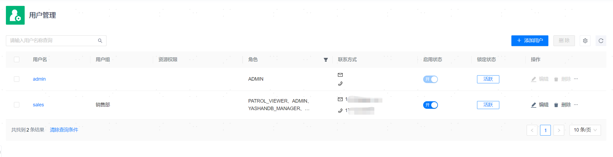

**网页路径**：【权限管理】>【用户管理】

## 用户基本操作

**功能介绍**

超级管理员可以添加不同用户并结合[用户组](用户组管理)和[角色](角色管理)对其进行资源和权限的精细化管理，使其在实际业务体系中行使对应的职能权限。

每个自定义添加的用户都必须绑定一个用户组，添加用户前需先添加[用户组](用户组管理)。

**主要内容解释**

**【用户名】**：用于登录管理平台的用户名，必填参数，长度范围为[1,24]个字符。用户添加成功后，无法修改用户名。

**【密码】**：用于登录管理平台的密码，必填参数，可以直接使用默认密码`MP@123`，首次登录时需先更新密码才能进入管理平台。

**【用户组】**：除了预置的超级管理员（admin）外，所有自定义添加的用户都必须绑定一个用户组。

**【资源权限】**：用户可访问的托管资源，不可指定，直接继承其所绑定的用户组的数据库资源相关配置，**ADMIN角色的用户不受此约束可以访问所有资源**。

**【角色】**：用户的角色，用户角色可分为：

- 继承所得角色：直接继承其所绑定的用户组的角色相关配置，无法直接去除继承所得角色，如需调整只能通过修改用户组的角色配置。
- 自定义绑定所得角色：绑定角色时，不受所属用户组的角色约束，可以重复绑定相同角色。用户组的角色变更时，组内用户的自定义绑定所得角色不受影响。

**【联系方式】**：联系方式可以配置手机号或邮箱，可选参数。如需维护联系方式，可通过编辑联系人或用户登录平台后自行维护[个人信息](../../个人中心/个人信息)。

- 手机号无需填写国家区号（例如86、+86），直接填写11位数字号码即可。
- 邮箱仅校验邮箱格式，不校验邮箱的真实性。

**【启用状态】**：仅已启用的用户可登录管理平台并正常执行其权限范围内的操作。

**【锁定状态】**：正常情况下，用户的锁定状态为【活跃】。若因密码错误连续登录失败超过重试次数后，该用户将被锁定，此时状态将变为【已锁定】，锁定状态的用户无法登录管理平台。锁定时间期满后会自动解锁，也可以提前手动解锁。重试次数和锁定时间均可参考[登录安全设置](../../系统设置/平台信息设置/登录安全设置)按需调整。

## 重置密码

**网页路径**：【重置密码】

**功能介绍**

若某个用户忘记密码无法登录管理平台，可重置其密码。重置密码时会关闭TOTP口令密码认证，如需再次开启请参考[登录安全设置](../../系统设置/平台信息设置/登录安全设置)复原相应配置。

**主要内容解释**

**【重置密码】**：重置目标用户的密码为`MP@123`，再次使用该用户登录时需先更新密码才能进入管理平台。

## 解锁用户

**网页路径**：【解锁用户】

**功能介绍**

对于【已锁定】的用户可以在锁定时间期内提前进行手动解锁，解锁后可正常使用该用户。

连续累计登录失败达到5次将冻结用户，连续冻结会加大冻结时间，默认会自动解冻，登录成功后可重置冻结时间。

**主要内容解释**

**【解锁用户】**：手动解锁【已锁定】的用户。
