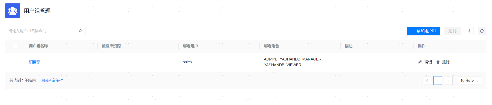

**网页路径**：【权限管理】>【用户组管理】

**功能介绍**

您可以创建不同的用户组，以用户组的维度批量管理组内用户可访问的[托管资源](../../资源管理/00资源管理)的范围和基础角色。建议将不同的业务部门与用户组进行映射。

未绑定用户的用户组可删除，已绑定用户的用户组无法删除。

**主要内容解释**

**【用户组名称】**：用户组的名称，为用户绑定用户组时以该名称作为标识，必填参数，长度范围为[1,24]个字符。

**【数据库资源】**：用户组可访问的数据库资源，资源权限对用户组内所有用户生效。可选参数，允许为空。

**【绑定用户】**：[创建用户](用户管理)时需要为用户绑定用户组，此信息显示用户组内所有用户。

**【绑定角色】**：用户组所具备的角色权限，角色权限对用户组内所有用户生效。可选参数，允许为空。

**【描述】**：用户组的补充描述，可选参数，长度范围为[0,60]个字符。
