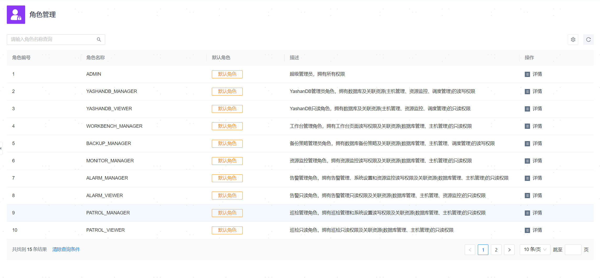

**网页路径**：【权限管理】>【角色管理】

**功能介绍**

管理平台提供了15种默认角色，您可以在角色列表中查看各个角色的相关信息了解其权限范围，并在后续使用中为[用户组](用户组管理)和[用户](用户管理)合理绑定角色，从而合理约束用户在管理平台中的操作权限。

> **Note**：
>
> 非admin角色无法访问任务管理页面与主机管理的网络管理页面。

**主要内容解释**

**【角色名称】**：角色的名称，全局唯一，为用户组或用户绑定角色时均以角色名称作为标识。

**【描述】**：角色的概括性描述，帮助理解角色与实际业务体系中职能的对应关系。

**【角色权限】**：角色权限将管理平台分为[YashanDB模块](../../资源管理/00资源管理)、[主机模块](../../资源管理/00资源管理)、[监控模块](../../../监控与告警/监控定义及展示/00监控定义及展示)、[告警模块](../../../监控与告警/告警定义及展示/00告警定义及展示)、[巡检模块](../../../数据库运维指南/诊断优化/巡检)、[日志模块](../../../数据库运维指南/诊断优化/日志分析)、[调度模块](../调度管理/00调度管理)、[工作台模块](../../../监控与告警/工作台)和[系统设置模块](../../系统设置/00系统设置)，不同角色具备不同模块的读/写权限。

**ADMIN角色独有权限**

- YashanDB
  - 部署YashanDB
  - 托管YashanDB
  - 移除托管YashanDB
- 主机管理
  - 添加主机
  - 移除主机
  - 网络管理
    - 网络平面
- 调度管理
  - 任务管理
- 权限管理
  - 用户管理
  - 用户组管理
  - 角色管理
- 系统设置
  - 操作审计
  - 默认设置
  - 通知服务设置
  - 时间同步设置
