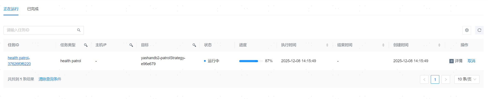

**网页路径**：【调度管理】>【任务管理】

## 正在运行的任务

**功能介绍**

在正在运行任务的列表中，记录了当前正在运行中的任务，可以关注【进度】了解任务的运行阶段。

**主要内容解释**

**【任务类型】**：当前任务的类型，包括数据库管理（例如AddYasdbToYcm、StopYasdbNode）、服务器管理（例如HostCreate）、巡检（例如health patrol）、备份及备份策略相关（例如BackupYasdb）、表空间（集）管理（例如AddTablespace、AddTablespaceSet）、日志相关（例如LogCollect）等。

**【主机IP】**：执行当前任务的目标操作对象的IP地址。

**【目标】**：执行当前任务的目标操作对象，可能为服务器（采用IP地址进行标识）、数据库（采用数据库名称进行标识）、数据库某个实例、巡检策略、备份策略或备份文件等。

## 查看任务详情

**网页路径**：【详情】

**网页路径**：【任务ID】

**功能介绍**

在任务详情页面，您可以查看指定任务的基本信息、任务参数、任务输出结果、任务拓扑图以及子任务日志。

## 取消任务

**网页路径**：【取消】

**功能介绍**

可以取消等待中的任务，以及运行中的备份任务，其它运行中的任务和已完成任务无法取消。

## 已完成的任务

**网页路径**：【已完成】

**功能介绍**

在已完成任务的列表中，记录了所有已经完成的历史任务，可通过关键字进行筛选查看。
