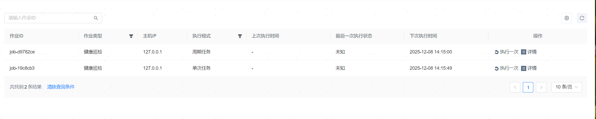

**网页路径**：【调度管理】>【作业管理】

## 作业列表

**功能介绍**

作业列表记录包含数据库单次定时备份，数据库周期备份，数据库单次定时恢复，数据库单次定时巡检与数据库周期巡检。

**主要内容解释**

**【作业类型】**：作业类型分为数据库备份、数据库恢复、表空间备份、表空间恢复、归档日志备份、健康巡检。

**【主机IP】**：数据库备份作业中备份文件存储的目的端服务器IP，健康巡检则恒为127.0.0.1。

**【执行模式】**：作业的执行模式，分为单次任务和周期性任务。

## 执行作业

**网页路径**：【执行一次】

**功能介绍**

对于周期性任务，除根据策略定期自动执行外，您也可以手动进行单次执行。若作业关联的策略已被删除，则无法再进行【执行一次】操作。

对于未失效作业，除了根据作业定时自动执行外，用户可以点击【执行一次】进行单次执行。

作业失效场景说明：

1. 单次定时作业已完成执行，作业失效。

2. 巡检策略被删除或被关闭，巡检作业失效。

3. 备份策略被删除、已应用的备份策略被关闭、已应用的备份策略取消应用，备份作业失效。

4. 下发定时恢复的数据库备份取消恢复，备份恢复作业失效。

## 查看作业详情

**网页路径**：【详情】

**功能介绍**

在作业详情页面，您可以查看指定作业的详情和历史记录。

**主要内容解释**

**【关联策略】**：健康巡检作业或周期性备份作业所关联的策略，单击策略名称可查看其详情。若作业关联的策略已被删除，将无法查看策略的名称和详情。

**【历史记录】**：当前作业的所有历史执行记录，包括执行起止时间、主机IP和执行结果。
