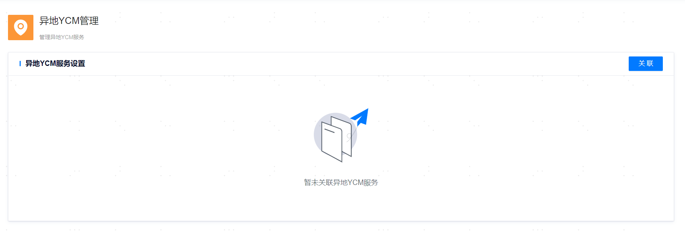

**网页路径**：【系统设置】>【异地YCM管理】

**功能介绍**

本地YCM管理平台（简称本地YCM）支持关联其它不同地域的YCM管理平台（简称异地YCM）。关联完成后，两地的YCM会互相同步主机和数据库相关的元数据，本地YCM可以查看异地的数据库实例节点可用信息，并且可以对异地的数据库实例进行切换、备份、巡检等操作。

需要注意的是，本地YCM不会采集异地主机和数据库节点的监控指标信息，以及收集日志信息。因此，在管理异地资源对象时，其中部分功能受限。异地主机不支持的功能有：更新和删除、日志分析、监控告警、添加数据库安装包。异地数据库节点不支持的功能有：监控告警、日志分析、死锁诊断、alert日志、站内告警消息通知、修改运维管理用户YASOM的密码。

## 关联异地YCM

**网页路径**：【关联】

**功能介绍**

将本地YCM关联上异地YCM，且只允许关联一个异地YCM。需要注意的是，关联是双向的，同样的异地YCM也会关联上本地YCM。

**主要内容解释**

**【异地主YCM服务所在地址】**：异地主YCM服务的通信IP地址。

**【异地主YCM服务端口】**：异地主YCM服务的通信端口。

**【异地YCM服务用户名】**：异地YCM服务的登录用户名称。

**【异地YCM服务用户名密码】**：异地YCM服务的用户密码。

**【本地YCM服务地址】**：YCM高可用部署实例的选举IP地址。

## 更新异地YCM

**网页路径**：【更新】

**功能介绍**

更新已经关联的异地YCM信息。需要注意的是，更新是双向的，同样的异地YCM也会更新。

## 移除异地YCM

**网页路径**：【移除】

**功能介绍**

移除已经关联的异地YCM。需要注意的是，移除是双向的，同样的异地YCM也会移除已经关联的本地YCM。

> **Warn**:
>
> 异地关联的两个YCM不能托管相同的主机。
>
> 如果YCM是主备部署模式，在异地关联时，需要确保所有主备YCM节点正常。
