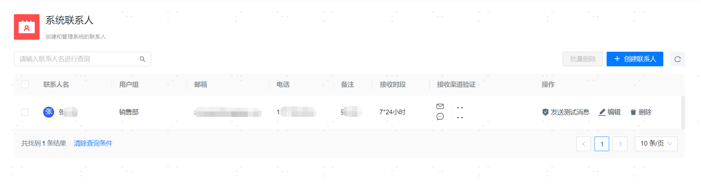

**网页路径**：【系统设置】>【系统联系人】

**功能介绍**

新建系统联系人后，在已完成[通知服务设置](通知服务设置)的前提下，用户可以实时接收来自管理平台的告警信息和巡检通知等推送。

根据联系人的接收渠道相关配置可以向其发送【邮件测试】或【短信测试】消息，检查确认通知服务是否可用以及接收渠道是否消息可达。

删除已有联系人后不可直接恢复，如需恢复需再次新建该联系人。

**主要内容解释**

**【联系人名】**：联系人的姓名，必填参数，长度范围为[1,24]个字符。

**【用户组】**：联系人所属用户组，可选参数，当使用具有admin权限的用户创建联系人时支持为联系人划分用户组（需先[新建用户组](../../平台运维/系统权限管理/用户组管理)），使用其他用户创建联系人时，无此选项，默认将其归属于用户所在用户组。

**【备注】**：联系人的补充信息，可选参数，长度范围为[0,50]个字符。

**【接收邮箱】**：用于接收告警通知（邮件形式）的邮箱，必填参数，此时不校验邮箱的真实性但不允许与已有联系人的接收邮箱重复（重复性校验时区分大小写）。

**【接收手机】**：用于接收告警通知（短信形式）的手机号，可选参数，无需填写国家区号（例如86、+86），直接填写11位数字号码即可。

**【接收时段】**：接收告警通知的时间段，固定为7*24小时。

**【接收渠道验证】**：接收的邮箱或者短信是否验证通过。
