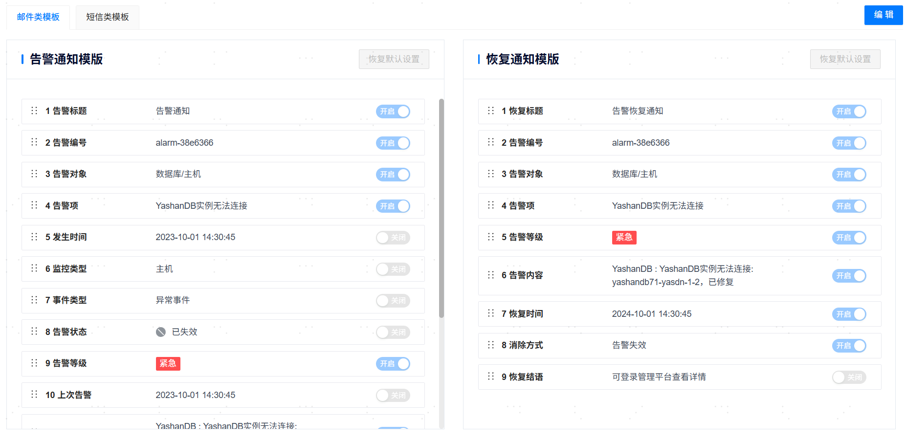
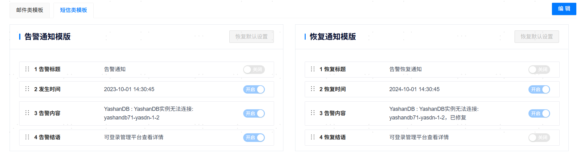

**网页路径**：【系统设置】>【通知服务设置】


<span id="webpath5" name="webpath5" class="yaslink"></span>
## 邮箱设置

**网页路径**：【邮箱设置】

**功能介绍**

管理平台支持实时将告警信息、巡检通知等及时推送给相关人员，增加响应速度提升运维效率。配置相关信息并开启邮箱服务后，管理平台可以通过邮件形式实时向[系统联系人](系统联系人)邮箱推送告警信息和巡检通知等。

配置邮箱服务信息后，仅【保存】只能存储各项参数值信息，需【验证并保存】完成验证并通过才能启用邮箱服务。

**主要内容解释**

**发信服务器**：邮件服务器的域名地址，格式为`smtp.example.com`。

**端口**：邮件服务器的端口号。

**加密**：邮件服务器的加密方式，可按需选择加密或不加密，加密时支持SSL或TLS协议。

**账户**：邮件服务的发件人邮箱。

**密码**：可选参数，发件人邮箱的密码。

<span id="sms" name="sms" class="yaslink"></span>

<span id="webpath29" name="webpath29" class="yaslink"></span>
## 短信设置

**网页路径**：【短信设置】

**功能介绍**

开启短信服务且[系统联系人](系统联系人)配置接收手机后，管理平台可以通过短信形式实时向系统联系人推送告警信息和巡检通知等。

管理平台支持通过深圳市政数局短信平台、联通短信平台、IMSG短信平台或自定义程序发送短信：
- 如需使用上述短信平台，需先通过对应平台的官方途径开通短信服务并完成相应的基础配置，具体操作可参考各平台的官方指引。

- 如需使用自定义程序，需先将其脚本文件存放在管理平台的后台服务器中，且要求平台安装用户具备该文件的执行权限。

在新增短信服务时，可以通过验证短信服务并填写接受手机测试短信服务的可用性。

**主要内容解释**

**【短信服务名称】**：短信服务的名称，必填参数，长度范围为[1,32]个字符。

**【短信平台】**：支持[深圳市政数局短信平台](#szzsj)、[联通短信平台](#UMS)、[IMSG短信平台](#IMSG)和[自定义程序](#user-defined)。

**【URL地址】**：对应短信平台应用的URL地址，使用自定义程序时无此项信息。

**【用户名】**及**【密码】**：对应短信平台的认证信息，包括用户名和密码，使用自定义程序时无此项信息。

**【验证通过】**：验证短信服务的结果状态，仅验证通过的短信服务可使用。

**【开启状态】**：短信服务的启停状态，同一时间只会生效一个短信服务，开启某个短信服务时会自动关闭已开启的其他短信服务。

<span id="szzsj" name="szzsj" class="yaslink"></span>
### 深圳市政数局短信平台

**【请求方式】**：HTTP协议的请求方式，只能为POST。

**【编码类型】**：短信文本的编码类型，支持ASCII、GB2312、GBK、GB18030、UTF-8以及Unicode，默认为UTF-8。

<span id="UMS" name="UMS" class="yaslink"></span>
### 联通短信平台

**【请求方式】**：HTTP协议的请求方式，只能为POST。

**【企业编号】**：申请/开通联通短信平台相关服务时，其为各企业分配的编号，企业编号是每个企业的唯一标识。

**【子扩展号】**：配置相应的子拓展号（subPort），由短信平台统一分配。

<span id="IMSG" name="IMSG" class="yaslink"></span>
### IMSG短信平台

**【自定义扩展号】**：自定义扩展的发送方码号（ext），即106码号后面扩展的部分，可选参数。

**【自定义消息ID】**：自定义的消息ID（seqid），可选参数，不填则由短信平台生成唯一编号。

**【短信签名】**：在IMSG短信平台申请且已通过审核的短信签名，可选参数。短信签名通常是位于短信正文前【】中的署名，用于标识企事业单位主体或业务。

<span id="user-defined" name="user-defined" class="yaslink"></span>
### 自定义程序

**主要内容解释**

**执行推送程序命令**：自定义程序的脚本文件存放路径，需确保管理平台安装用户具备该文件的执行权限。

命令示例：

```bash
# binary
$ send_sms --phone "13800000000" --msg "WUNNIGFsYXJtIG1lc3NhZ2U="

# python
$ python3 send_sms.py --phone "13800000000" --msg "WUNNIGFsYXJtIG1lc3NhZ2U="
```

相关参数如下表所示。

|  参数名称| 数据类型| 描述|
| -------- | -------- | ----------------------------------------------- |
| phone    | string   | 接收手机号，必选参数。                                        |
| msg      | string   | 告警信息，采用base64编码（使用标准base64 RFC 4648）必选参数。当自定义程序获取到msg后，需要先对其进行base64解码，然后再将解码后的信息发送短信到对应的接收手机。 |

自定义python程序示例：

```python
#!/usr/bin/python
# -*- coding: UTF-8 -*-

import argparse
import base64
import hashlib
import requests
import json
import time

unicom_endpoint = "http://127.0.0.1:9090/sms/v2/api/ssend"
unicom_id = "<id>"
unicom_user = "<user>"
unicom_pwd = "<password>"
unicom_sub_port = "<sub_port>"

def parse_args():
    parser = argparse.ArgumentParser()
    parser.add_argument("-p", "--phone", type=str, help="phone number")
    parser.add_argument("-m", "--msg", type=str, help="send message, using base64 codec")
    args = parser.parse_args()
    if args.phone is None:
        print("argument 'phone' is none")
        exit(1)
    if args.msg is None:
        print("argument 'msg' is none")
        exit(1)
    return args

def sha256_encrypt(text):
    """
    对字符串进行SHA256 加密
    """
    sha256 = hashlib.sha256()
    sha256.update(text.encode('utf-8'))
    return sha256.hexdigest()

def gen_headers():
    """
    生成请求头
    """
    now_milli_time = str(int(round(time.time() * 1000)))
    sign = sha256_encrypt(unicom_user + unicom_pwd + now_milli_time)
    headers = {
        'content-type': 'application/json;charset=utf-8',
        'accept': 'application/json',
        'timestamp': now_milli_time,
        'sign': sign,
    }
    return headers

def gen_req(args):
    """
    生成请求体
    """
    message = base64.b64decode(args.msg)
    req = {
        'spNum': unicom_id,
        'content': str(message),
        'mobiles': args.phone,
        'userMsgId': "",
        "atTime": "",
        'subPort': unicom_sub_port,
    }
    json_req = json.dumps(req)
    return json_req

def send_sms(args):
    """
    发起短信请求
    """
    hds = gen_headers()
    req = gen_req(args)

    resp = requests.post(unicom_endpoint, data=req, headers=hds)
    print(resp.status_code)
    print(resp.content)
    resp.close()

if __name__ == "__main__":
    args = parse_args()
    send_sms(args)
```

返回结果示例：

```bash
python3 send_sms.py --phone "13800000000" --msg "c2VuZCBzbXMgdGVzdAo="
200
b'{"description":"send message success","result":"0000","taskid":"819396"}\n'
```

## 自定义脚本设置

**网页路径**：【自定义脚本设置】

### 查看系统变量

**网页路径**：【新增脚本】>【查看系统变量】

**功能介绍**

在编写脚本文件前可先查看所有可引用的系统变量，变量引用方式为`${变量名称}`，告警接收人名称`${receiver_name}`为必选变量。

### 新增脚本

**网页路径**：【新增脚本】

**功能介绍**

管理平台支持通过自定义脚本搭建通知服务，通知方式包括邮件或短信。

自定义脚本文件需满足如下要求：

- 脚本文件内容必须以`#!/bin/bash`开头。
- 脚本文件的后缀名只能为`.sh`或`.bash`，文件大小不能超过10M。
- 脚本文件必须存放在`{管理平台安装路径}/notify_script/`路径下，且需确保管理平台安装用户具备该文件的执行权限。

上传脚本至对应路径后，需将该脚本添加至管理平台、测试通过并启用后才能正式使用自定义的通知服务。

在主备部署场景下需要注意的是，在主节点页面添加脚本时，会默认将脚本内容保存在后端数据库中，并同步到备节点。主节点保存后，备节点也会定时从数据库中同步脚本内容。因此，如果用户需要修改脚本，首先在主节点安装目录修改好脚本内容后，然后在前端查看/编辑脚本页面点击提交按钮，这时文件内容会更新到数据库，并最终同步到备节点。直接私自修改备节点的脚本内容会被同步覆盖，升主后无法生效。

**主要内容解释**

**【脚本名称】**：脚本的文件名（含后缀），必填参数，不能重复添加同一个脚本。

**【执行脚本参数】**：执行脚本文件所需的参数，选填参数。

**【MD5值】**：脚本文件的MD5值，选填参数。

### 测试脚本

**网页路径**：【新增脚本】>【测试】

**网页路径**：【查看】>【测试】

**网页路径**：【测试】

**功能介绍**

所有新增或修改过配置的脚本都应先完成【测试】验证其可用性，仅验证通过的脚本才能启用。

### 启用脚本

**网页路径**：【操作】

**功能介绍**

您可以按需启用验证通过的脚本，脚本启用后视为通知服务配置完成。管理平台会采用脚本中指定方式实时向[系统联系人](系统联系人)推送告警信息。

### 删除脚本添加记录

**网页路径**：【删除】

**功能介绍**

您可以按需删除脚本添加记录，该操作不会删除实际的脚本文件。

## 通知模板

**网页路径**：【通知模板】

**功能介绍**

通知模板分为邮箱类模板和短信类模板，支持邮箱或短信的告警信息格式能够自定义配置，包括针对某项消息内容的开启和关闭，不同项的顺序编排。

每个模板中至少需要有一个模板项是开启状态。




