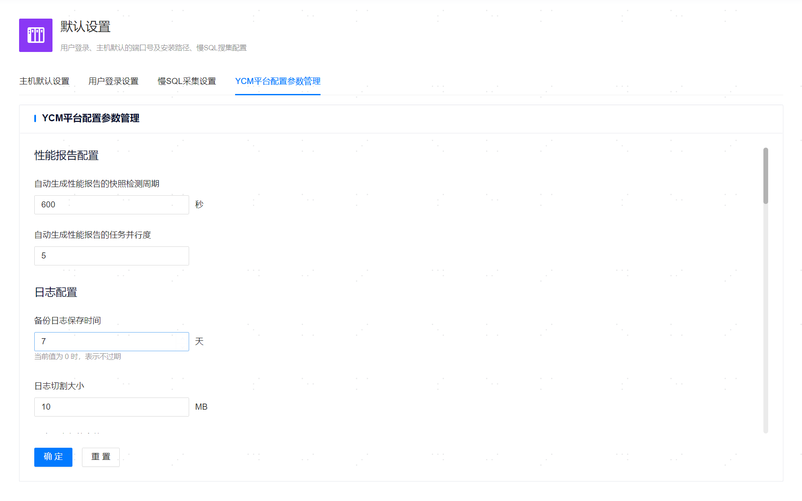

**网页路径**：【系统设置】>【默认设置】>【平台配置参数管理】

**功能介绍**

管理平台支持用户修改管理平台的配置参数，相关修改的配置参数会应用到管理平台、prometheus、loki等组件中。

**主要内容解释**

**性能报告配置**

**【自动生成性能报告的快照检测周期】**：管理平台自动生成性能报告的快照检测时间间隔，默认值为600秒，最小值为60秒，最大值为86400秒。
**【自动生成性能报告的任务并行度】**：管理平台自动生成性能报告的最大任务并行数量，默认值为5，最小值为1。

**日志配置**

**【日志切割大小】**：管理平台日志切割前的文件的最大大小，默认值为10MB，最小值为10MB。

**【最大日志备份个数】**：管理平台日志切割后生成的旧文件最大数量，默认值为30个，最小值为1个，当为0时表示全部保存。

**【备份日志保存时间】**：管理平台日志切割后生成的旧文件的保存时间，默认值为7天，最小值为1天，当为0时表示全部保存。

**【日志保存路径】**：管理平台日志的保存路径，该路径必须存在，管理平台对其有读写权限。在主备部署场景下需要注意的是，该参数只会在主节点生效，不会同步到备节点。

**【读取慢日志文件最大行数】**：管理平台读取慢日志文件的最大行数，默认值为5000行，最小值为1行，最大值为100000行。

**【loki收集日志保存时间】**：loki组件收集托管数据库、添加主机日志的保存时间，默认值为30周，最小值为1周，最大值为5217周。

**监控告警配置**

**【告警信息缓存更新间隔】**：管理平台对告警信息缓存的更新时间间隔，默认值为10秒，最小值为1秒，最大值为3600秒。

**【自定义短信推送程序执行超时时间】**：管理平台通过自定义短信推送程序发送告警时执行的超时时间，默认值为15秒，最小值为1秒，最大值为604800秒，当为0时表示不限制。

**【审计告警检测间隔】**：管理平台的审计告警检测时间间隔，默认值为60秒，最小值30秒，最大值为3600秒。

**【异地告警检测间隔】**：管理平台的异地告警检测时间间隔，默认值为30秒，最小值为30秒，最大值为3600秒。

**【采集数据间隔】**：prometheus采集数据的时间间隔，默认值为20秒，最小值为1秒，最大值为3600秒。该参数必须大于或者等于主机的采集数据超时时间。

**【采集数据超时时间】**：prometheus采集数据的超时时间，默认值为18秒，最小值为1秒，最大值为3600秒。该参数取值必须小于或者等于采集数据间隔。

**【监控数据保存时间】**：prometheus采集的监控数据保存时间，默认值为180天，最小值为1天。

**鉴权配置**

**【token有效时间】**：管理平台的token有效时间，默认值为30分钟，最小值为1分钟，最大值为525600分钟。

**【用户密码过期时间】**：管理平台的用户密码过期时间，默认值为60天，最大值为3650天，当为0表示不限制。

**【用户登录最大尝试次数】**：管理平台的用户登录失败后最大尝试次数，默认值为5次，最大值为30次，最小值为5次。

**【用户登录后锁定时间】**：管理平台的用户因密码错误连续登录失败超过最大尝试次数被锁定的时间期限，单位为分钟，取值范围为[3,10080]，默认值为3。锁定时间期满后，该用户会自动解锁。

**其余配置**

**【更新节点信息间隔】**：管理平台更新托管数据库节点主备信息的时间间隔，默认值为30秒，最小值为1秒。

**【主机之间配置文件同步间隔】**：管理平台将配置文件同步到添加主机的时间间隔，默认值为5秒，最小值为1秒。

**【后端数据库最大连接数】**：管理平台连接后端数据库的最大连接数量。后端为yashandb时，默认值为10个，最小值为1个，最大值为16384个，当为0时表示不限制连接数量。后端为sqlite3时，默认值为1个，不能修改。

**【浏览器忽略保存密码】**：配置浏览器是否忽略保存密码，当配置打开时，管理平台页面输入密码处浏览器不保存密码。

**【异地数据同步间隔】**：关联异地管理平台后，同步异地数据的时间间隔，默认为30秒，最小值为1秒，最大值为3600秒。

