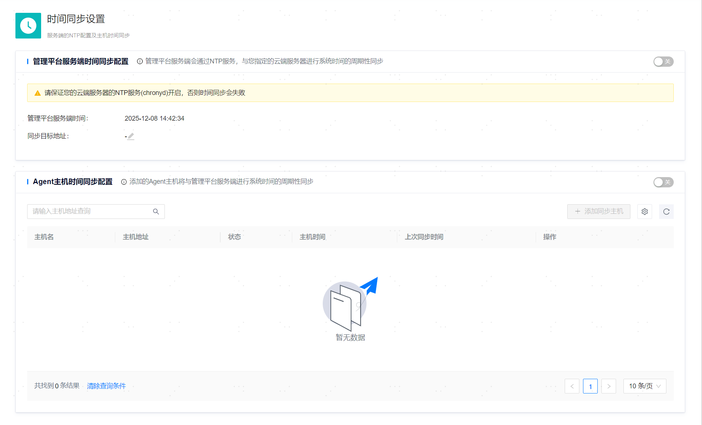

**网页路径**：【系统设置】>【时间同步设置】



## 管理平台服务端

### chrony环境准备

NTP服务依赖chrony命令。

```bash
# 查看是否存在chrony
# chronyc --version

# 若不存在，可使用以下方式安装
# yum install chrony  
# 或
# apt update && apt-get -y install chrony 
```

**功能介绍**

管理平台服务端可以通过NTP服务与指定的云端服务器进行系统时间同步。

如需使用该功能，需确保：
- 已开启云端服务器的NTP服务（chronyd）。
- 已获取平台后端服务器的root或sudo权限用户及其密码。

**主要内容解释**

**【管理平台服务端时间】**：管理平台服务端的当前时间。

**【同步目标地址】**：开启时间同步时，需指定的云端服务器地址。

## ycm-agent端

**功能介绍**

管理平台服务端可以向被托管资源的服务器同步时间，从而确保服务端与资源端（ycm-agent端）的时间一致。

若服务端与资源端（ycm-agent端）时间不一致，上报的告警、事件等记录的时间记录将以资源端（ycm-agent端）为准。若服务端和资源端已通过其他方式保障所有服务器的时间一致（例如，所有服务器已在操作系统层面建立时间同步机制），此处可无需配置。

如需使用该功能，需确保：
- 已完成[服务器管理](../../资源管理/服务器管理)。
- 已获取目标服务器的root或sudo权限用户及其密码。
- 已获取平台后端服务器的root或sudo权限用户及其密码。

**主要内容解释**

**服务器信息**：添加需时间同步的服务器后，列表中将呈现该服务器的主机名、IP地址、配置时间同步的状态、主机时间以及上次同步时间。

**【立即同步】**：可以随时对已成功配置时间同步（状态为“成功”）的服务器执行立即同步系统时间。
