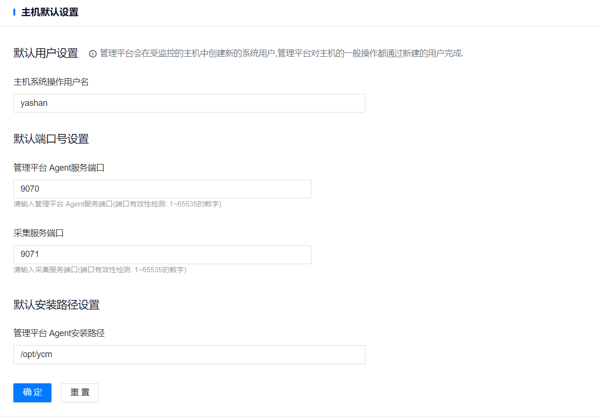

**网页路径**：【系统设置】>【默认设置】>【主机默认设置】

**功能介绍**

您可以自定义配置ycm-agent在被托管服务器中的安装用户、端口以及安装路径，在Web页面中修改配置与修改deploy.yml配置文件中client信息的效果一致。

如需自定义配置该类信息，必须在[托管服务器](../../资源管理/服务器管理)之前完成配置。若在已托管服务器后修改相应参数，仅对后续新托管的服务器生效。

**主要内容解释**

**【主机系统操作用户名】**：用于在被托管服务器中安装和运行ycm-agent相关服务的用户，默认值为YCM，长度范围为[1,49]个字符且需符合目标服务器操作系统的相关要求。若设置为服务器操作系统中不存在的用户，在托管服务器时会静默创建该用户和同名用户组。该参数对应于deploy.yml配置文件中client信息部分的system_user参数。

**【管理平台 Agent服务端口】**：ycm-agent与管理平台之间、ycm-agent所在服务器之间通信的端口，取值范围为[1,65535]，默认为9070。该参数对应于deploy.yml配置文件中client信息部分的agent_port参数。

**【主机信息采集端口】**：ycm-agent采集服务器的网络状态、磁盘使用率、内存使用率以及内存剩余容量等信息的端口，取值范围为[1,65535]，默认为9071。该参数对应于deploy.yml配置文件中client信息部分的export_port参数。

**【管理平台 Agent安装路径】**：ycm-agent相关服务在被托管服务器中的安装路径，默认值为/opt/ycm，长度范围为[1,99]个字符且需符合目标服务器操作系统的相关要求。该参数对应于deploy.yml配置文件中client信息部分的install_path参数。
