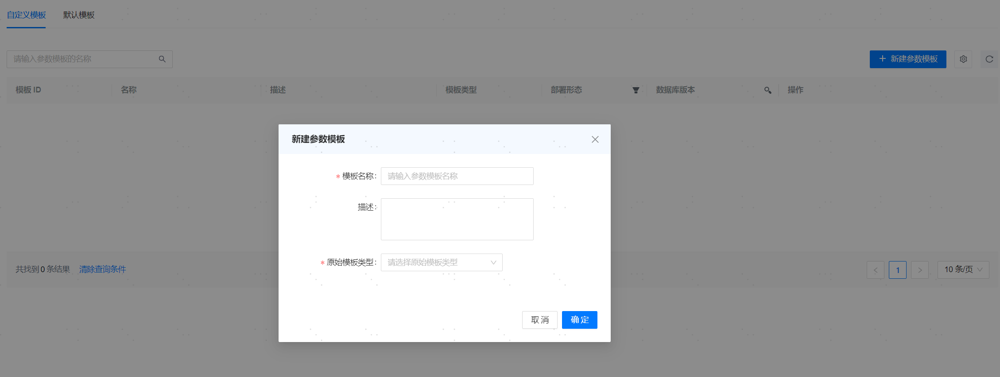

**网页路径**：【YashanDB】>【YashanDB列表】>【参数模板】

## 默认模板

**网页路径**：【默认模板】

**功能介绍**

参数模板是对一系列数据库配置项的聚合，管理平台支持使用参数模板简化数据库参数配置。

默认模板仅支持单机部署形态，支持查看、支持应用、无法编辑、无法删除，支持对比模板，也可另存为自定义模板，对自定义模板进行编辑。

## 自定义模板

### 新建参数模板

**网页路径**：【自定义模板】> 【新建参数模板】

**功能介绍**

自定义参数模板可在默认模板的基础上按需进行参数配置。自定义模板支持查看、应用、编辑、删除、支持比对模板，也可另存为模板。

### 参数模板详情

**网页路径**：【自定义模板】> 【模板 ID】

**功能介绍**

参数模板详情界面可查看每个Group下的主备配置信息：包含建库参数和数据库实例配置参数。

对比模板，可查看两个模板的差异。
