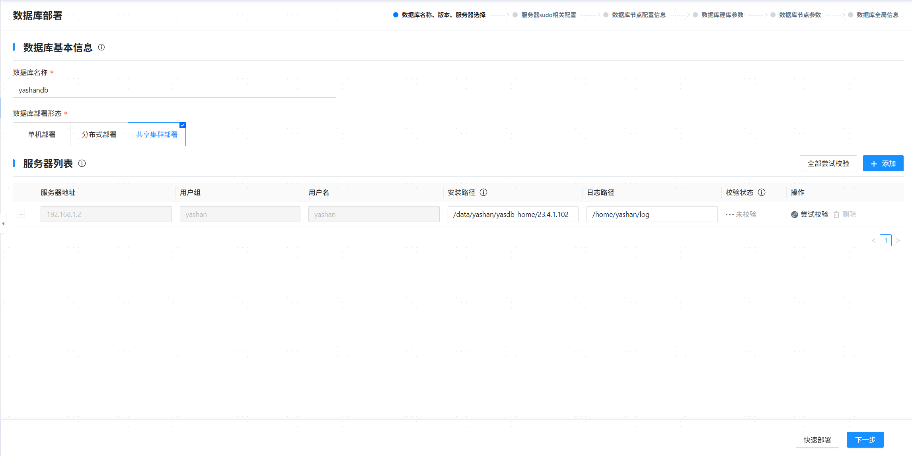
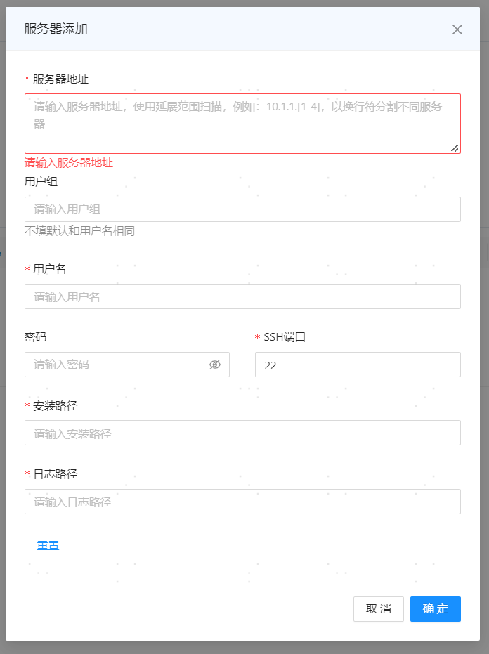
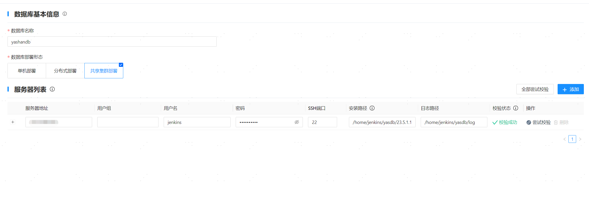
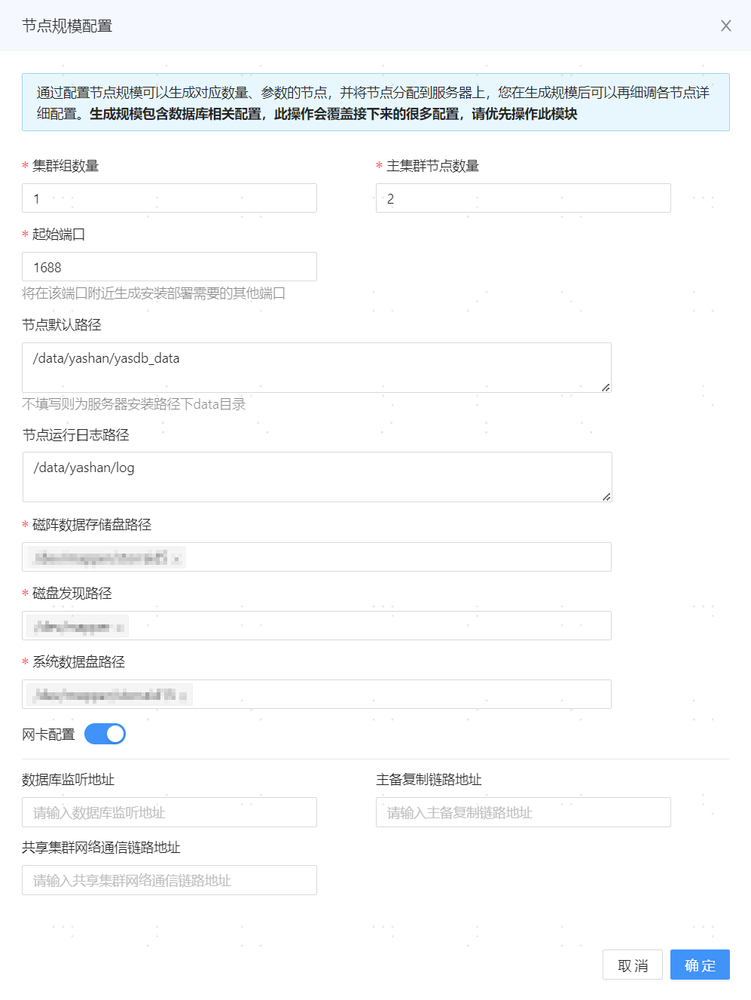
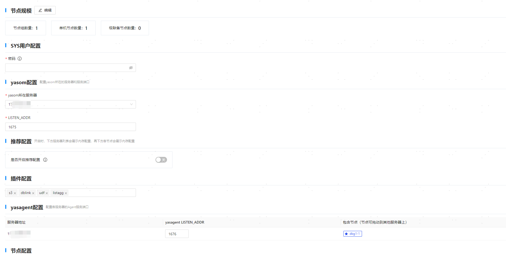
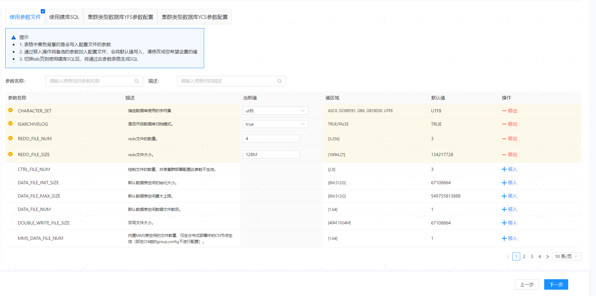
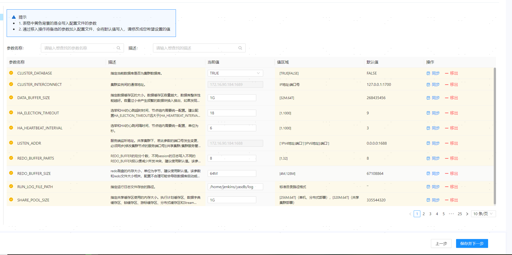
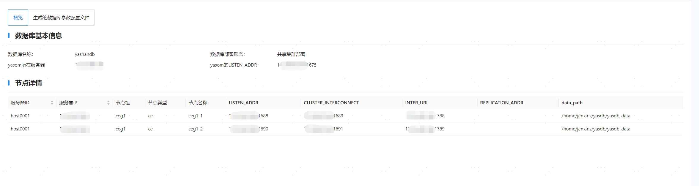

## 步骤1：进入部署页面

   

## 步骤2：配置数据库基本信息与服务器信息

1. 根据实际情况，配置数据库基本信息：
   
   - 数据库名称：填写数据库集群名称，该名称也将作为初始数据库的名称（database name）。必须以字母开头，支持字母（区分大小写）、数字以及下划线，长度为[4,64]个字符，例如yashandb。

   - 数据库类型：选择数据库部署形态，例如集群。

> **Note**:
>
> 如需复用/清理当前环境中的配置信息记录（可能会保留配置信息的场景：可视化安装成功后又卸载数据库、可视化安装失败等），可单击 **[数据库名称]** 输入框，在下拉选项中选择/清理对应的配置。
> 
> 

2. 在服务器列表中，默认识别Web服务所在服务器的信息，检查确认安装路径等信息无误后单击 **[尝试校验]** 检查正确性。

   

3. 单击服务器列表右上方的 **[添加]** 。

4. 在弹出的对话框中，添加其他服务器信息，单击 **[确定]** 保存配置。

   

1. 单击 **[全部尝试校验]** 检查正确性。

   

2. 确认信息无误后，单击 **[下一步]** 。

## 步骤3：配置服务器sudo

1. 在数据库配置区域，可以配置以下功能：

   - 开机自启monit：开启时，守护进程将在服务器开机后自行启动并拉起YashanDB的各个进程，间接实现数据库的开机自启动。

   - 用户添加到YASDBA用户组：开启表示将安装用户加入YASDBA组，可免密登录数据库。

   上述功能开启后均需安装用户具备sudo权限，本示例使用默认配置，即仅开启将用户添加到YASDBA用户组。

   

2. 确认信息无误后，单击 **[下一步]** 。

## 步骤4：配置集群节点信息

1. 在弹出的节点规模配置对话框中，根据[实际规划](../数据库安装前准备/服务器准备)的实例数调整相关配置，单击 **[确定]** 保存信息。

   - 集群组数量：共享集群组的数量。例如1为搭建1个集群，2为搭建一主一备集群，3为搭建一主两备集群，以此类推。此例中以搭建1个集群为例。

   - 主集群节点数量：选择主集群的数据库实例数量。

   - 备集群节点数量：选择备集群的数据库实例数量。如果集群组数量大于1，会出现该输入框。

   - 起始端口：填写数据库监听端口的起始值，若存在多个监听端口系统会根据[端口划分规则](../数据库安装前准备/安装初始环境调整)自行计算，默认值为1688。

   - 节点默认路径：填写YashanDB的数据目录，置空则默认为服务器安装路径上一级目录的yasdb_data目录，**安装后修改不生效**，支持数字、字母（区分大小写）以及部分符号（`/`、`-`、`_`、`.`），最长71个字符，例如/data/yashan/yasdb_data。

   - 节点运行日志路径：填写YashanDB的运行日志路径，置空则默认为服务器安装路径上一级目录的log目录，推荐和主机列表的日志路径一致。例如/data/yashan/log。

   - 磁阵数据存储盘路径：填写为数据盘规划的共享存储LUN路径，例如/dev/yfs/data0。

   - 磁盘发现路径：填写为磁盘发现路径，用于发现集群共享存储的磁盘路径，该路径是磁阵数据存储盘路径和系统数据盘路径的父级目录，例如/dev/yfs。

   - 系统数据盘：填写为系统数据盘规划的共享存储LUN路径，例如/dev/yfs/sys0、/dev/yfs/sys1和/dev/yfs/sys2。

   - 网卡配置：可以将数据库监听地址、主备复制链路地址和共享集群网络通信链路地址配置为不同的网段，格式为`192.168.1.0/24`。

   

2. 在SYS用户配置区域，设置数据库超级管理员SYS用户的密码，配置要求如下：

    - 密码长度为8 - 64位。
    
    - 密码中不能包含对应的数据库用户名称。
    
    - 密码必须同时包含数字、字母和特殊字符。

    - Linux OS命令相关的特殊字符（例如`@`、`/`、`.`、`!`、`$`、`'`等）需进行转义。

3. 在yasom配置区域，可根据实际情况调整yasom所在服务器和监听端口。

   - yasom所在服务器：默认为当前服务器IP。

   - LISTEN_ADDR：yasom的监听端口，默认为1675。

4. 在插件配置区域，可按需选择需要安装的插件。

5. 在yasagent配置区域，可按需调整以下配置：

   - yasagent LISTEN_ADDR：yasagent的监听端口，默认为1676。

   - 包含节点：显示每个服务器上对应部署的数据库实例信息，带星标的实例角色为主，其他为备。可拖拽实例调整其分布。

6. 在节点配置区域，可按需调整以下配置：
   
   - 单击节点组（如下图ceg1），可以对该节点组的磁盘相关配置进行修改。

   - 修改节点规模：增删节点/节点组。例如单击 **[增加节点组]** ，可增加备集群；单击节点组（如下图ceg1）旁边的**[+]** ，可为该集群增加实例；单击实例名称（如下图ceg1-1）旁边的删除标志，可删除该集群的实例。

   - 展开数据库实例列表，单击实例名称（如下图ceg1-1），查看实例信息，可按需调整相关配置。

     
7. 确认信息无误后，单击 **[下一步]** 。

## 步骤5：设置建库参数

确认信息无误后，单击 **[下一步]** 。



## 步骤6：设置配置参数

在 **[数据库节点参数]** 页面，可按需增/删/改各数据库实例的参数，确认信息无误后，单击**[保存并下一步]** 。



## 步骤7：部署数据库

1. 在 **[数据库全局信息]** 页面，确认信息无误后，单击**[部署]** 。

   

> **Note**:
>
>部署完成后，yasom会在`/home/yashan/install/conf/CE/yashandb`目录中生成hosts.toml和yashandb.toml文件，其中yashandb为数据库名称，此目录为安装目录。

## 步骤8：配置环境变量

以安装用户登录到每个服务器上，执行如下命令生效环境变量。

```shell
# 部署命令成功执行后将会在$YASDB_HOME目录下的conf文件夹中生成<<集群名称>>.bashrc环境变量文件
$ cd /data/yashan/yasdb_home/{版本号}/conf
# 如~/.bashrc中已存在YashanDB相关的环境变量，将其清除

$ cat yashandb.bashrc >> ~/.bashrc
$ source ~/.bashrc
```

## 步骤9：检查安装结果

若连接报错或执行SQL语句报错，请根据错误提示信息检查安装步骤，或咨询我们的技术支持。

1. 使用yasql工具连接数据库，查看实例状态。

    ```shell
    $ yasql sys/********@192.168.1.2:1688
    SQL> SELECT STATUS FROM v$instance;

    STATUS        
    ------------- 
    OPEN        

    SQL> SELECT database_name FROM v$database;

    DATABASE_NAME                                                    
    ---------------------------------------------------------------- 
    yashandb
    ```

2. （可选）创建数据库用户并赋权，更多操作请查阅用户管理。

    ```shell
    SQL> CREATE USER sales IDENTIFIED BY sales;
    
    SQL> GRANT CONNECT TO SALES;
    ```
