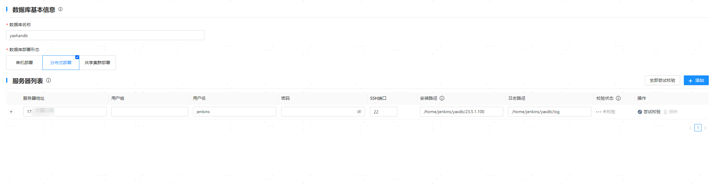
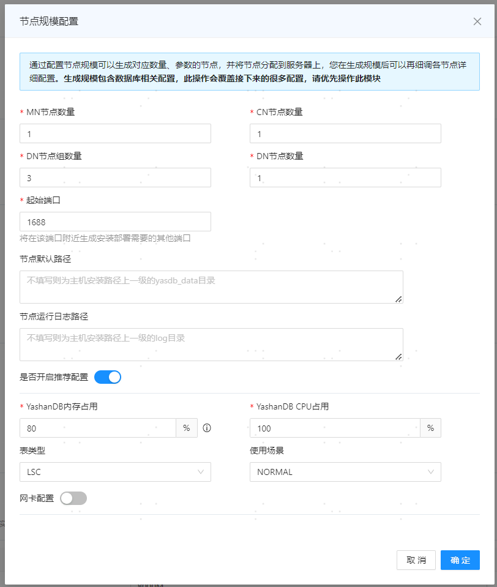
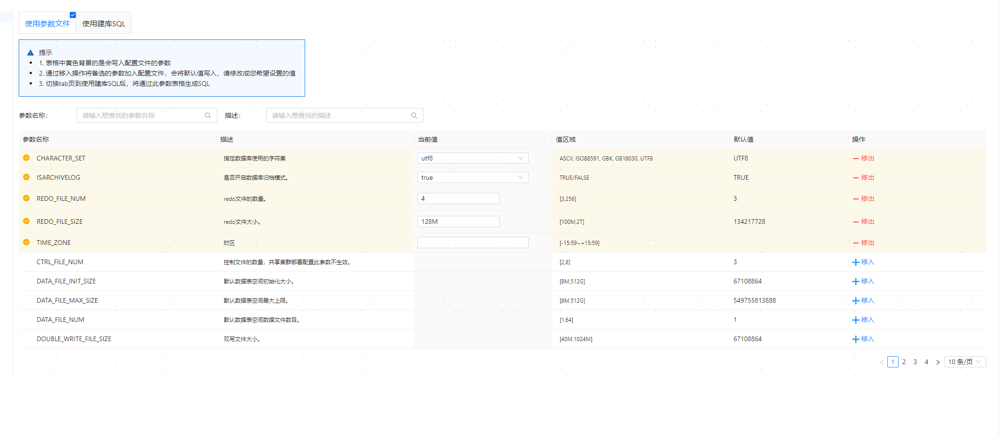
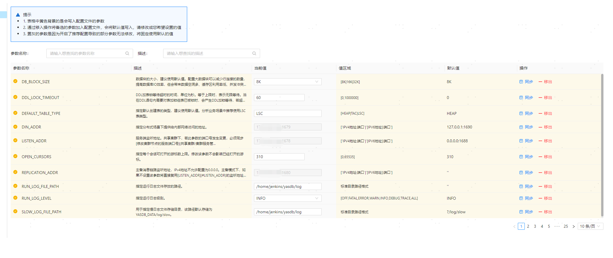
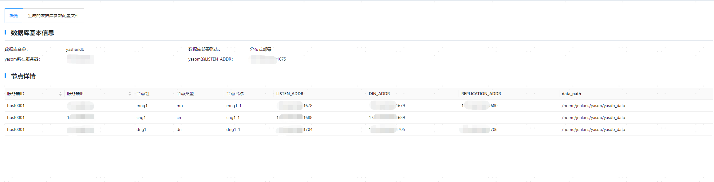

## 步骤1：进入部署页面


## 步骤2：配置数据库基本信息与服务器信息

1. 根据实际情况，配置数据库基本信息：
   
   - 数据库名称：填写数据库集群名称，该名称也将作为初始数据库的名称（database name）。必须以字母开头，长度为[1,63]个字符，例如yashandb。

   - 数据库部署形态：选择数据库部署形态，例如分布式部署。

> **Note**:
>
> 如需复用/清理当前环境中的配置信息记录（可能会保留配置信息的场景：可视化安装成功后又卸载数据库、可视化安装失败等），可单击 **[数据库名称]** 输入框，在下拉选项中选择/清理对应的配置。
> 
> 

2. 在服务器列表中，默认识别Web服务所在服务器的信息，检查确认安装路径等信息无误后单击 **[尝试校验]** 检查正确性。

**注意选择数据库部署形态为分布式部署。**

   

3. 单击服务器列表上方的 **[添加]** 。

4. 在弹出的对话框中，添加其他服务器信息，单击 **[确定]** 保存配置。
   
   

5. 单击 **[全部尝试校验]** 检查正确性。

6. 确认信息无误后，单击 **[下一步]** 。

## 步骤3：配置服务器sudo

1. 在数据库配置区域，可以配置以下功能：

   - 创建cgroup：开启表示创建用于YashanDB CPU资源管理的cgoup目录，并需填写服务器其他配置区域的cgroup目录。仅需安装可开启CPU资源管理的数据库（非级联备）时需配置该参数。

   - 开机自启monit：开启时，守护进程将在服务器开机后自行启动并拉起YashanDB的各个进程，间接实现数据库的开机自启动。

   - 用户添加到YASDBA用户组：开启表示将安装用户加入YASDBA组，可免密登录数据库。

   上述功能开启后均需安装用户具备sudo权限，本示例使用默认配置，即仅开启将用户添加到YASDBA用户组。

   

2. 确认信息无误后，单击 **[下一步]** 。

## 步骤4：配置数据库节点信息

1. 在弹出的节点规模配置对话框中，根据[实际规划](../数据库安装前准备/服务器准备)的节点数调整相关配置，单击 **[确定]** 保存信息。

   - MN节点数量：选择MN节点数量。

   - CN节点数量：选择CN节点数量。

   - DN节点组数量：选择DN节点组数量。

   - DN节点数量：选择DN节点数量。

   - 起始端口：填写数据库监听端口的起始值，若存在多个监听端口系统会根据[端口划分规则](../数据库安装前准备/安装初始环境调整)自行计算，默认值为1688。

   - 节点默认路径：填写YashanDB的数据目录，置空则默认为服务器安装路径上一级目录的yasdb_data目录，**安装后修改不生效**，支持数字、字母（区分大小写）以及部分符号（`/`、`-`、`_`、`.`），最长75个字符，例如/data/yashan/yasdb_data。

   - 节点运行日志路径：填写YashanDB的运行日志路径，置空则默认为服务器安装路径上一级目录的log目录，推荐和主机列表的日志路径一致。例如/data/yashan/log。

   - 是否开启推荐配置：开启推荐配置时，yasom将调用DBMS_PARAM高级包生成推荐参数覆盖同名配置参数，默认为开启。开启时，还需配置以下参数：

      - YashanDB内存占用：设置YashanDB可用服务器内存的百分比，yasom将根据该百分比计算出具体内存限制。

      - YashanDB CPU占用：设置YashanDB可用服务器CPU的百分比，yasom将根据该百分比计算出具体CPU限制。

      - 表类型：选择主要业务常用的表类型，修改数据库配置参数，分布式内存库默认表类型为HEAP。

      - 使用场景：参数调优场景，先选择数据库类型为MEM，表类型选择HEAP后使用场景选择AIM，默认内存表空间百分比为80%。

   - 网卡配置：可以将数据库监听地址、主备复制链路地址和分布式网络通信链路地址配置为不同的网段，格式为`192.168.1.0/24`。

**注意校验数据库类型为MEM，表类型为HEAP，使用场景为AIM。**

   

2. 在SYS用户配置区域，设置数据库超级管理员SYS用户的密码，配置要求如下：

    - 密码长度为8 - 64位。
    
    - 密码中不能包含对应的数据库用户名称。
    
    - 密码必须同时包含数字、字母和特殊字符。

    - Linux OS命令相关的特殊字符（例如`@`、`/`、`.`、`!`、`$`、`'`等）需进行转义。

3. 在yasom配置区域，可根据实际情况调整主yasom所在服务器和监听端口。

   - yasom所在服务器：默认为当前服务器IP。

   - LISTEN_ADDR：yasom的监听端口，默认为1675。

4. 在推荐配置区域，检查配置信息，此处配置取至节点规模中的对应配置。
   
   ```shell
   开启推荐配置后，部分参数会有固定值，无法修改。参数如下：
   +--------------------------------+-------------+---------+
   |            name                |  recommend  | restart |
   +--------------------------------+-------------+---------+
   | DATA_BUFFER_SIZE               |       5498M |  True   |
   | VM_BUFFER_SIZE                 |        741M |  True   |
   | WORK_AREA_STACK_SIZE           |          1M |  True   |
   | WORK_AREA_POOL_SIZE            |         16M |  True   |
   | WORK_AREA_HEAP_SIZE            |       2048K |  True   |
   | SHARE_POOL_SIZE                |        741M |  True   |
   | LARGE_POOL_SIZE                |        112M |  True   |
   | MAX_PARALLEL_WORKERS           |          12 |  True   |
   | SCOL_DATA_BUFFER_SIZE          |        128M |  True   |
   | SCOL_DATA_PRELOADERS           |           2 |  True   |
   | COLUMNAR_WORK_AREA_HEAP_SIZE   |         32M |  True   |
   | COLUMNAR_VM_BUFFER_SIZE        |        128M |  True   |
   | COLUMNAR_BULK_SIZE             |        1024 |  True   |
   | COMPRESSION                    |         LZ4 |  True   |
   | PQ_POOL_SIZE                   |        128M |  True   |
   | MAX_SESSIONS                   |         128 |  True   |
   | MAX_WORKERS                    |           0 |  True   |
   | TAB_QUEUE_WINDOW_SIZE          |           8 |  True   |
   | BLOOM_FILTER_FACTOR            |         0.5 |  True   |
   | DEGREE_OF_PARALLEL             |           1 |  True   |
   | MMS_DATA_LOADERS               |           3 |  True   |
   | CHECKPOINT_INTERVAL            |        192M |  False  |
   | CHECKPOINT_TIMEOUT             |          60 |  False  |
   | REDOFILE_IO_MODE               |      DIRECT |  True   |
   | DATAFILE_IO_MODE               |     DEFAULT |  True   |
   | COMMIT_LOGGING                 |   IMMEDIATE |  False  |
   | RECOVERY_PARALLELISM           |           2 |  True   |
   | REDO_BUFFER_SIZE               |         16M |  True   |
   +--------------------------------+-------------+---------+
   ```

5. 在插件配置区域，可按需选择需要安装的插件。

6. 在yasagent配置区域，可按需调整以下配置：

   - yasagent LISTEN_ADDR：yasagent的监听端口，默认为1676。

   - DB自适应内存限制：仅当开启推荐配置时，必须配置内存限制，格式为`数字 + 空/K/M/G/T`，取值范围[节点数 * 1536M,服务器最大内存]。

   - 包含节点：显示每个服务器上对应部署的节点信息，带星标的节点角色为主，其他为备。可拖拽节点调整节点分布。

7. 在节点配置区域，可按需调整以下配置：
   
   - 修改节点规模：增删节点/节点组。例如单击 **[增加节点组]** ，可增加DN节点组；单击节点组（如下图mng1）旁边的**[+]** ，可为该MN组增加节点；单击节点名称（如下图mng1-1）旁边的删除标志，可删除该节点。

   - 展开数据库节点列表，单击节点名称（如下图mng1-1），可查看节点信息，并可按需调整相关配置。

**注意校验推荐配置打开，表类型为HEAP，使用场景为AIM。**

   

8. 确认信息无误后，单击 **[下一步]** 。

## 步骤5：设置建库参数

在 **[数据库建库参数]** 页面，确认信息无误后，单击**[下一步]** 。

**注意校验DB_TYPE当前值为MEM。**



## 步骤6：设置配置参数

**注意校验ENABLE_DSTB_DN_EXEC当前值为ON。**

在 **[数据库节点参数]** 页面，可按需增/删/改各节点的参数，确认信息无误后，单击**[保存并下一步]** 。



## 步骤7：部署数据库

1. 在 **[数据库全局信息]** 页面，确认信息无误后，单击**[部署]** 。

   

> **Note**:
>
>部署完成后，yasom会在`/home/yashan/install/conf/SE/yashandb`目录中生成hosts.toml和yashandb.toml文件，其中yashandb为数据库名称，此目录为安装目录。

## 步骤8：配置环境变量

以安装用户登录到每个服务器上，执行如下命令生效环境变量。
```shell
# 部署命令成功执行后将会在$YASDB_HOME目录下的conf文件夹中生成<<集群名称>>.bashrc环境变量文件
$ cd /data/yashan/yasdb_home/{版本号}/conf
# 如~/.bashrc中已存在YashanDB相关的环境变量，将其清除

$ cat yashandb.bashrc >> ~/.bashrc
$ source ~/.bashrc
```

## 步骤9：检查安装结果
若连接报错或执行SQL语句报错，请根据错误提示信息检查安装步骤，或咨询我们的技术支持。

1. 使用yasql工具连接数据库，查看实例状态。

    ```shell
    $ yasql sys/********@192.168.1.3:1688
    SQL> SELECT STATUS FROM v$instance;
    
    STATUS        
    ------------- 
    OPEN        
    
    SQL> SELECT database_name FROM v$database;
    
    DATABASE_NAME                                                    
    ---------------------------------------------------------------- 
    yashandb
    ```

2. （可选）创建数据库用户并赋权，更多操作请查阅用户管理。

    ```shell
    SQL> CREATE USER sales IDENTIFIED BY sales;
    
    SQL> GRANT CONNECT TO SALES;
    ```
