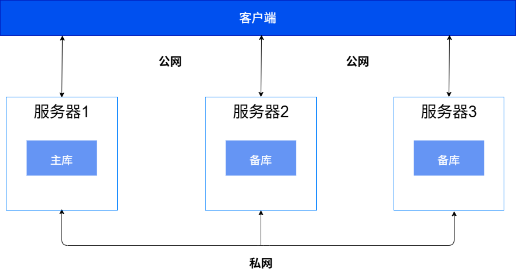
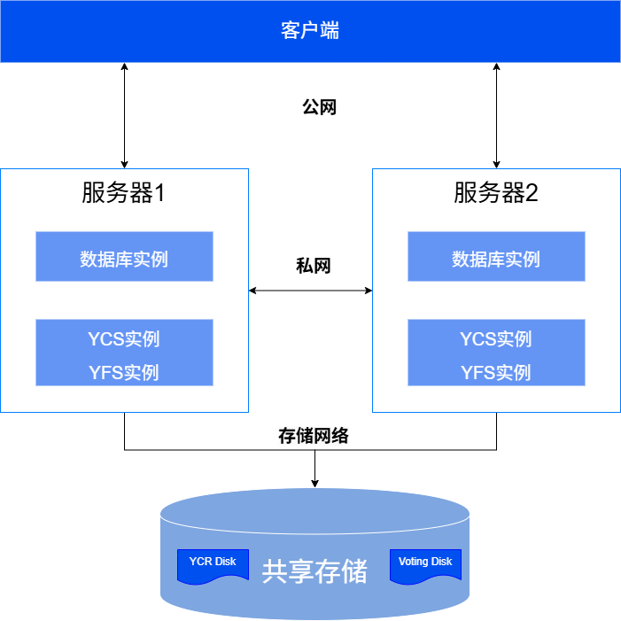
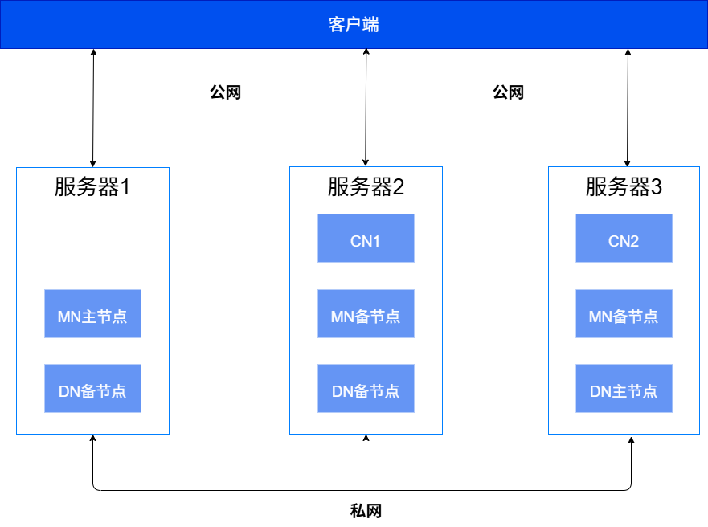

为确保应用数据的安全以及隔离来自互联网的非法命令，建议将YashanDB的组网根据功能划分为相互独立且隔离的网络。

- 公网：主要用于外部业务访问YashanDB、DBA进行数据库管理以及数据库工具进行数据库命令调用等。
- 私网：主要用于YashanDB内部通信。
- 存储网络（共享集群独有）：主要用于共享集群实例访问共享存储。

## 单机部署

单机部署的典型组网如下图所示，该组网方案以一主两备为例，主库和各个备库建议分别部署在不同的服务器上。

|  地址| 说明| 建议网段|
|--------------------|-------------|-----------------|
| LISTEN_ADDR | 用于连接数据库，对外提供数据库服务 | 公网网段        |
| REPLICATION_ADDR（主备部署时需要） | 用于主备库之间内部通信，数据库用户无法访问 仅主备部署时，需要规划该地址  | 私网网段    |

## 共享集群部署

共享集群部署的典型组网如下图所示，该组网方案以2台服务器 + 1台共享存储搭建双实例单库共享集群环境为例，实例应部署在不同服务器上。

|  地址| 说明| 建议网段|
|--------------------|-------------|-----------------|
| LISTEN_ADDR | 用于连接数据库，对外提供数据库服务 | 公网网段         |
| CLUSTER_INTERCONNECT INTER_URL REPLICATION_ADDR（主备部署时需要） | CLUSTER_INTERCONNECT用于集群内数据库实例之间通信，INTER_URL用于集群内YCS实例之间内部通信，REPLICATION_ADDR用于同组内主集群之间通信，数据库用户均无法访问 同一台服务器上的这三类地址可以采用相同IP + 不同端口号 | 私网网段    |

## 分布式部署

分布式部署的典型组网如下图所示，该组网方案以1个MN组、2个CN、1个DN组（DN组和MN组均为1主2备）为例，各组的主备节点建议分别部署在不同的服务器上。

  

|  地址| 说明| 建议网段|
|--------------------|-------------|-----------------|
| LISTEN_ADDR | CN节点的监听地址用于连接数据库，对外提供数据库服务 | 公网网段         | 
| REPLICATION_ADDR（MN/DN组内主备部署时需要） DIN_ADDR | REPLICATION_ADDR用于同组内主备节点之间通信，DIN_ADDR用于MN、CN及DN节点跨组内部通信，数据库用户均无法访问 每个节点组的端口号不同，同一台服务器上的这两类地址可以采用相同IP  | 私网网段    |
