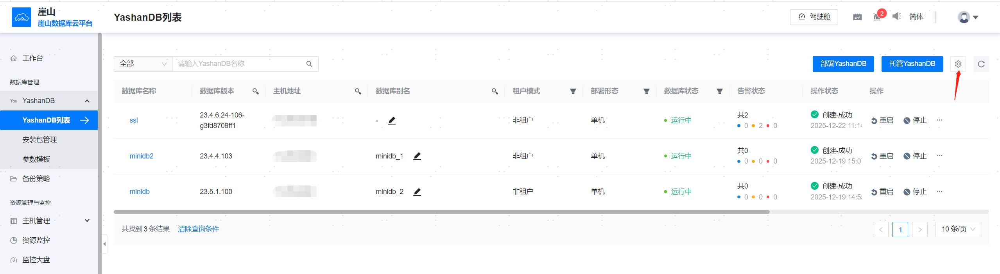
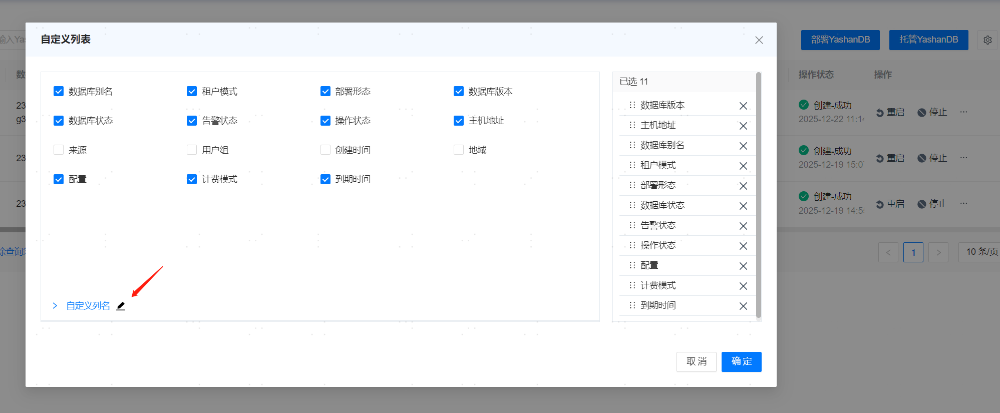
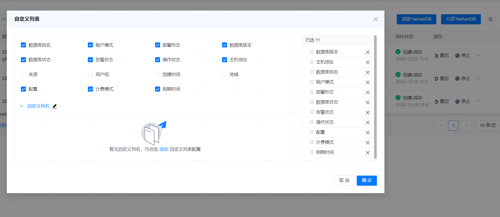
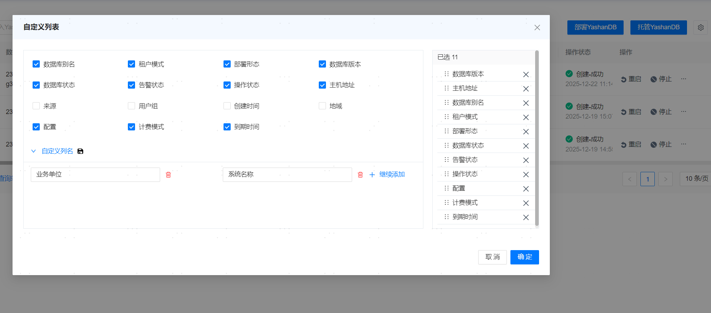
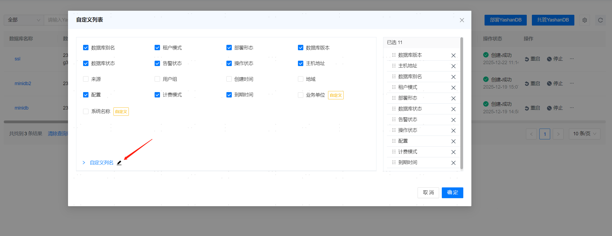
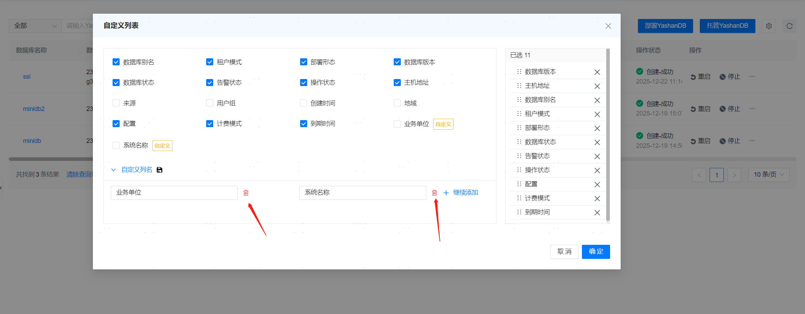
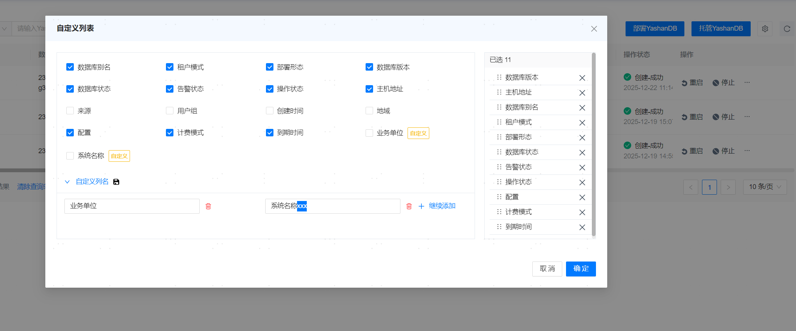
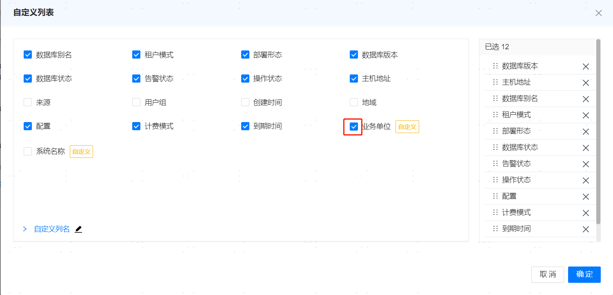
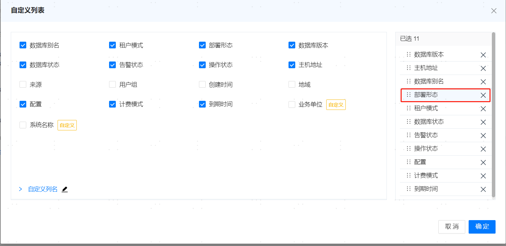
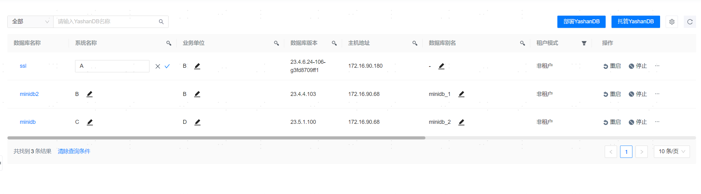

**网页路径**：【YashanDB】

**前提条件**

数据库为OPEN状态时才可进行托管。

托管数据库之前需先将数据库相关服务器添加到管理平台，保证添加主机时的[管理平台系统用户](../资源管理/服务器管理.html#user)和数据库所在的服务器用户一致。

最多支持托管10套数据库，数据库的部署规格和形态不限制。

## 托管数据库

**网页路径**：【YashanDB列表】>【托管YashanDB】

**功能介绍**

支持将yasboot部署的数据库托管到管理平台。

1. 填写YashanDB基本信息和数据库实例信息，单击【检查】。

**主要内容解释**

**【OM所在主机IP】**：必填参数，数据库中yasom所在主机IP地址。

**【数据库所在主机用户】**：必填参数，数据库中yasom所在主机的安装用户。

**【数据库名称】**：必填参数，为空时自动扫描主机上部署的数据库，有且只有一个数据库时可进行下一步托管操作。

**【数据库用户】**：必填参数，具有DBA权限的数据库用户，管理平台将自动创建YASOM用户。

**【数据库密码】**：必填参数，数据库用户密码。

**【标识名称】**：可选参数，当多个数据库名称相同可以使用标识名称托管，标识名称需要在管理平台中保持唯一性。

**【数据库别名】**：可选参数，可以用中文对数据库起别名，别名没有唯一性要求。

**【用户组】**：可选参数，绑定该数据库的[管理平台用户组](../平台运维/系统权限管理/用户组管理)，可以绑定多个。

**【运维用户名】**：管理平台的后台数据库运维用户名称，默认为YASOM用户。

为了监控运维管理托管数据库，默认授予数据库运维用户YASOM的权限有：

|  类型| 权限名称| 用途|
| -------- | -------------------------------- | -------------------------------------------------------------------- |
| 角色     | CONNECT                          | 具有CREATE SESSION权限，赋予CONNECT角色的用户能够登录会话。          |
| 角色     | SELECT_CATALOG_ROLE              | 具有访问V$、DV$与GV$视图的权限。                                        |
| 角色     | SYSDBA                           | 具有执行SHUTDOWN、备份、BUILD（包括yasrman、yasbak备份工具）的权限。 |
| 对象权限 | 视图dba_backup_set读权限         | 查询dba_backup_set视图信息。                                         |
| 对象权限 | 视图dba_data_files读权限         | 查询dba_data_files视图信息。                                         |
| 对象权限 | 视图dba_tablespaces读权限        | 查询dba_tablespaces视图信息。                                        |
| 对象权限 | 视图wrm$_database_instance读权限 | 查询wrm$_database_instance视图信息。                                   |
| 对象权限 | 视图wrm$_snapshot读权限          | 查询wrm$_snapshot视图信息。                          |
| 对象权限 | 视图unified_audi_trail读权限     | 查询unified_audi_trail视图信息。                          |
| 对象权限 | 视图auditable_system_actions读权限          | 查询auditable_system_actions视图信息。                          |

**【运维用户密码】**：可选参数，管理平台的后台数据库运维用户密码。如果YASOM用户已经存在且密码和默认密码不同时必填。

2. （可选）添加CA根证书，填写证书路径，确认无误后单击【托管YashanDB】。

> **Note**:
> 
> - 如果管理平台的后端数据库为YashanDB，且被托管到管理平台中，该数据库的部分功能受限，不支持的功能有：停止、重启、升级、卸载、备份恢复、删除表空间、主备切换、扩缩容等。
>
> - 如何生成CA根证书root.crt文件，可参考YashanDB文档：[https://doc.yashandb.com/yashandb/23.4/zh/All-Manuals/Product-Security/Encryption/Trusted-Channel/Managing-Certificates.html#getSSLCert](https://doc.yashandb.com/yashandb/23.4/zh/All-Manuals/Product-Security/Encryption/Trusted-Channel/Managing-Certificates.html#getSSLCert)
>
> 如何生成CA根证书root.crt文件，可参考YashanDB文档：[https://doc.yashandb.com/yashandb/23.4/zh/All-Manuals/Product-Security/Encryption/Trusted-Channel/Managing-Certificates.html#getSSLCert](https://doc.yashandb.com/yashandb/23.4/zh/All-Manuals/Product-Security/Encryption/Trusted-Channel/Managing-Certificates.html#getSSLCert)
>
> - 关联异地YCM后，需要两地YCM都正常运行，才能托管或者移除数据库。
> 
> 移除关联异地YCM后，以上限制消除。如果异地YCM无法正常移除，可以在本地YCM上通过yasadm强制移除。
>

## 部署数据库

### 安装包部署

**网页路径**：【安装包管理】>【部署】

**前提条件**

1. 进行[数据库安装前准备](./数据库安装前准备/00数据库安装前准备)，使操作系统具备安装部署YashanDB的环境。

2. 将主机[添加](./服务器管理)到管理平台。

仅支持使用版本号大于等于**23.2.4.100**的YashanDB安装包部署。

可编辑管理平台安装路径下的`etc/ycm.yaml`，在`supportPkgDeployMinVersion`字段配置最小可部署版本，配置完成后需重新登录管理平台。此操作可能导致部署失败，需谨慎配置。

**功能说明**

单击【部署】，填写端口，在管理平台所在机器启动OMWeb服务。

跳转到内嵌的OMWeb页面后，从管理平台中选取已添加的主机进行部署。

以分布式数据库部署为例，在OMWeb页面进行[数据库安装](./数据库安装/分布式部署)。

部署成功后，数据库会自动托管到管理平台。

> **Note**:
> 
> YashanDB从23.2.3.100开始，支持主备共享集群部署，谨以数据库版本说明为准。主备共享集群部署后，备集群的备节点处于started状态属于数据库限制，是正常现象。23.4.0.0之后，部署完备集群的备节点会开放到open状态。
>
> 管理平台的安装包部署功能未适配需要填写插件包路径的数据库版本。用该版本部署时，插件包不生效。在23.2版本中，23.2.9.100之后的安装包部署无需填写插件包路径。23.4.0.0之后的安装包也无需填写插件包路径。
>

## 数据库操作

**网页路径**：【YashanDB列表】>【操作】

**功能介绍**

添加成功数据库后，可以在YashanDB列表页查看数据库的基本信息和运行状态，并且可对整个数据库进行一系列操作：

- **重启**：重启数据库的所有实例。
- **停止**：停止数据的所有实例。
  
- **移除托管**：将数据库从管理平台解除托管，实际上不会卸载。
- **更新实例**：更新数据库实例规模：用户未通过管理平台对数据库进行扩缩容，导致数据库实例规模发生变化，可点击更新实例按钮，将新的实例规模更新到管理平台侧（不支持更新异地数据库实例规模）。
- **卸载**：卸载数据库，并从管理平台移除。
- **订阅**：订阅数据库之后，资源相关的告警消息，资源变动，任务消息都会以站内消息的形式发送给当前用户。

### 数据库升级
**网页路径**：【YashanDB列表】>【操作】>【升级】

**功能介绍**

支持将管理的数据库升级到高版本数据库，升级数据库的步骤如下：

1. 填写包括升级方式、升级版本、升级前备份等基本信息，单击【升级】。
2. 确认升级的目标版本信息无误后，单击【下一步】。
3. 对数据库升级进行预检查，检查通过后，单击【升级】。

**主要内容解释**

**【升级方式】**：必填参数，支持离线升级和滚动升级两种方式。

**【升级版本】**：必填参数，升级的目标版本，可以在安装包管理模块添加。升级版本必须大于当前版本，其中滚动升级要求前3位版本号相同，暂不支持升级到22.2版本的数据库。

**【是否执行全量checkpoint】**：是否在升级前对数据库执行全量checkpoint。执行全量checkpoint可以加快升级速度。

**【是否执行全量备份】**：是否在升级前对数据库进行全量备份。如果选择执行全量备份，需要填写以下参数。

- 存储类型：支持本地存储和远程存储两种方式，其中本地存储是保存到管理平台部署的主机上，远程存储是保存到管理平台添加的主机上。
- 存储主机IP：保存备份集的远程主机，远程存储时必填。
- 存储路径：必填参数，数据库备份集保存的路径。
- 压缩算法：可选参数，数据库备份的压缩算法。
- 压缩等级：可选参数，数据库备份的压缩算法的压缩级别。

**【数据库部署主机SSH密码】**：部署数据库的主机用户SSH密码，需要确保部署数据库所有主机用户的密码一致。如果yasom主机到数据库所有主机都配置SSH免密，该参数可以不填。

**【数据库部署主机SSH端口】**：必填参数，部署数据库的主机用户SSH端口。

**【数据库sys用户密码】**：数据库sys用户的密码。若数据库所有节点的主机安装用户配置了YASDBA用户组免密（主机用户在YASDBA用户组内），该参数为可选参数；否则为必填参数。

**【升级预检查】**：升级数据库前会进行以下检查，必须通过检查才能下发升级命令。

- 数据库实例状态检查：升级前需要确保数据库实例为OPEN状态。如果检查不通过，可以通过页面修改实例状态到OPEN。
- 服务器守护进程检查：升级前需要终止各实例所在服务器上的守护进程。如果检查不通过，可以通过页面关闭节点守护进程，升级成功后会自动开启。
- 数据库仲裁模式检查：升级前需要暂时关闭仲裁。如果检查不通过，可以通过页面关闭仲裁服务，升级成功后会自动开启。

> **Note**:
>
> - 数据库升级有离线升级和滚动升级两种方式，离线升级支持范围可参考YashanDB文档：[https://doc.yashandb.com/yashandb/23.4/zh/All-Manuals/Installation-and-Upgrade/Upgrade/Upgrade-Procedure/Offline-Upgrade.html](https://doc.yashandb.com/yashandb/23.4/zh/All-Manuals/Installation-and-Upgrade/Upgrade/Upgrade-Procedure/Offline-Upgrade.html)
>
> 滚动升级支持范围可参考YashanDB文档：[https://doc.yashandb.com/yashandb/23.4/zh/All-Manuals/Installation-and-Upgrade/Upgrade/Upgrade-Procedure/Rolling-Upgrade.html](https://doc.yashandb.com/yashandb/23.4/zh/All-Manuals/Installation-and-Upgrade/Upgrade/Upgrade-Procedure/Rolling-Upgrade.html)
>
> - 若不通过管理平台私自升级管理的数据库，管理平台后端检测到这种情况，会自动更新数据库的版本号、安装路径等相关的元数据。
>

### 数据库回滚
**网页路径**：【YashanDB列表】>【操作】>【回滚】

**功能介绍**

如果升级失败，支持将数据库回滚到升级前版本。

### 数据库自定义列配置

**网页路径**：【YashanDB列表】> 

**功能介绍**

YashanDB列表中设置的自定义字段，可以在主机列表、告警列表选择展示对应的列。

**主要操作**

**添加**：添加自定义列。

1. 单击自定义列名右侧的。

2. 提示暂无自定义列名，单击添加。

3. 输入自定义列名，单击【确定】。

**删除**：删除自定义列。

1. 所要删除的列取消勾选，然后单击自定义列名右侧的。

2. 单击。

**更新**：更新自定义列。

1. 单击自定义列名右侧的。

2. 更新自定义列名，单击【确定】。

**显示**：显示自定义列。

1. 勾选所要显示的列名。

**排序**：自定义列进行排序。

1. 鼠标选取列名，上下移动来进行排序。

**输入**：自定义列输入值。

1. 单击，输入自定义列值，单击勾号确认。

