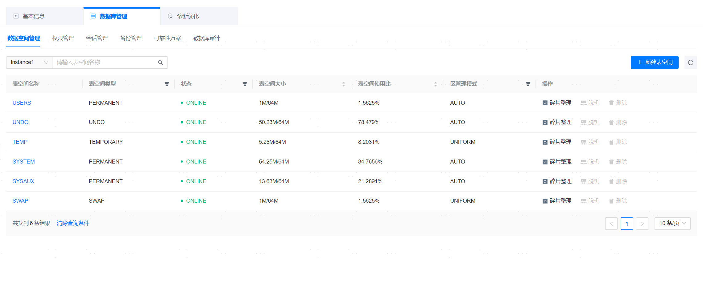
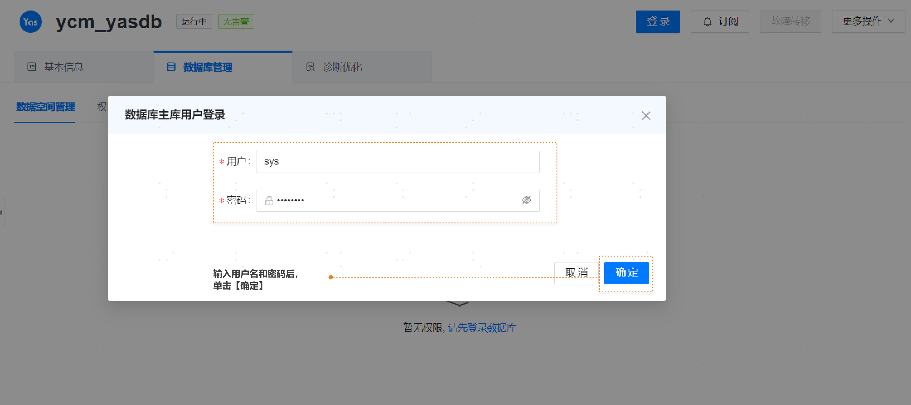
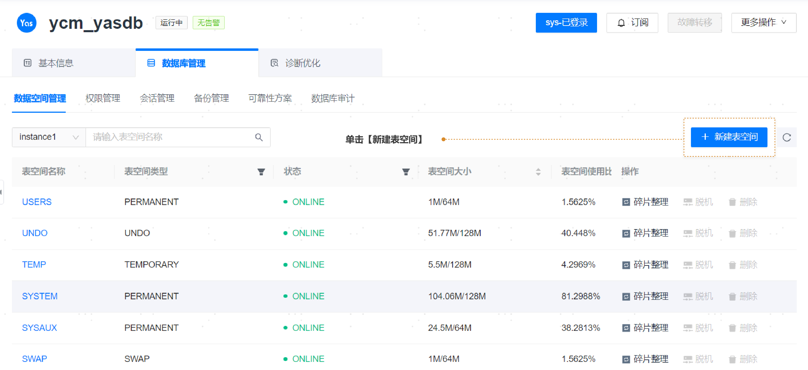
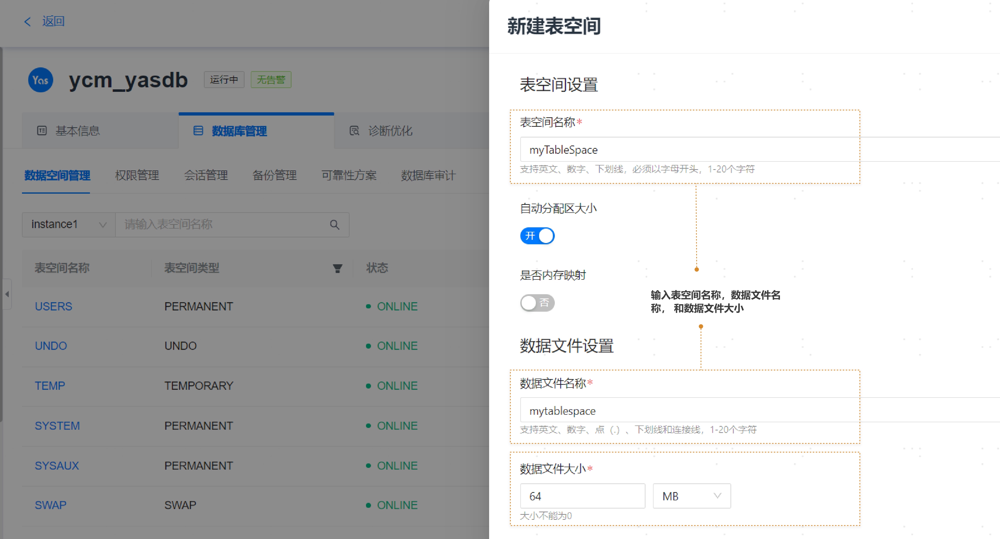

**网页路径**：【YashanDB】>【YashanDB列表】>【数据库名称】>【数据库管理】>【数据空间管理】

## 表空间管理

**功能介绍**

管理平台提供快捷管理表空间的功能，主要包括新建表空间等。

1. 请先单击 **【登录】** 按钮。

2. 输入SYS用户和密码，单击确定。

3. 单击 **【新建表空间】** 按钮。

4. 输入表空间名称和数据文件名称，单击 **【确定】** 按钮，表空间创建成功。

