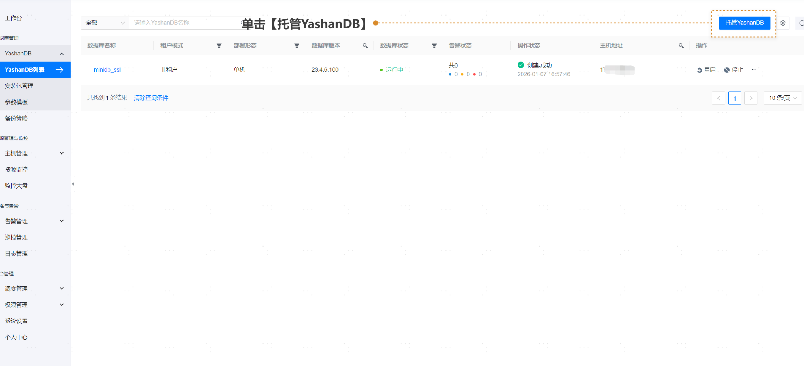
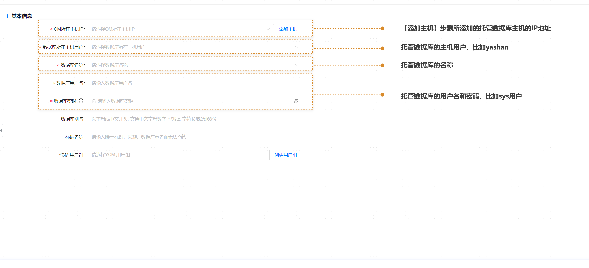
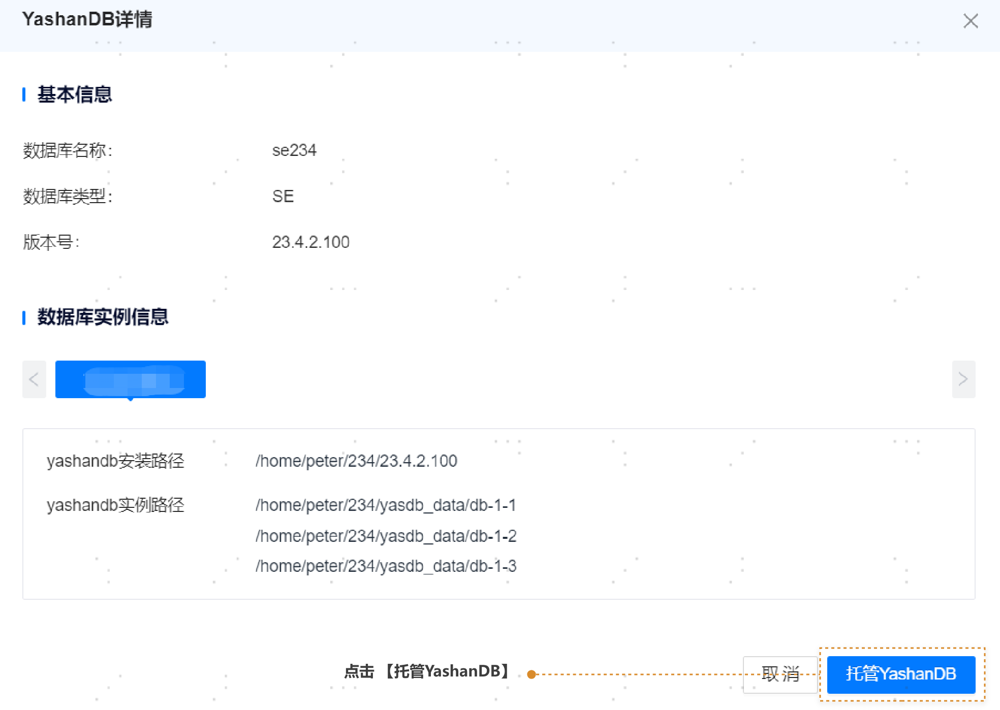

## 托管数据库

**网页路径**：【YashanDB】>【YashanDB列表】>【托管YashanDB】

**功能介绍**

支持将yasboot部署的数据库托管到管理平台，然后在管理平台对数据库服务器进行常规操作。

1. 请先单击 **【托管YashanDB】** 按钮。

2. 填写YashanDB基本信息和数据库实例信息，单击【检查】。

3. 单击 **【托管YashanDB】**，数据库托管成功。

