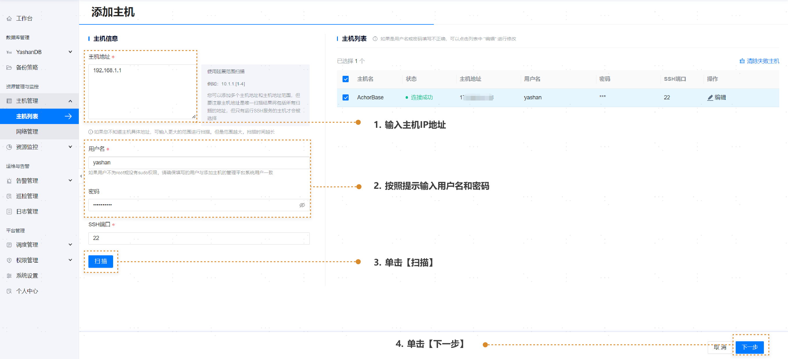
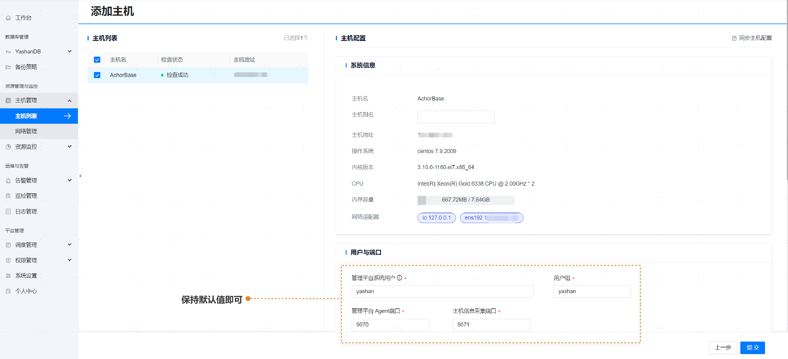
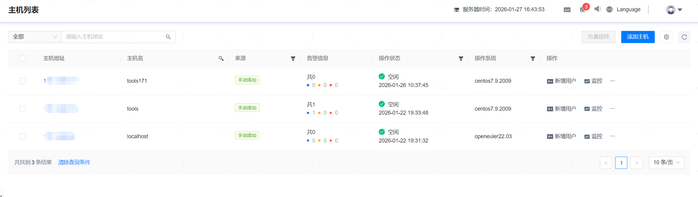

## 添加主机

**网页路径**：【主机管理】>【主机列表】>【添加主机】

**功能介绍**

管理平台支持将YashanDB主机进行统一接管和监控。添加主机步骤如下：

1. 主机列表页面单击 **【添加主机】** 按钮。

2. 填写完主机信息，单击【扫描】可展示主机是否连接成功，若连接失败可单击【编辑】修改用户名密码，也可【清除失败主机】。

3. 单击【下一步】。

4. 单击 **【提交】**，即可成功添加主机。

