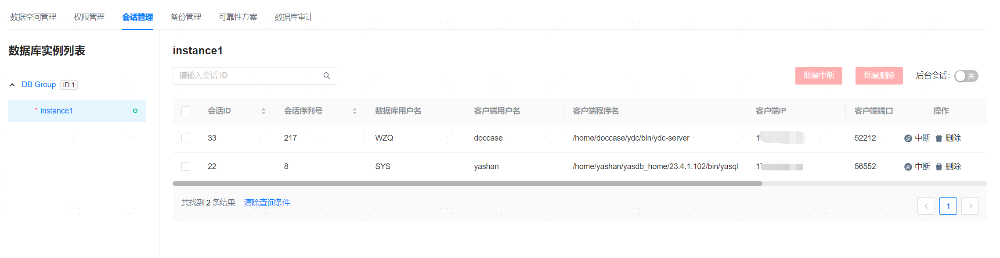

**网页路径**：【YashanDB】>【YashanDB列表】>【数据库名称】>【数据库管理】>【会话管理】

**功能介绍**

会话管理提供查看当前实例已经连接的会话信息，用户会话的删除和中断功能。

用户可切换不同数据库实例查看会话信息，可选择是否展示后台会话。

> **Note**:
>
> 数据库会话管理在分布式部署形态下有如下限制：
> - 仅支持连接分布式数据库CN实例的会话进行删除和中断操作。
> - 仅支持查询自身连接的session，不可进行删除和中断操作。

**主要内容解释**

**【中断】**：向数据库下发`alter system cancel session ?`语句（？表示绑定的会话ID参数），中断当前会话正在执行的SQL语句。

**【删除】**：向数据库下发`alter system Kill session ?`语句（？表示绑定的会话ID参数），强制停止指定的会话连接。
