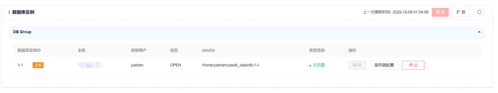
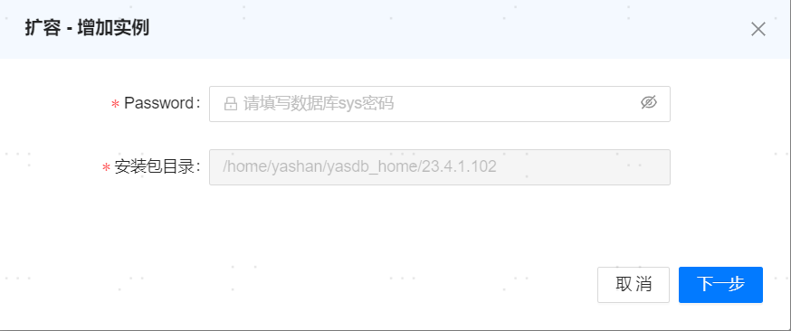
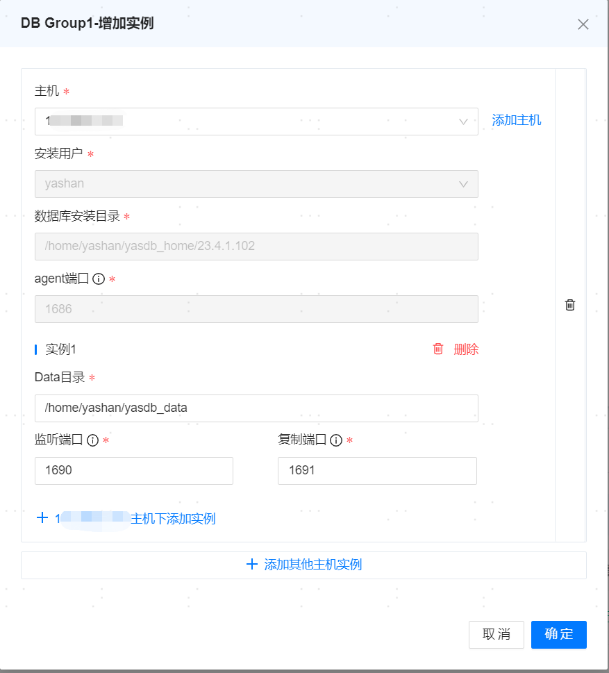
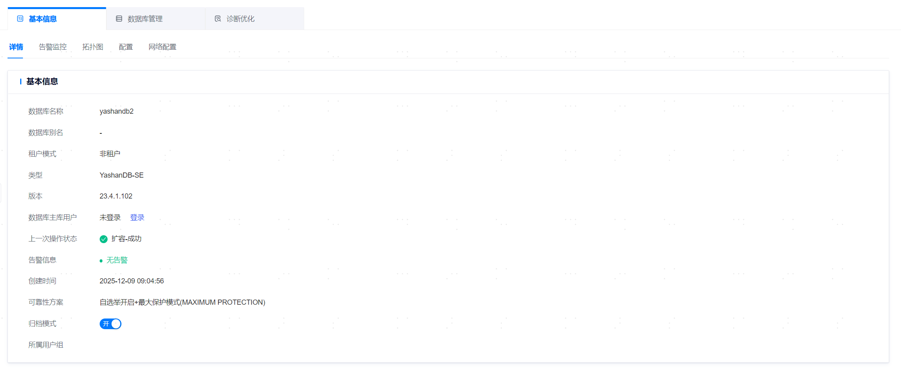
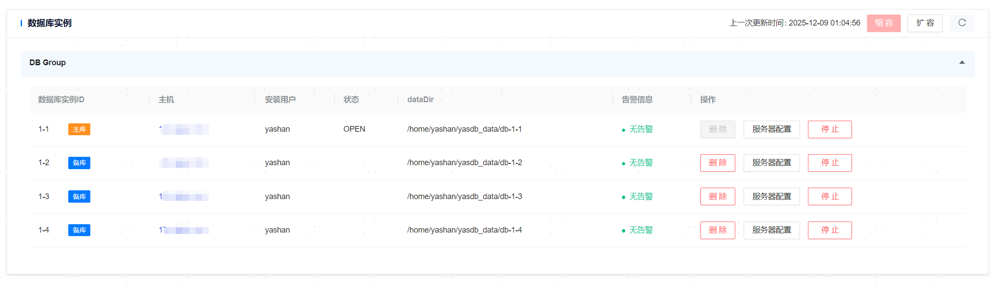
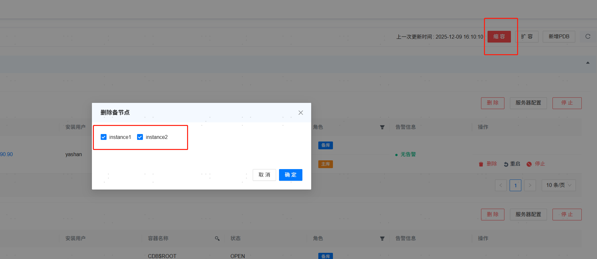

**网页路径**：【YashanDB】>【YashanDB列表】>【数据库名称】>【基本信息】>【详情】

**功能介绍**

管理平台支持查看实例的服务器配置、更新数据库实例信息、启停实例、扩容、缩容等功能。

## 扩容

**功能介绍**

该功能仅支持23.2.4.100版本及后续**单机部署**数据库，以及23.4版本以及后续版本**共享集群部署**数据库。

单机部署数据库下，支持增加数据库的备节点；共享集群部署数据库下，支持增加主group的的实例节点。若扩容节点所在主机为新主机时，没有数据库节点以及yasagent进程，可以选择不同的主机用户安装新增节点。

> **Note**：
>
> 不支持有级联备节点的单机数据库增加备节点。
>
> 单节点数据库增加备节点时，该数据库必须配置好主备消息链路监听地址参数`REPLICATION_ADDR`。
>
> 不支持将异地主机作为新增备节点的主机。
>
> 不支持增加异地数据库备节点。
>
> 若开启主备仲裁，需关闭后才能增加备节点。
>
> 共享集群目前不支持缩容，如果扩容失败，不支持将扩容失败节点删除，其残留的扩容数据可能会导致后续扩容失败。

## 步骤：增加节点

1. 在数据库实例区域，点击扩容，输入sys用户密码。确认信息无误后，单击 **[下一步]** 。

2. 选择需要增加主机的节点，单击 **[确认]**

   - 同主机增加节点。

   - 其他主机新增节点。

3. 主机添加成功，提示成功信息 。

## 缩容

**功能介绍**

该功能仅支持23.2版本及后续**单机部署**数据库。

当数据库处于最大保护模式时，如需要删除数据库所有的备节点，须在【数据库管理 > 可靠性方案】中，将数据库切为最大可用模式。

> **Note**：
>
> 仅23.4版本之后的单机数据库，若删除备节点后，原备节点所处主机上已经没有任何节点和yasom进程，管理平台会调用yasboot，在OM中移除该主机。
>
> 不支持有级联备节点的单机数据库删除备节点。
>
> 不支持删除异地数据库备节点。
>
> 若开启主备仲裁，需关闭后才能删除备节点。

## 步骤：删除节点

1. 在数据库实例区域，点击 **[缩容]**。

   - 选择需要删除节点，点击复选框。

   - 对于单个节点，也可直接点击 **[删除]**。

## 分布式数据库开关自选举

**功能介绍**

该功能仅支持23.2版本及后续**分布式部署**数据库。

分布式部署数据库下，当MN或DN组至少为一主两备的规模，且主库可用，支持开关组内自选举。

## 服务器配置

**功能介绍**

点击【服务器配置】即可查看服务器网络配置，文件路径等信息。

管理平台提供IP访问控制功能，用户可进行白名单配置，以增强数据库访问的安全性，该功能默认关闭，由用户在需要时启用。
