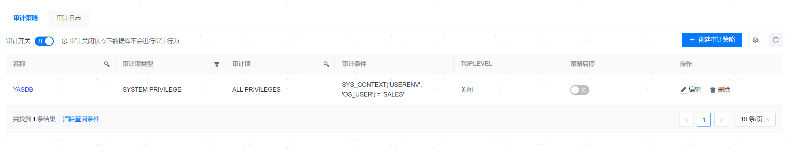
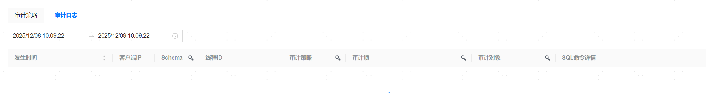

**网页路径**：【YashanDB】>【YashanDB列表】>【数据库名称】>【数据库管理】>【数据库审计】

<span id="webpath3" name="webpath3" class="yaslink"></span>
## 审计策略

**网页路径**：【审计策略】



**功能介绍**

管理平台支持创建审计策略来对数据库行为进行审计。

数据库审计的前提条件是：审计策略已开启，审计开关打开。

**主要内容解释**

**【审计策略名称】**：必填参数，支持英文、数字、下划线，以字母或者下划线开头，1-20个字符。

**【审计规则】**：必填参数，支持创建权限审计、行为审计、角色审计规则。

**【审计条件】**：可选参数，该表达式用于定义是否执行审计策略的判断条件，若条件结果为true则执行审计策略，否则不执行。

> **Note**：
>
> 审计条件为创建审计策略SQL中'WHEN'关键字后面的部分，在页面端输入两侧无需单引号，语句内部可直接使用单引号。

```sql
# sql语句
CREATE AUDIT POLICY up_SYS_CONTEXT
  ACTIONS SELECT ON sales.area
  WHEN 'SYS_CONTEXT(''USERENV'', ''OS_USER'') = ''SALES'''
  EVALUATE PER SESSION;

# 上述sql对应页面输入的审计条件为
SYS_CONTEXT('USERENV', 'OS_USER') = 'SALES'
```

**【审计条件判断频率】**：可选参数，执行一次审计条件判断的频率：STATEMENT、SESSION、INSTANCE。

- STATEMENT：关注每个SQL语句的执行，审计条件判断频率与SQL语句的执行频率一致。
- SESSION：关注会话期间的操作，审计条件判断频率依赖于会话中SQL语句的执行频率，但可能采用汇总或简化的方式记录。
- INSTANCE：关注数据库实例的整体状况，审计条件判断频率可能较低，依赖于特定的时间间隔或触发事件。

**【TOPLEVEL】**：可选参数，是否对内部语句进行审计。

## 审计日志

**网页路径**：【审计日志】



**功能介绍**

管理平台支持查看根据审计策略运行的审计日志。

审计项不支持中文搜索。

审计对象不支持schema搜索。
