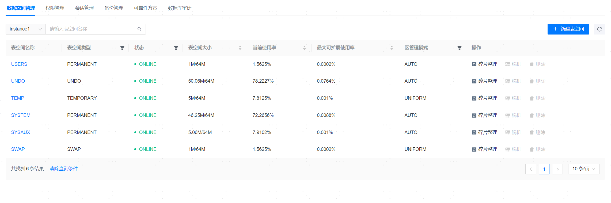

**网页路径**：【YashanDB】>【YashanDB列表】>【数据库名称】>【数据库管理】>【数据空间管理】

## 表空间管理

**功能介绍**

管理平台提供快捷管理表空间的功能，主要包括新建表空间、碎片整理和脱机等。

数据桶管理不支持**22.2版本单机部署**的数据库。

碎片整理可减少表空间所占用的物理存储空间，从而释放未使用的空间或优化存储布局。支持指定碎片整理的目标大小。

脱机可将指定的表空间设置为离线状态。表空间离线后，其中的表和索引将不再可用，直到表空间恢复为在线状态。不可对默认表空间进行脱机操作。

**主要内容解释**

**【表空间名称】**：单击即可查看表空间基本信息、数据文件列表和数据桶列表。支持修改数据桶的读写模式。

**【区管理模式】**：AUTO（数据库自动决定每个区的大小）、UNIFORM（需管理员显式指定每个区的大小）。

## 表空间集管理

**功能介绍**

仅**分布式部署**才存在表空间集。

管理平台提供快捷管理表集空间的功能，其主要功能包括：新建表空间集、添加数据桶等。

**主要内容解释**

**【表空间集名称】**：单击即可查看表空间集的基本信息和数据桶列表。
