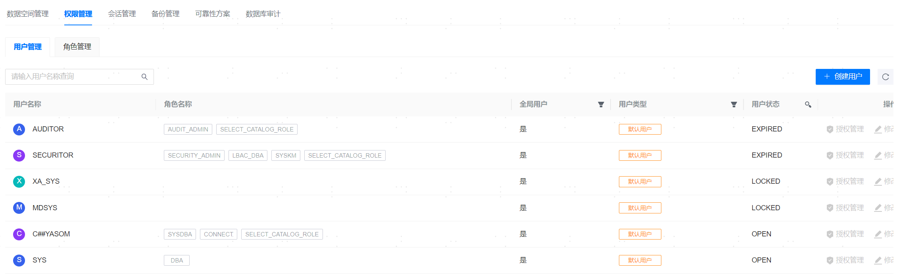
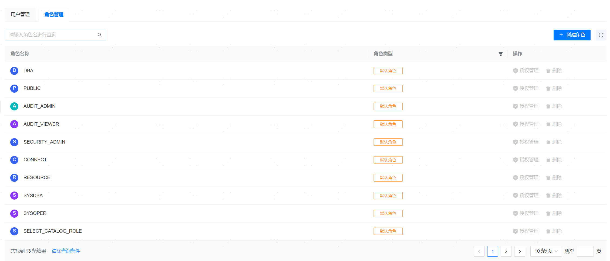

**网页路径**：【YashanDB】>【YashanDB列表】>【数据库名称】>【数据库管理】>【权限管理】

## 用户管理

**网页路径**：【用户管理】

**功能介绍**

用户管理您可进行数据库用户创建、授权管理、密码修改等操作。

授权管理可以对用户的角色和权限进行修改，最终权限是角色权限和用户自身权限的合集。

**主要内容解释**

**【用户】**：必填参数，支持英文、数字、下划线，必须以字母开头，取值范围为[1,64]。与YashanDB在用户创建上的行为完全一致，表现为：

- 如果用户名输入一个小写的aa，创建成功后为AA。
- 如果用户名输入"aa"，创建成功后为aa。

**【密码】**：必填参数，取值范围为[1,64]。

## 角色管理

**网页路径**：【角色管理】

**功能介绍**

角色管理您可进行数据库角色创建、授权管理等操作。

授权管理可以对角色所包含的权限进行修改。

**主要内容解释**

**【角色名称】**：必填参数，取值范围为[1,64]。与YashanDB在角色创建上的行为完全一致，表现为：

- 如果输入一个小写的aa，创建成功后为AA。
- 如果输入"aa"，创建成功后为aa。

**【设置权限】**：可选参数，可对角色赋予系统级或对象级权限。
