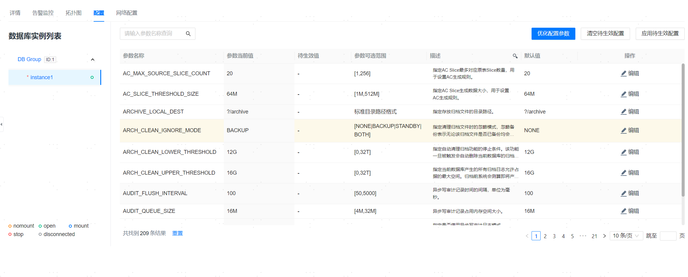

**网页路径**：【YashanDB】>【YashanDB列表】>【数据库名称】>【基本信息】>【配置】

## 编辑配置项

**网页路径**：【编辑】

**功能介绍**

单击配置项列表【编辑】，即可修改当前数据库配置项信息，管理平台对配置项信息的修改分为两种：

- 仅保存：将配置项的修改保存，在未来的时间点可以单击【应用待生效配置】应用到数据库
- 保存并生效：将配置项修改信息立马应用到数据库

两种修改行为都可以选择不同的同步方式将本实例的配置项修改应用到其他实例，同步方式主要有以下几种：

- 仅应用到本实例
- 同步到所有的DB实例

## 优化配置参数

**网页路径**：【优化配置参数】

**功能介绍**

数据库可以根据传入的变量，生成符合业务类型和系统资源状况的配置参数，即推荐参数。

支持生成、展示、筛选和应用此推荐参数。

必须使用拥有ALTER SYSTEM权限的用户登录数据库。

## 清空待生效配置

**网页路径**：【清空待生效配置】

**功能介绍**

单击【清空待生效配置】可以将所有未生效的配置项一起清空。

## 应用待生效配置

**网页路径**：【应用待生效配置】

**功能介绍**

单击【应用待生效配置】可以将所有未生效的配置项一起应用到数据库。

> **Note**：
>
> 同时配置多个参数，若参数之间有数值依赖关系则可能导致修改失败，请根据报错信息合理配置参数值或分批修改。
