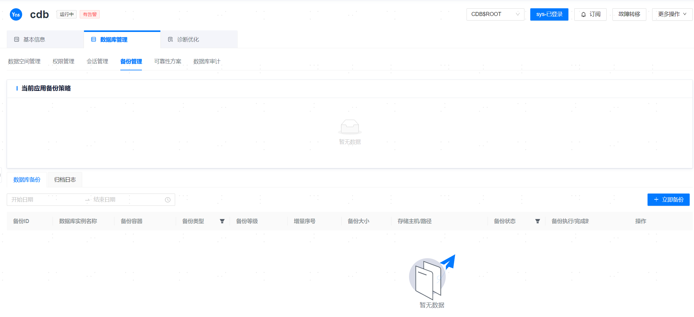

**网页路径**：【YashanDB】>【YashanDB列表】>【数据库名称】>【数据库管理】>【备份管理】

## 立即备份

**网页路径**：【立即备份】

**功能介绍**

管理平台提供对数据库、表空间、归档日志立即备份的功能。支持租户与非租户的数据库备份、表空间备份、归档日志备份，其中表空间备份仅支持PDB级别备份。如需使用该功能需确保：

- 备份时，数据库所在的服务器上的ycm-agent需要对用户填写的存储路径有读写权限，否则将备份失败。
- 数据库所在服务器与存储备份集的服务器的CPU架构相同。

**主要内容解释**

**备份对象**：备份对象分为数据库、表空间以及归档日志。

**备份类型**：根据不同的备份对象，其支持的备份类型如下：

**数据库备份类型**：数据库备份分为全量备份和增量备份两种，其中增量备份又分为普通增量备份和累积增量备份。

- 全量备份都是LEVEL 0备份。
- 增量备份有LEVEL 0和LEVEL 1两个级别：
  - LEVEL 0增量备份作为后续所有LEVEL 1增量备份的基线。LEVEL 0增量备份本质上也是一种全量备份，但是在备份概要文件中添加了与全量备份区分的物理标识。
  - LEVEL 1增量备份只备份自上次执行增量备份以后系统产生的增量数据，相较于全量备份，增量备份数据量不大，能节省磁盘空间，恢复所需时间短。LEVEL 1的普通增量备份或累积增量备份，其对应的LEVEL 0增量备份可以是普通增量备份也可以是累积增量备份。
- YashanDB支持1000次连续LEVEL 1增量备份，考虑到备份集的可维护性与存储资源使用，不建议连续多次LEVEL 1增量备份。

**表空间备份类型**：表空间备份仅支持全量备份。

**归档日志备份类型** ：归档日志备份支持全量备份、按照指定归档日志的SCN范围备份、以及按照指定归档日志的时间范围备份。

**【开始时间】**：立即备份提供了单次备份任务的下发功能，单次备份任务分为立即执行的备份任务和稍后一段时间执行的备份任务。稍后一段时间执行的备份任务会在[作业管理](../../平台管理/平台运维/调度管理/作业管理)中添加一条未运行的备份单次作业，作业完成后该作业永久失效。

> **Note**:
>
> 将备份文件保存到管理的主机，且该主机是多用户时，需要确保`ycm-agent`安装用户对备份存储路径有读写权限。
>
> 表空间备份仅支持23.4及以后版本的单机数据库。
>
> 若登录用户为PDB，只能看到当前PDB的备份策略和备份集。

> **Warn**:
>
> 请不要在数据库执行备份的过程中卸载数据库，否则可能遇到下述问题。
>
> 23.2之后的单机数据库，备份过程中，网络问题或者yasrman被误删等异常情况会导致yasrman获取失败。备份任务报错可能包含：`bin/yasrman: No such file or directory`。若出现此错误，为了不影响后续备份，请到相应路径下清理yasrman目录。
>
> 如果备份时选择了本地存储，请删除管理平台安装目录下的`yasrman/数据库版本号`目录。
> 如果备份时选择了其他主机，请删除`ycm-agent`安装目录下的`yasrman/数据库版本号`目录。
> 删除后，请对这个数据库再次备份，以确保该机器正确获取了完整的yasrman和lib库。

## 恢复

**网页路径**：【恢复】

**功能介绍**

备份管理提供对当前数据库、表空间恢复的能力。

仅对于**单机数据库**，支持使用其他单机数据库的备份恢复，恢复成功后，需要根据实际情况修改数据库配置，并且此数据库的旧备份将无法用于恢复。

> **Warn**：
>
> 对数据库执行恢复是高危操作，除了对数据库自身的影响外，还会打断管理平台中的其他正在执行的任务。请慎重决定是否要恢复数据库。

**主要内容解释**

**【开始时间】**：单次恢复任务分为立即执行的恢复任务和稍后一段时间执行的恢复任务。稍后一段时间执行的恢复任务，会在[作业管理](../../平台管理/平台运维/调度管理/作业管理)中新增一条单次执行的恢复作业，作业执行完成之后，永久失效。

> **Note**:
>
> YashanDB不支持跨版本恢复备份，如果需要跨版本恢复，请先恢复到相同版本数据库，再升级数据库。
>
> 恢复前管理平台会预估所需的磁盘空间并判断当前空间是否足够。预估空间仅供参考，如果提示当前空间不足，需要操作人员评估并确认是否继续恢复。

**【数据恢复路径】**：23.4以后，部分部署形态支持指定路径恢复。注意，CTRL文件和归档日志文件均恢复至默认数据路径。

对于单机级联备数据库，由于数据复制链路不对称，存在部分节点，被选为恢复实例时，会使得另外一部分实例无法被恢复到正常状态，所有将此类节点从可选列表中置灰。

|  数据库部署形态| 支持指定的路径粒度|
| ------------ | ------------|
| 单机 | YASDB_DATA（全部数据恢复路径）、REDO、具体表空间路径|
| 分布式 | YASDB_DATA（全部数据恢复路径）|
| 共享集群 | YFS中，全部数据恢复路径、REDO、具体表空间路径 |

> **Warn**：
>
>  指定路径恢复场景，目前尚未提供磁盘空间检查，请自行确认。
>
>  指定路径恢复后的数据库，扩容会失败并产生残留，恢复后请勿扩容。
>
>  指定路径恢复后，卸载无法清理默认数据路径外的文件。

**数据库恢复相关选项**

**【恢复到】**：单机部署模式允许用户指定恢复实例，分布式部署模式默认恢复所有实例，共享集群部署模式会自动选择实例进行恢复。

- 恢复到LEVEL 0备份（全量备份、普通增量备份、累积增量备份）只需要当前备份文件集。

- 恢复到LEVEL 1累积增量备份，需要当前累积增量备份集和其对应的LEVEL 0增量备份集，该LEVEL 0增量备份集可以是普通增量备份也可以是累积增量备份。

- 恢复到LEVEL 1普通增量备份，需要一组增量备份文件，从LEVEL 0增量备份开始有序恢复。这一组增量备份可以包含普通增量也可以包含累积增量备份。

> **Note**:
>
> 恢复到LEVEL 1的增量备份，需要先恢复到其基线备份。LEVEL 1普通增量备份的基线备份是上一次增量备份（普通增量或累计增量），LEVEL 1累积增量备份的基线备份是上一次LEVEL 0增量备份。
>
> 恢复前管理平台会预估所需的磁盘空间并判断当前空间是否足够。预估空间仅供参考，如果提示当前空间不足，需要操作人员评估并确认是否继续恢复。
>
> 对同一个备份集进行多次恢复，可能会导致归档文件不可用， 报错“cannot recover to a consistent status”，此时需要用命令行进入数据库服务器，手动进行删除归档恢复。

**【恢复方式】**：分为以下三种恢复方式：

- 完整恢复：恢复前，删除目标数据库的归档日志文件，恢复到数据库的备份时间点，属于完全恢复。
- 归档恢复：保留目标数据库的归档日志文件，恢复时会尽可能回放归档日志，恢复到数据库的当前时间，属于完全恢复。
- 基于时间点的恢复（PITR）：该方式同样会保留目标数据库的归档日志文件，为指定时间点恢复，属于不完全恢复。分布式无法使用PITR。
