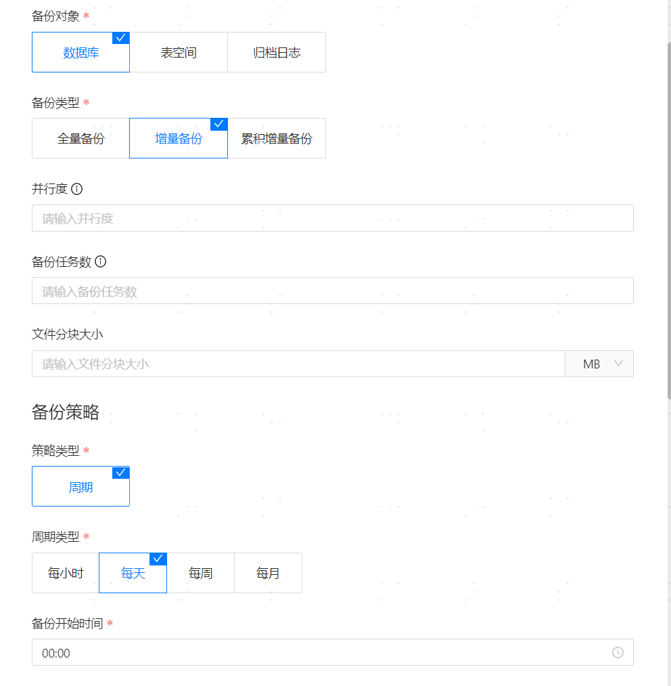
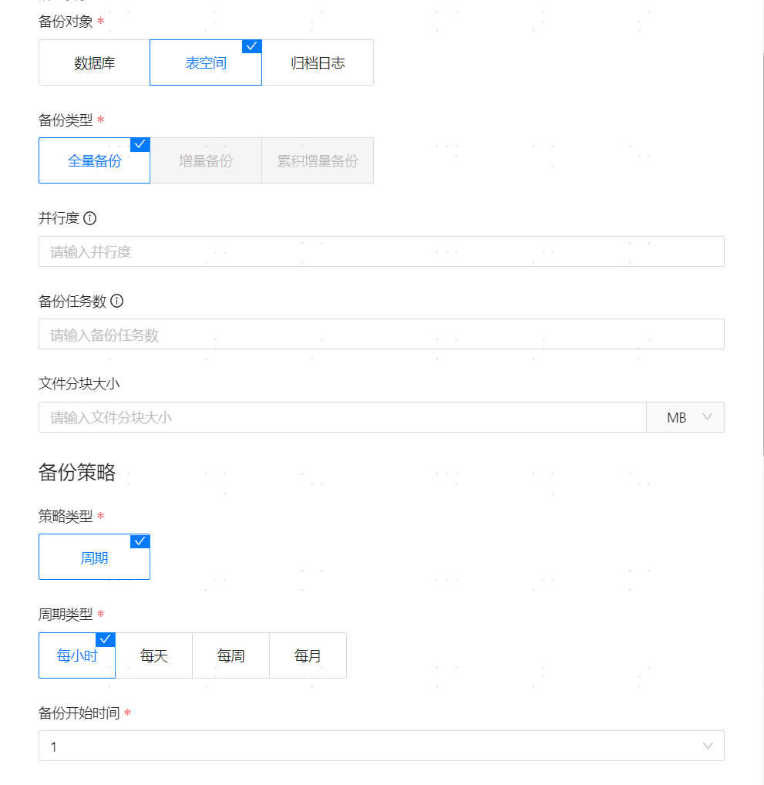
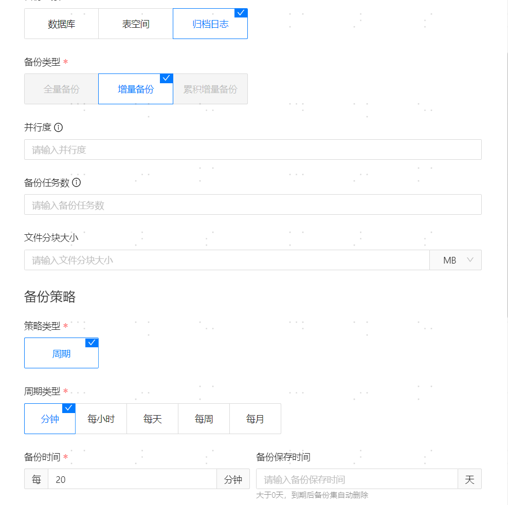
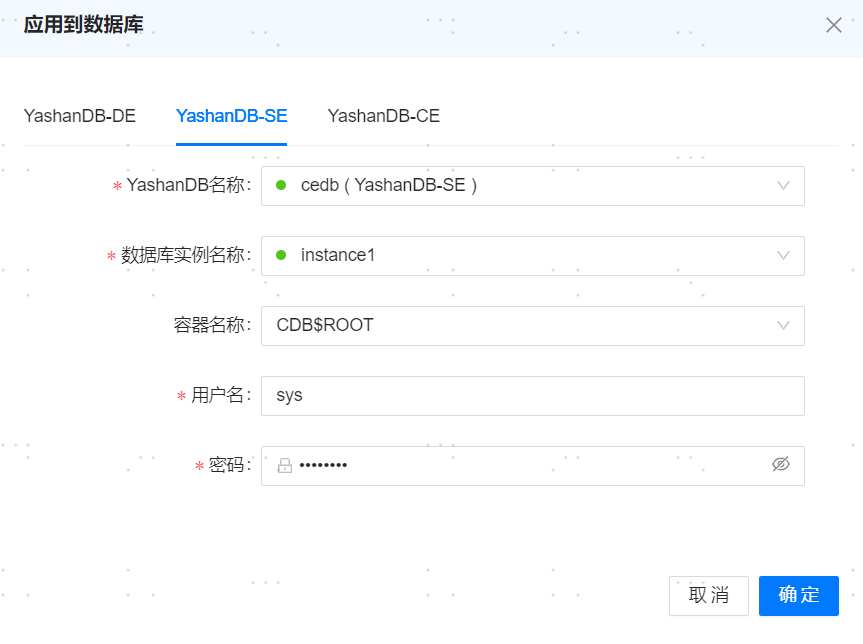

**网页路径**：【备份策略】


<span id="webpath5" name="webpath5" class="yaslink"></span>
## 新增备份策略

**网页路径**：【新增备份策略】

**功能介绍**

数据库备份策略是确保数据安全性、完整性和可恢复性的重要措施，制定备份策略，旨在应对各种潜在的数据丢失风险，及时为YashanDB创建备份，能够迅速且有效地恢复数据库到正常状态。

**主要内容解释**

**【策略名称】**：必填参数，长度不超过32字符。

**【备份对象】**：必填参数，备份对象分为数据库、表空间和归档日志。

**【备份类型】**：必填参数，全量/增量/累积增量。

**【并行度】**：可选参数，针对一次备份任务设置的线程数。

**【备份任务数】**：可选参数，该备份策略下最多允许同时并行多少个备份任务。

**【文件分块大小】**：可选参数，备份任务会分为多个小块，每块的文件大小。

**【策略类型】**：必填参数，默认是周期类型。

**【周期类型】**：必填参数，每小时/每天/每周/每月/分钟。其中分钟周期只支持归档日志备份。

**【备份时间】**：分钟周期时该参数必填，相邻两次备份的分钟间隔时间。

**【具体某天】**：必填参数，针对每周或每月的周期类型，需选择具体的某一天。

**【备份开始时间】**：必填参数，到达指定备份日期后，触发备份操作的时间点。

**【备份保存时间】**：可选参数，备份到达指定时间后，触发删除操作。

**【最大备份数量】**：可选参数，单个数据库所能允许的最大备份数量，当备份数量达到该值时默认删除最旧的备份集。

**【存储类型】**：必填参数，提供本地存储和其他主机存储两种不同的备份存储方式，**必须保证管理平台安装用户有该路径的访问权限**。

**【存储路径】**：必填参数，本机或者远程主机保存备份文件的路径。

**【备份压缩算法】**：支持使用ZSTD、LZ4两种压缩算法。ZSTD可以提供更高的压缩率，减少备份文件大小。LZ4可以提供更高的压缩速率，降低压缩时间。

**【备份压缩等级】**：ZSTD和LZ4压缩算法都提供低、中、高三种压缩等级，用于在压缩速度和压缩比之间进行灵活的平衡。压缩等级越高，在压缩时需要更多的内存和空间。推荐使用低级。

**【文件tar打包】**：支持不打包、仅打包和打包并压缩三种方式，默认为仅打包。22.2版本的单机和共享集群，以及所有版本的分布式支持仅打包和打包并压缩两种方式。

**【备份前switch logfile】**：归档日志备份前，是否执行`ALTER SYSTEM SWITCH LOGFILE;`语句，进行在线日志切换。

> **Note**:
>
> - 备份时，数据库所在的服务器上的ycm-agent需要对用户填写的存储路径有读写权限，否则将备份失败。
> - 不允许数据库所在服务器与存储备份集的主机的CPU架构不同。
> - 表空间备份策略所应用的表空间，在【应用到数据库】时指定。每个表空间都会生成一个单独的备份，并计入备份数量，请合理指定最大备份数量。
> - 表空间备份策略仅支持23.4及以后版本的单机数据库。
> - 归档日志备份只支持增量备份。在备份策略应用到节点后，第一次执行全量备份；后续备份从该备份策略产生的备份集中的最大SCN为起点SCN，终点SCN为当前数据库已存在的最大归档文件中的最后一条日志，进行增量备份。
> - 表空间备份策略仅支持23.4版本以及之后的单机数据库。
> - 归档日志备份策略仅支持23.2版本以及之后的单机和共享集群部署。

## 备份策略示例
### 数据库周日全量备份


### 数据库每天增量备份


### 表空间每天全量备份


### 归档日志分钟间隔增量备份


<span id="webpath76" name="webpath76" class="yaslink"></span>
## 应用到数据库

**网页路径**：【应用到数据库】

**功能介绍**

将备份策略应用到某个具体的数据库，应用成功后会在作业管理里边添加一条备份的周期性作业，该数据库也会按照策略进行周期性备份。

**主要内容解释**

**应用到数据库**：可将备份策略应用到YashanDB数据库，应用完成后会新增一条周期性的备份作业，可进入[作业管理](../../平台管理/平台运维/调度管理/作业管理)查看新增的作业。

> **Note**:
>
> 数据库用户需要同时拥有以下角色和权限。
>
>    ```sql
>    -- 以用户USER_XXX为例
>    SQL> GRANT CONNECT TO USER_XXX;
>    GRANT SELECT ON SYS.DBA_ROLE_PRIVS TO USER_XXX;
>    GRANT SELECT_CATALOG_ROLE TO USER_XXX;
>    GRANT SYSBACKUP TO USER_XXX;
>    ```



**【解绑】**：取消策略在某个数据库上的应用，同时会失效对应数据库相关的周期性备份作业。
