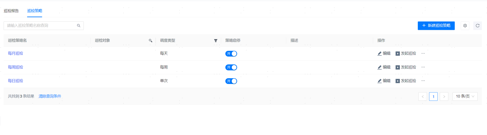

**网页路径**：【巡检管理】

## 巡检策略

**网页路径**：【巡检策略】

**功能介绍**

管理平台支持配置巡检策略，启停策略，对数据库按需定时发起巡检，诊断数据库存在的问题，代替人工的日常巡检，减轻运维人员的工作量。

**主要内容解释**

**【策略名称】**：必填参数，最多60个字符。

**【策略备注】**：可选参数，最多输入200个字符。

**【巡检对象】**：必填参数，已托管的数据库。若选择多个数据库，则要求已选择的数据库有相同的数据库用户和密码。

**【用户名】**：必填参数，数据库用户名。

**【密码】**：必填参数，数据库用户名密码。

**【周期类型】**：必填参数，单次/每天/每周/每月。

**【开始时间】**：必填参数，巡检开始时间。

**【异常事件匹配时间】**：选填参数，检查错误日志和异常事件的匹配时间，默认30天。

**【通知对象】**：可选参数，可前往[系统联系人](../../平台管理/系统设置/平台信息设置/系统联系人)添加通知对象。若邮件服务未启用，则已选的通知对象收不到邮件通知，可前往[通知服务设置](../../平台管理/系统设置/平台信息设置/通知服务设置)进行配置。

> **Note**:
>
> 若选择多个巡检对象，但其用户名密码不一致，创建巡检策略会失败。

## 巡检报告

**网页路径**：【巡检报告】

**功能介绍**

巡检从数据库安全性、稳定性、可用性、性能分析、容量分析五个模块来检查和评估数据库的健康情况，对存在的风险进行汇总，生成一份详细的巡检报告，巡检报告能够展示各个PDB的资源使用情况。支持在线查看和下载巡检报告。

巡检信息和报告可通过邮件及时推送给DBA等运维人员。

**主要内容解释**

**【巡检报告ID】**：单击即可查看详细的巡检报告。巡检报告详细内容如下：

- 基本信息：展示数据库名称、类型、状态等基础信息。
- 健康巡检结果：
  - 数据库健康总览：健康 `[95,100)`，亚健康 `[80,95)`、警告 `[60,80)`、严重 `[0,60)`。
  - 健康风险模型：针对安全、稳定、可用性、性能、容量五方面进行风险分析。
  - 风险汇总：展示健康等级、类别及巡检风险指标项。
  - 详细情况：针对安全、稳定、高可用、性能分析、容量分析、ADR报告等方面展示数据库详细情况。
