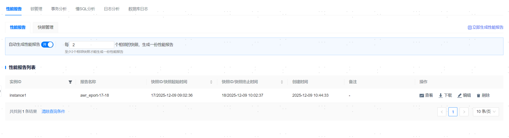
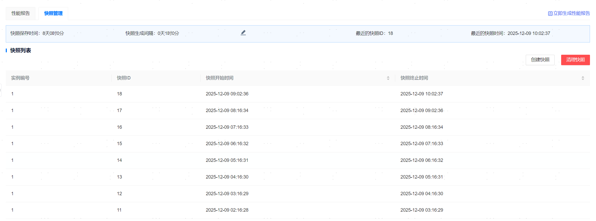

**网页路径**：【YashanDB】>【YashanDB列表】>【数据库名称】>【诊断优化】>【性能报告】

## 性能报告

**网页路径**：【性能报告】

**功能介绍**

性能报告用于收集关于YashanDB操作统计信息和其他统计信息。管理平台提供了自动生成性能报告和立即生成性能报告的功能。

**主要内容解释**

**【自动生成性能报告】**：修改自动生成报告的快照间隔（必须>=2），单击【自动生成性能报告】，即可开启自动生成性能报告功能。

**【立即生成性能报告】**：选择快照的起始ID和快照的终止ID后，单击【确定】，即可立即生成性能报告。

> **Note**:
>
> 为保证性能报告的准确性，YashanDB要求**快照起始ID和快照结束ID之间不能有重启，停止**等操作，如果有如上操作，会导致生成性能报告任务失败。
>
> 每次周期轮询检测快照最多只会生成对应并行度的性能报告数，配置可参考[性能报告配置](./../../平台管理/系统设置/资源信息设置/平台配置参数管理)。

## 快照管理

**网页路径**：【快照管理】

**功能介绍**

管理平台提供快捷生成快照功能，为YashanDB所有重要统计信息和负载信息执行一次快照，以及修改快照保存时间、快照生成间隔、清理快照和查看所有快照的功能。

快照是YashanDB用来存储某一瞬间数据库的CPU使用、内存使用、I/O读写等状态，YashanDB每间隔一个小时就会生成一份快照。

**主要内容解释**

**【快照保存时间】**：默认值为8天，取值范围为[1,36500]天。

**【快照生成间隔】**：默认值为60分钟，取值范围为[10,52560000]分钟。

**【创建快照】**：单击即可创建一份快照。

**【清理快照】**：一次性清除所有快照。
