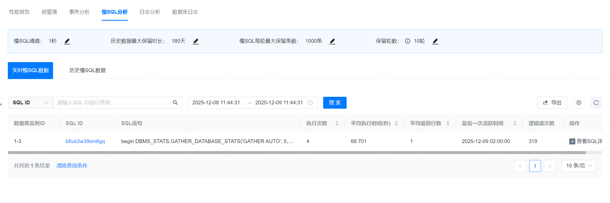
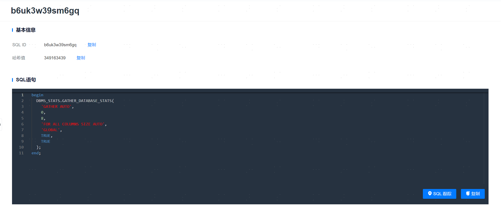
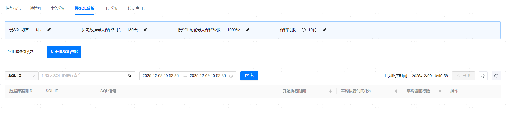

**网页路径**：【YashanDB】>【YashanDB列表】>【数据库名称】>【诊断优化】>【慢SQL分析】

## 实时慢SQL数据

**网页路径**：【实时慢SQL数据】

**功能介绍**

实时慢SQL数据指的是当前在数据库查询中执行时间过长的SQL语句。管理平台针对此类SQL提供SQL分析、SQL跟踪，一键导出为csv文件的功能。

分布式还支持查看该条SQL语句在DN的执行情况。

### 实时慢SQL详情

**网页路径**：【实时慢SQL数据】>【查看SQL详情】

**功能介绍**

查看SQL详情展示基本信息、慢SQL语句、SQL游标信息以及SQL执行计划。可进行复制或SQL跟踪操作，SQL跟踪会重新执行一遍SQL，展示AUTORACE执行结果并打印执行计划。

**主要内容解释**

**【基本信息】**：包含SQL ID和哈希值。

**【SQL语句】**：展示SQL文本信息。

**【SQL跟踪】**：SQL跟踪会重新执行一遍SQL，展示AUTORACE执行结果并打印执行计划。

**【SQL游标信息】**：展示该条SQL的子游标信息。

**【SQL执行计划】**：展示该条SQL的执行计划信息。

**【Outline管理】**：展示该条SQL的outline相关信息，支持outline的开关、创建、编辑、删除、绑定、解绑和查看近30天绑定记录。

**【SQL优化建议】**：展示该条SQL的优化建议列表，目前仅支持索引推荐类型。

> **Note**:
>
> Outline管理仅支持绑定SQL_ID类型的outline，仅支持yashandb-23.2.9.100及以上版本。
>
> SQL优化建议中索引推荐暂不支持表连接类型SQL，支持普通索引和组合索引的推荐。

## 历史慢SQL数据

**网页路径**：【历史慢SQL数据】

**功能介绍**

历史慢SQL数据指的是管理平台定时收集数据库的历史慢SQL语句。管理平台对历史慢SQL提供SQL详情查看，一键导出为csv文件的功能。

## 慢SQL配置

**功能介绍**

慢SQL配置展示了数据库慢SQL相关配置，用户能够修改数据库慢SQL展示和保存策略的相关配置。

**主要内容解释**

**【慢SQL阈值】**：展示SQL列表的最小执行时间，默认值为1秒。

**【历史数据最大保留时长】**：慢SQL数据保留时长，默认值为180天。

**【慢SQL每轮最大保留条数】**：慢SQL每轮最大保留条数，默认值为1000条。

**【保留轮数】**：慢SQL保留的轮数，数据库实例每重启一次为一轮，默认值为10轮。 
