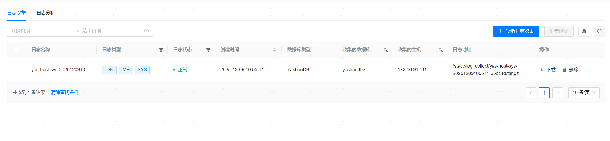
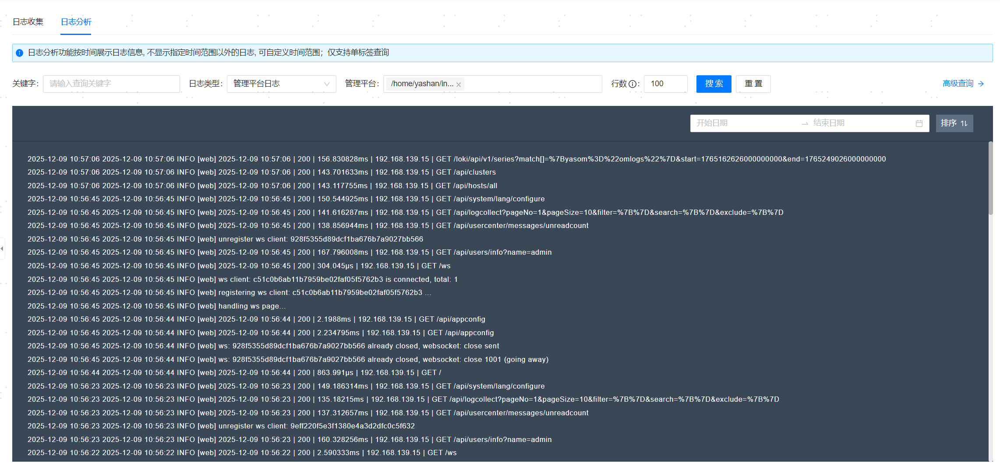
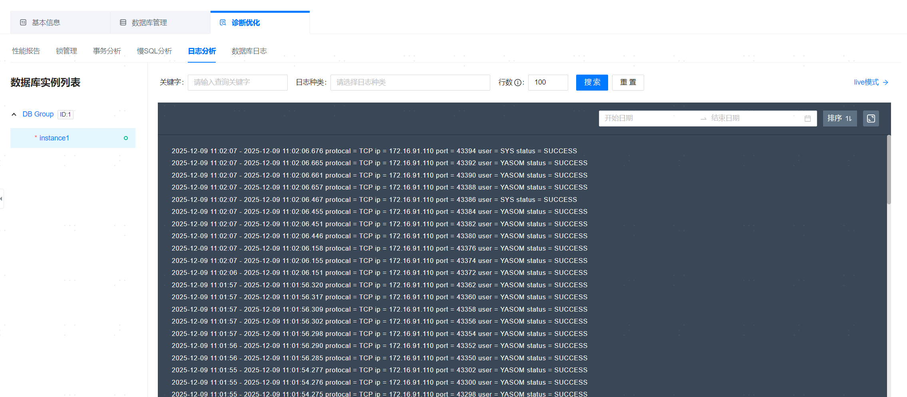
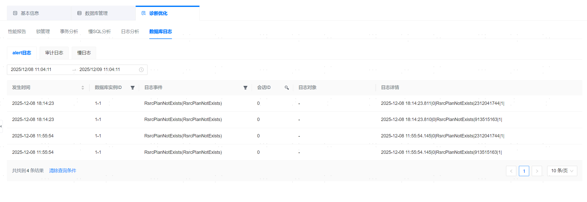
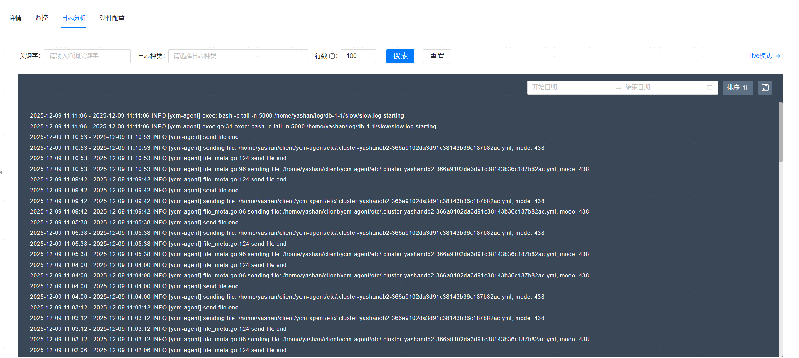

**网页路径1**：【日志管理】

**网页路径2**：【YashanDB】>【YashanDB列表】>【数据库名称】>【诊断优化】

**网页路径3**：【主机管理】>【主机列表】

## 日志收集

**网页路径1**：【日志收集】

**功能介绍**

管理平台支持收集以下类型的日志：

- 数据库日志（DB）：采集数据库日志，支持CDB与PDB级别日志收集。若选择采集数据库日志，将会自动选择数据库所部署的主机进行日志收集。
- 主机管控日志（管理平台）：采集Agent主机由管理平台管控产生的agent.log日志。
- 主机系统日志（SYS）：采集Agent主机的系统日志，该操作需要root用户的权限。

## 日志分析

**网页路径1**：【日志分析】

**功能介绍**

管理平台支持分析的日志包括：管理平台日志、YashanDB日志、主机日志。其中YashanDB日志支持CDB与PDB级别日志分析。

日志分析需要管理平台服务端与添加的Agent主机的系统时间基本一致，时间相差过大可能会导致日志收集失败。您可进行[Agent主机时间同步配置](../../平台管理/系统设置/资源信息设置/时间同步设置)。

**主要内容解释**

【LogQL语句】：专门为Loki设计的用于查询日志条目的语言，详情见[LogQL语法](../../参考指南/LogQL语法)。

### 数据库

#### 日志分析

**网页路径2**：【YashanDB】>【YashanDB列表】>【数据库名称】>【诊断优化】>【日志分析】

**功能介绍**

支持展示数据库所有实例的日志，具备静态展示，实时展示与检索能力。

live模式的日志查询功能，能够实时刷新查看最新的日志，输入查询参数，单击【live模式】即可。

**主要内容解释**

**【日志种类】**：收集的日志种类有：

- run.log：数据库运行日志
- alert.log：告警日志
- slow.log：慢日志

#### 数据库日志

**网页路径2**：【YashanDB】>【YashanDB列表】>【数据库名称】>【诊断优化】>【数据库日志】

**功能介绍**

支持查看alert日志、审计日志、慢日志。

慢日志默认为关闭状态，可在[配置参数](../基本运维管理/配置参数)中将ENABLE_SLOW_LOG参数修改为TRUE启动慢日志记录。

### 主机

#### 日志分析

**网页路径3**：【主机列表】>【主机名称】>【日志分析】

**功能介绍**

支持展示服务器的日志，具备静态展示，实时展示与检索能力。

live模式的日志查询功能，能够实时刷新查看最新的日志，输入查询参数，单击【live模式】即可。

**主要内容解释**

**【日志种类】**：收集的日志种类有：

- install_sh.log : 主机安装日志
- node_exporter.log : node_exporter收集指标组件日志
- promtail.log : promtail收集日志组件日志
- ycm-agent.log : ycm-agent日志
- ycm-agent-start.log : ycm-agent标准输出日志
