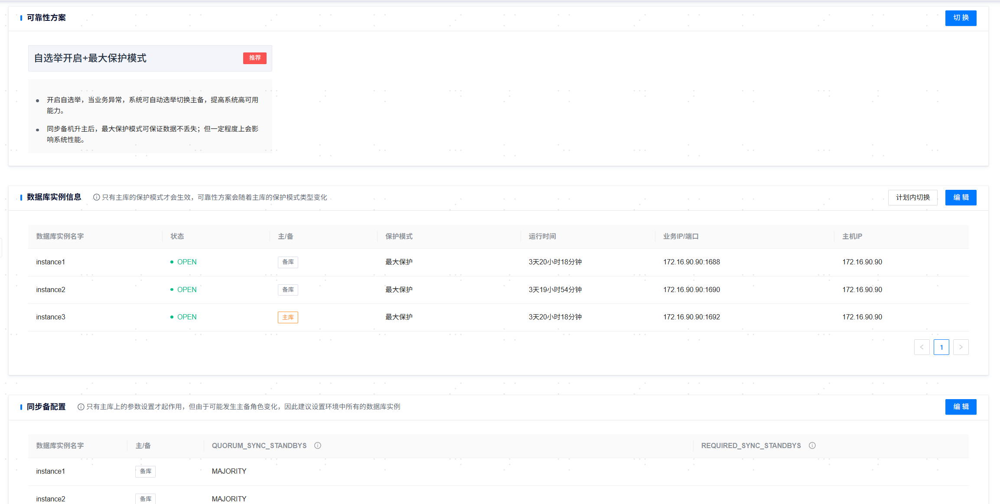

**网页路径**：【YashanDB】>【YashanDB列表】>【数据库名称】>【数据库管理】>【可靠性方案】

## 单机部署数据库

**功能介绍**

基于自选举开启/关闭与不同的保护模式，组合成六种可靠性方案，支持对数据库整体的可靠性方案与单个实例的保护模式进行修改，与此关联功能还有计划内切换，故障转移，同步备配置。

### 切换可靠性方案

**网页路径**：【切换】

> **Note**：
>
> 仅归档模式开启，一主至少一备的YashanDB单机数据库支持可靠性方案设置。

**功能介绍**

#### 一主一备数据库

在可靠性方案卡片栏，单击【切换】，进入可靠性方案选择页面，该页面提供了6种可靠性的组合方案：

- 仲裁开启+零丢失模式+最大保护模式
- 仲裁开启+普通模式+最大可用模式
- 仲裁开启+普通模式+最大性能模式
- 仲裁关闭+最大性能模式
- 仲裁关闭+最大可用模式
- 仲裁关闭+最大保护模式

> **Note**:
>
> 可靠性方案的配置粒度为数据库，即对某数据库配置时其所有实例均统一生效。
>
> 该机制基于yasom对数据库执行仲裁，在主节点发生故障时自动切换。仅在yasom和备节点的yasagent进程在线时仲裁生效。

零丢失模式保证仲裁不丢失数据，普通丢失模式可能丢失数据。

备节点与yasom部署于同一台服务器时，不建议使用仲裁选主，如仍需使用，推荐使用普通模式。因为在零丢失模式下，若yasom和备节点同时故障会使主节点产生业务阻塞。

若yasom不可用，即使处于仲裁选主的零丢失模式，仍有可能因数据库保护模式无法变更（例如，此时备节点宕机，主节点的保护模式无法从最大保护变为最大可用），而使得主节点产生业务阻塞。

开启仲裁后，不能再手动failover、切换保护模式。

#### 一主多备数据库

在可靠性方案卡片栏，单击【切换】，进入可靠性方案选择页面，该页面提供了6种可靠性的组合方案：

- 自选举开启+最大保护模式
- 自选举开启+最大可用模式
- 自选举开启+最大性能模式
- 自选举关闭+最大性能模式
- 自选举关闭+最大可用模式
- 自选举关闭+最大保护模式

> **Note**：
>
> 可靠性方案的配置粒度为数据库，即对某数据库配置时其所有实例均统一生效。
>
> 该机制为基于Raft集群架构的自动选主。该部署模式默认推荐\<自选举关闭+最大性能模式>，反之推荐\<自选举开启+最大保护模式>。
>
> 对含有级联备节点的数据库，需**谨慎**开启最大保护模式。

对多组的单机数据库：
- 正常情况下，默认只对主节点所在组切换可靠性方案。
- 若旧主节点所在组全部宕机，点击故障切换，将备节点组中的备节点升主。待恢复后，应将旧主节点降备，且关闭该组自选举。

### 计划内切换

**网页路径**：【计划内切换】

**功能介绍**

数据库实例信息卡片栏提供YashanDB的Switchover（计划内切换），单击【计划内切换】，会列出所有的备库信息，用户可以选择一个数据库实例进行主备切换。

Switchover切换过程中，主库已连接的会话将全部断连且无法建立新的连接会话，直至切换完成或失败。

Switchover完成后，主备库会重新进行连接，将出现短暂的网络断连。

### 同步备配置

**网页路径**：【编辑】

**功能介绍**

同步备配置指事务提交的时候主库的redo日志至少同步到多少个备库后才能提交。

最大保护模式下QUORUM_SYNC_STANDBYS和REQUIRED_SYNC_STANDBYS参数才生效。

自动选主功能开启后不允许QUORUM_SYNC_STANDBYS和REQUIRED_SYNC_STANDBYS参数指定备库名。

**主要内容解释**

**QUORUM_SYNC_STANDBYS**：ANY1(*)：表示必须同步所有备库中的任意一个事务才能提交

**REQUIRED_SYNC_STANDBYS**：instance2：表示必须同步到实例名称为instance2的实例事务才能提交。

## 分布式部署数据库

分布式部署数据库要求为高可用部署环境。

分布式部署数据库暂不支持切换可靠性方案和同步备配置。

### 计划内切换

**网页路径**：【计划内切换】

**功能介绍**

数据库实例信息卡片栏提供YashanDB的Switchover（计划内切换），单击【计划内切换】，会列出所有MN和DN的可切换备库信息，单次仅支持一个组内数据库实例的切换，用户可以选择一个来进行主备切换。

Switchover切换过程中，主库已连接的会话将全部断连且无法建立新的连接会话，直至切换完成或失败。

Switchover完成后，主备库会重新进行连接，将出现短暂的网络断连。

> **Caution**：
>
> 只有主库的保护模式才会生效，可靠性方案会随着主库的保护模式类型变化。
>
> 分布式部署规模下，不建议修改保护模式，请谨慎修改。
