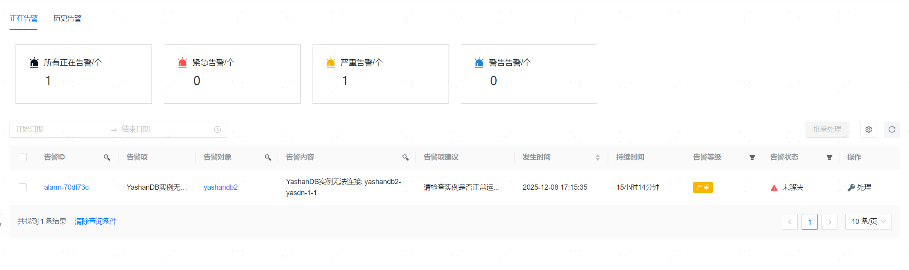

**网页路径1**：【告警管理】>【告警列表】

**网页路径2**：【工作台】>【最近告警】>【查看全部告警】

**网页路径3**：【YashanDB】>【YashanDB列表】>【数据库名称】>【基本信息】>【告警监控】>【更多告警】

**网页路径4**：【主机管理】>【主机列表】>【主机名称】>【监控】>【更多告警】

## 正在告警

**网页路径1**：【正在告警】

**功能介绍**

当[告警策略](告警策略)的应用对象触发该策略中的某个告警项规则时，将产生相应的告警提示。正在告警表示暂未解决的告警，历史告警则表示解决/消除后的告警。

**主要内容解释**

**告警统计**：统计了正在告警的总数以及各个等级的告警总数。

**告警列表**：正在告警列表中，记录了所有已触发但暂未解决的告警信息。

**【告警状态】**：当前告警的状态，可能为未解决、解决中或已挂起。

**【告警等级】**：告警等级可分为紧急、严重和警告，通过[告警项](告警策略.html#alarmitems)的【运算规则】配置。

**【告警对象/告警内容】**：告警对象表示触发当前告警的资源对象（某个服务器或数据库），告警内容表示实际被匹配的某个告警项及其触发告警的具体描述（例如无法连接到具体某个数据库实例，通过告警项的【告警项描述】配置）。

**【告警项建议】**：当前告警的解决方案建议，通过告警项的【告警项建议】配置。

**【告警项】**：当前告警实际被匹配的告警项。

### 查看告警详情

**网页路径1**：【告警ID】

**功能介绍**

在告警详情页面，您可以查看指定告警的基本信息、历史数据、告警项规则以及告警时间轴，为充分了解并分析告警事项获取数据基础。

**主要内容解释**

**【基本信息】**：可以查看该告警的基本信息，包括告警ID、告警对象、发生时间、消除时间以及消除方式等

**【历史数据】**：可以查看该告警对应告警项表达式在不同时刻的数值记录。

**【告警项规则】**：可以查看该告警对应告警项的具体告警规则。

**【告警时间轴】**：可以查看该告警的变动信息、告警处理人、告警通知接收人。

### 屏蔽告警

**网页路径1**：【告警ID】>【屏蔽告警】

详情请查阅[屏蔽规则](告警策略.html#suppress)。

### 处理告警

**网页路径2**：【处理】

**功能介绍**

对于“未解决”状态的告警，您可以按需进行【设为挂起】、【设为解决中】或【手动关闭】。

设置挂起或解决中后，告警状态将变为“已挂起”或“解决中”。在状态过期时限内，触发此告警的对象的同一告警项将不会再产生新的告警；如果告警恢复正常或手动消除，则告警状态转变为已解决。

> **Note**:
> 
> 【设为挂起】：告警场景在预期内，暂时忽略该告警时可选择暂时挂起。
>
> 【设为解决中】：告警场景在预期外，尝试解决告警时可把告警设置为解决中。

手动关闭后，告警将被消除，消除方式为手动关闭，其状态将变为“已解决”并移入【历史告警】列表。

**主要内容解释**

**【状态过期时间】**：设置挂起或解决中时，需配置“已挂起”或“解决中”状态的过期时限，可配置为1小时、3小时、6小时、12小时或自定义设置截至时间。

**关闭原因**：手动关闭告警时，需选择原因，可选择误告警、告警问题已解决、告警问题已忽略或其他原因。

## 历史告警

**网页路径1**：【历史告警】

**功能介绍**

解决/消除后状态为“已解决”的告警称为历史告警，您可以在【历史告警】列表中查看告警记录和相应的告警详情。

**主要内容解释**

**【消除方式】**：当前告警的解决方式，分为故障恢复、告警失效和手动关闭。

## 异地告警

**网页路径1**：【异地告警】

**功能介绍**

关联异地YCM后，当异地YCM产生重要告警、或者是该告警被解决时，会从异地YCM同步告警信息到本地YCM。

重要告警包含：
1. YashanDB实例无法连接。
2. YashanDB主库与备库同步延迟过高。
3. 异地YCM服务异常。

