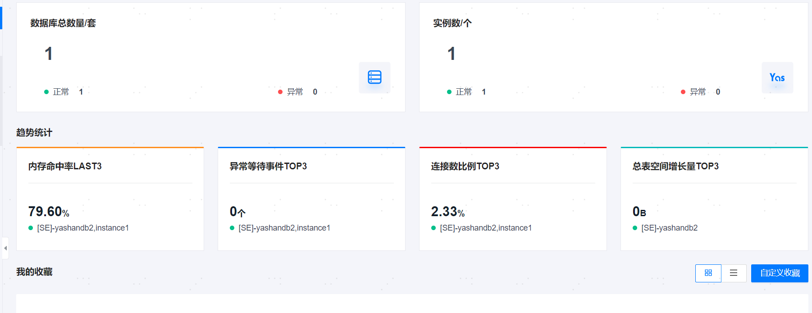

**网页路径**：【工作台】

工作台可按需选择查看数据库或服务器的信息统计，统计信息可分为资源信息和告警信息：

- 资源信息：展示平台所托管的资源总数、趋势统计以及用户自定义收藏的资源信息。
- 告警信息：展示指定时间内资源的告警信息，告警分为紧急、严重以及警告三种级别，时间段可指定为24小时（默认值）、1小时或3小时。

## 数据库信息统计

### 数据总览

**功能介绍**

展示管理平台中已托管的数据库相关的统计信息，以便运维团队或管理人员快速了解数据库运行状态。

**主要内容解释**

**数据库总数量/套**：展示了管理平台中已托管的数据库总数和YashanDB总数。

**趋势统计**：

- **内存命中率LAST3**：展示了数据库的缓存命中率最低的3个实例及其数据信息，缓存命中率 = 数据库访问缓存成功的次数 / 数据库访问缓存的次数。

- **异常等待事件TOP3**：展示了数据库异常等待事件个数最多的3个实例及其数据信息。

- **连接数比例TOP3**：展示了连接数比例最高的3个实例及其数据信息，连接数比例 = 数据库当前会话数 / 数据库最大会话数量。

- **总表空间增长量TOP3**：展示了数据库的总表空间用量在24h内增长量最多的3个实例及其数据信息。

### 我的收藏

**网页路径**：【数据库】>【自定义收藏】

**功能介绍**

管理平台支持自定义收藏需要重点关注的数据库，收藏成功后对应数据库的信息将展示在工作台页面，且会自动[订阅](../平台管理/个人中心/资源订阅)该资源。最多支持收藏5个数据库。

**主要内容解释**

**统计信息**：支持图形呈现（默认）和列表呈现方式，主要统计信息包括数据库运行状态、部署形态、实例信息、告警统计以及连接数等。

**【查看详情】**：在图形呈现方式下，单击数据库信息块右上角的【查看详情】可进入[数据库详情页](../数据库运维指南/基本运维管理/00基本运维管理)。

## 服务器信息统计

**网页路径**：顶部导航栏【数据库】>【主机】

### 数据总览

**功能介绍**

展示管理平台中所托管的服务器相关的统计信息，以便运维团队或管理人员快速了解服务器运行状态和使用情况。

**主要内容解释**

**【主机总数量/台】**：展示了管理平台中所托管的服务器总数量、正常运行的服务器数量以及异常的服务器数量。

**【趋势统计】**：

- **【CPU使用率TOP3】**：展示了服务器CPU使用率最高的3台服务器IP及其数据信息。

- **【内存使用率TOP3】**：展示了服务器内存使用率最高的3台服务器IP及其数据信息。

- **【网络吞吐量TOP3】**：展示了网络吞吐量最高的3台服务器IP及其数据信息，网络吞吐量可自行切换查看output出网流量（默认）或input入网流量。

- **【总文件系统空间使用率TOP3】**：展示了服务器文件系统空间总量使用率最高的3台服务器IP及其数据信息。

### 我的收藏

**网页路径**：【自定义收藏】

**功能介绍**

管理平台支持自定义收藏需要重点关注的服务器，收藏成功后对应服务器的信息将展示在工作台页面，且会自动[订阅](../平台管理/个人中心/资源订阅)该资源。最多支持收藏5台服务器。

**主要内容解释**

**统计信息**：支持图形呈现（默认）和列表呈现方式，主要统计信息包括服务器IP地址、CPU使用率、内存使用率、文件系统空间使用率、网络流量统计以及上次开机时间等。

**【查看详情】**：在图形呈现方式下，单击服务器信息块右上角的【查看详情】可进入服务器详情页。

## 最近告警

**功能介绍**

展示指定时间内管理平台中所托管的所有资源的告警信息，时间段可指定为24小时（默认值）、1小时或3小时。

告警分为紧急、严重以及警告三种级别，单击告警级别模块可展示当前级别下正在告警的记录。

单击【查看全部告警】可进入[告警列表](告警定义及展示/告警列表)查看全部告警信息。
