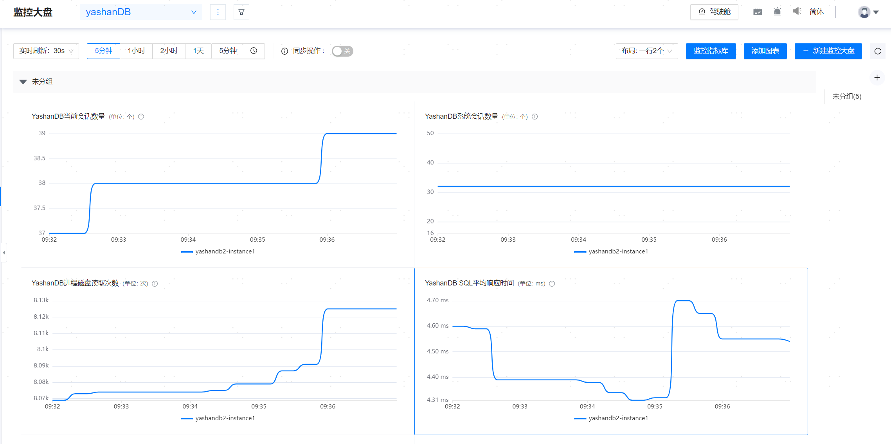
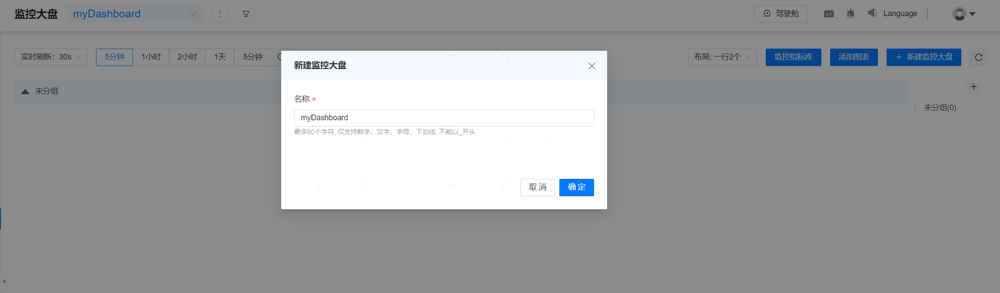
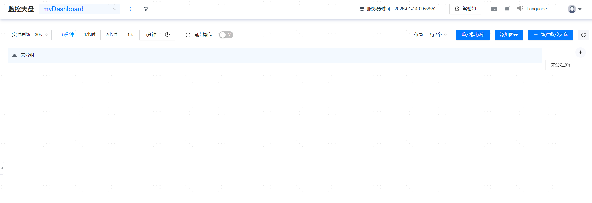
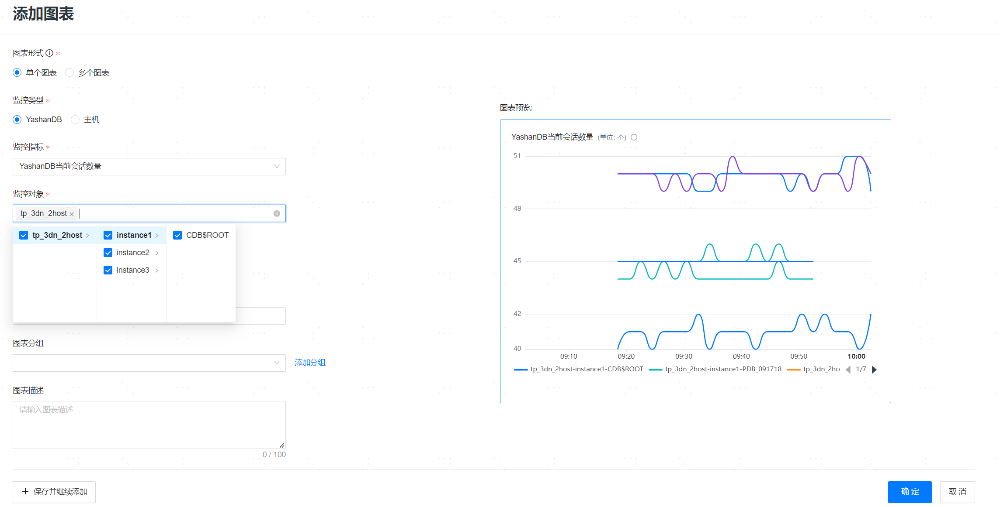

**网页路径**：【监控大盘】

**功能介绍**

监控大盘可以配置多个监控图表，每个图表支持配置不同的监控指标和监控对象（数据库和主机），其中数据库支持CDB和PDB级别的监控，以满足用户自定义监控的诉求。

监控大盘中的监控图表也支持启停同步操作、实时刷新和设置监控图表数据展示的时间范围。

## 监控大盘

监控大盘用于将需要同时查看的监控图表定义到同一个页面，包含多个监控图表和图表分组。

### 新建监控大盘

**网页路径**：【新建监控大盘】

**功能介绍**

用户可以按需新建符合实际需求的自定义大盘。

**主要内容解释**

**【大盘名称】**：监控大盘的名称，必填参数，可以由数字、汉字、字母或下划线组成，不能以_开头，长度范围为[1,60]个字符，名称必须唯一。

1. 单击**新建监控大盘**，输入监控大盘名称。

2. 单击**添加图表**。

3. 选择图表形式，监控类型，监控指标，监控对象。输入图标名称后，单击**确定**。

### 重命名监控大盘

**网页路径**：【重命名】

**功能介绍**

用户可以按需修改监控大盘的名称。

### 删除大盘

**网页路径**：【删除大盘】

**功能介绍**

用户可以按需删除自定义大盘，分组内的所有监控图表和分组会一并被删除，删除后不可直接恢复，如需恢复需再次新建。

## 监控图表

当创建大盘后，可在大盘中新增用户想关注的监控图表。

### 创建监控图表

**网页路径**：【添加图表】

**功能介绍**

用户可以按需在监控大盘中创建监控图表。

**主要内容解释**

**【图表种类】**：选择图表的展示形式，支持单个图表和多个图表两种，必填参数。

**【监控类型】**：支持配置YashanDB和主机两种不同的类型，必填参数。

**【监控指标】**：配置图表的监控指标，必填参数。

**【监控对象】**：支持配置多个不同的监控对象，必填参数，例如多个数据库对象，或者多个主机对象。

**【图表名称】**：监控图表名称，必填参数，长度范围为[1,100]个字符，同一个大盘内的所有图表名称必须唯一。

**【图表分组】**：支持配置图表所在分组。

**【图表描述】**：添加图表的备注说明信息。

> **Note**：
>
> 同一个监控图表内，最多允许配置100个数据库实例，或者100个主机。
>
> 同一个监控大盘内，最多允许配置500个图表。

### 编辑监控图表

**网页路径**：【编辑】

**功能介绍**

用户可以按需修改监控图表里面的所有可配置参数。

### 删除监控图表

**网页路径**：【删除】

**功能介绍**

用户可以按需删除监控大盘中的图表，删除后不可直接恢复，如需恢复需再次新建。

## 图表分组

**功能介绍**

分组用于对每个监控图表进行简单分类，用户可以将关联的指标放入同一分组下进行统一管理，以便更好地监测和分析数据库情况。

用户可以按需在监控大盘里面新建、编辑和删除图表分组。需要注意的是，删除监控大盘中的分组，分组内的所有监控图表会一并被删除，删除后不可直接恢复，如需恢复需再次新建。
