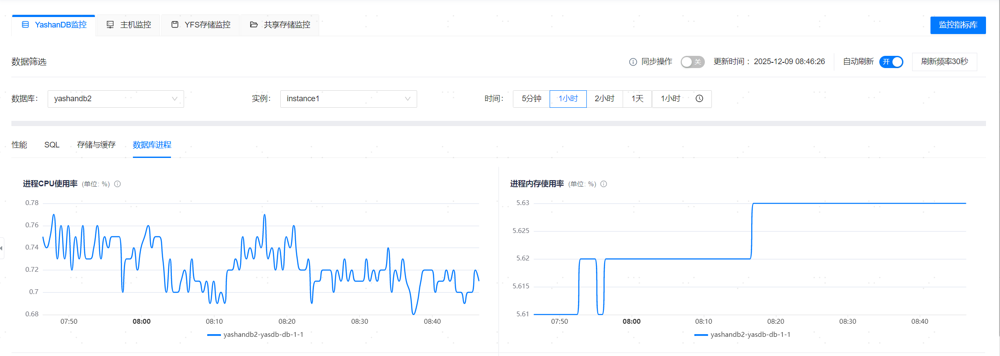
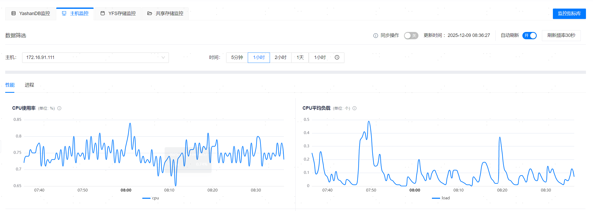
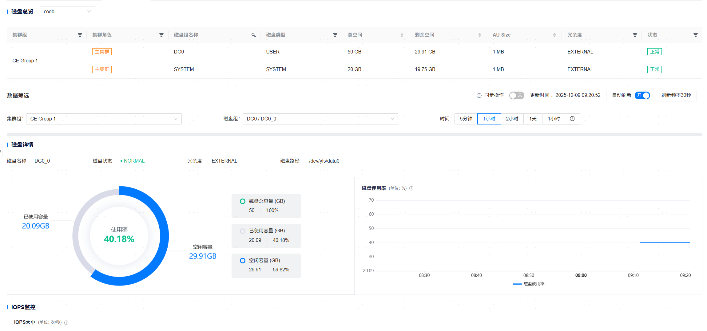
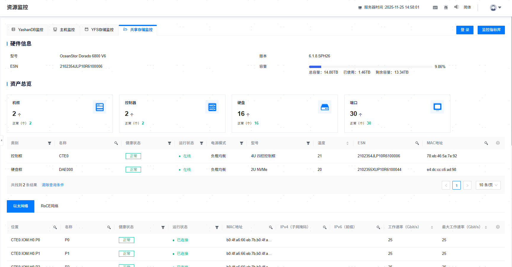

**网页路径1**：【资源监控】

**网页路径2**：【工作台】

**网页路径3**：【YashanDB】>【YashanDB列表】

**网页路径4**：【主机管理】>【主机列表】

**网页路径5**：【监控大盘】

## 监控图介绍

### 数据库监控图

**网页路径1**：【YashanDB监控】

**网页路径2**：【数据库】>【我的收藏】

**网页路径3**：【数据库名称】>【基本信息】>【告警监控】（>【更多监控】）

**功能介绍**

监控图是基于监控指标在时间、数量、比率等维度上的数据点之间的关系或趋势，理论上每个监控指标对应一张监控图表，但部分监控指标不适合用图表展示且数据图表无监控意义的则不产生监控图，例如YashanDB自选举开关配置等。

监控图支持框选时间段、单图表放大、单图表刷新、自动刷新、同步等操作。

数据库监控根据性能、SQL存储与缓存、数据库进程划分四个维度，具体监控指标如下：

性能：

  - QPS
  - TPS
  - 数据库每秒操作数
  - 数据库连接数
  - 等待事件数量
  - 主库与备库同步延迟
  - 长事务
  - spinlock等待次数
  - spinlock等待次数增量
  - SQL平均响应时间
  - YAC
    - GC CR BLOCK RECEIVE TIME
    - GC CR BLOCK RECEIVED
    - GC CR BLOCK RETRIES
    - GC CR BLOCK SERVED
    - GC REMOTE CR GRANT TIME
    - GC REMOTE CR GRANTS
 
> **Note**：
>
> 1.`等待事件数量`从`23.4.4.2`版本开始进行了优化，支持查看每个等待事件的数量；对于旧版本升级到`23.4.4.2`以及之后的高版本，升级前收集的`等待事件数量`历史数据展示可以通过监控大盘进行配置查看，该页面只展示优化后的数据。
>
> 2.`主库与备库同步延迟` 只支持备实例查看。
>
> 3.`YAC`下的监控图表为共享集群数据库独有。

SQL存储与缓存：

  - 高频SQL
  - TOP10 慢SQL详情
  - TOP SQL详情

> **Note**：
>
> `TOP SQL详情` 该功能主要用于帮助运维团队或管理人员快速查看数据库各维度TOP SQL信息，涉及维度有Elapsed Time、CPU Time、User I/O Wait Time、Gets、 Reads、Executions、Parse Calls、Sharable Memory TOP SQL，和性能报告中的SQL统计信息规格相同。支持选择不同快照区间，生成并查看对应的TOP SQL信息。
>
> `TOP SQL详情`只支持单机或者集群数据库主实例查看。针对22.2版本的数据库，获取详情信息需要DBA角色的权限，托管数据库时的默认授予运维用户的权限没有该角色，因此需要用户手动将DBA角色授予数据库后台运维用户`YASOM`。

存储与缓存：

  - 表空间占用大小
  - 系统表空间使用率
  - 用户表空间使用率
  - 磁盘读取次数
  - 磁盘读取时长
  - 缓存命中率
  - 内存读取次数
  - 归档文件大小

数据库进程：
  - 进程CPU使用率
  - 进程内存使用率
  - 进程存活状态
  - 进程文件描述符数量
  - 用户会话连接类型数
  - 进程线程数

> **Note**：
>
> `用户会话连接类型数` 只支持`23.2`及以上数据库版本查看。

### 主机监控图

**网页路径1**：【主机监控】

**网页路径2**：【主机】>【我的收藏】

**网页路径4**：【监控】

**网页路径4**：【主机名称】>【监控】

**功能介绍**

监控图是基于监控指标在时间、数量、比率等维度上的数据点之间的关系或趋势，理论上每个监控指标对应一张监控图表，但部分监控指标不适合用图表展示且数据图表无监控意义的则不产生监控图，例如进程启动用户检测、进程状态等。

主机监控支持框选时间段、单图表放大、单图表刷新、自动刷新、同步等操作。

主机监控根据性能、进程划分两个维度，具体监控指标如下：

性能：

 - CPU使用率
 - CPU平均负载
 - CPU I/O等待
 - 内存使用率
 - 交换空间使用率
 - 磁盘使用率
 - 磁盘IOPS（全部：显示所有磁盘的IOPS曲线。累加和：显示所有磁盘的IOPS之和。）
 - 网络吞吐量

进程：

 - 进程CPU使用率
 - 进程内存使用率
 - 进程存活状态
 - 进程文件描述符数量
 - 进程线程数

## 同步操作

**网页路径1**：【YashanDB监控】>【同步操作】

**网页路径1**：【主机监控】>【同步操作】

**网页路径1**：【监控大盘】>【同步操作】

**功能介绍**

同步操作是指同时查看并获取所有监控图在指定时刻或时间段的数据，开启同步操作时会默认关闭自动刷新。

开启该功能后，单击任意监控图选择某一时刻，所有监控图将同步展示该时刻的详细数据并生成统计信息。

## 自动刷新

**网页路径1**：【YashanDB监控】>【自动刷新】

**网页路径1**：【主机监控】>【自动刷新】

**功能介绍**

默认开启自动刷新监控图数据，数据刷新周期固定为30秒，可按需关闭。

### YFS存储监控图

**网页路径1**：【YFS存储监控】

**功能介绍**

监控图是基于监控指标在时间、数量、比率等维度上的数据点之间的关系或趋势，理论上每个监控指标对应一张监控图表。

YFS监控支持框选时间段、单图表放大、单图表刷新、自动刷新、同步等操作。

YFS监控可以查看共享集群数据库的YFS磁盘组和磁盘的基本信息，监控指标如下：

- 磁盘使用率
- IOPS大小

## 同步操作

**网页路径1**：【YFS存储监控】>【同步操作】

**功能介绍**

同步操作是指同时查看并获取所有监控图在指定时刻或时间段的数据，开启同步操作时会默认关闭自动刷新。

开启该功能后，单击任意监控图选择某一时刻，所有监控图将同步展示该时刻的详细数据并生成统计信息。

## 自动刷新

**网页路径1**：【YFS存储监控】>【自动刷新】

**功能介绍**

默认开启自动刷新监控图数据，数据刷新周期固定为30秒，可按需关闭。

### 共享存储监控图

**网页路径1**：【共享存储监控】

**功能介绍**

共享存储监控基于devicemanager接口，支持展示dorado硬件监控信息和资产总览。
