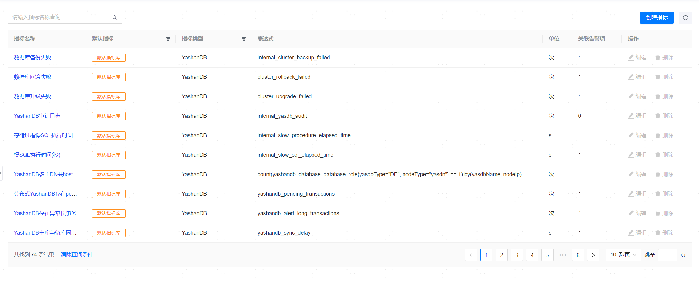

**网页路径1**：【资源监控】>【监控指标库】

**网页路径2**：【监控大盘】>【监控指标库】

**功能介绍**

管理平台提供了丰富的监控指标库，覆盖了数据库、操作系统和服务器的绝大部分关键指标，可以帮助您实时了解目标对象的运行状态、性能、资源用量以及负载等。同时，为日常运维、性能调优等提供丰富的数据基础，助力于及时预防、发现并解决问题，避免问题扩大而产生业务影响。

## 默认监控指标

系统提供了丰富的默认监控指标，默认监控指标不支持编辑和删除。系统提供的默认监控指标如下表所示：

|  指标名称| 指标类型| 表达式|
| --------------------------------------------------- | -------- | ------------------------------------------------------------------------------------------------------------------------------------------------------------------------------------------------------------------------------------------------------------------------------------- |
| YashanDB高频SQL数量                                 | YashanDB | count(increase(yashandb_high_frequencies_sql[1h])>10000)by(yasdbName,nodeId)                                                                                                                                                                                                          |
| YashanDB锁等待数量                                  | YashanDB | yashandb_lock_waits                                                                                                                                                                                                                                                                   |
| YashanDB每秒执行事务数                              | YashanDB | irate(yashandb_transactions[1m])                                                                                                                                                                                                                                                      |
| YashanDB每秒执行查询数                              | YashanDB | irate(yashandb_querys[1m])                                                                                                                                                                                                                                                            |
| YashanDB每秒执行操作数                              | YashanDB | irate(yashandb_operations[1m])                                                                                                                                                                                                                                                        |
| YashanDB进程打开文件数                              | YashanDB | node_monit_file_open                                                                                                                                                                                                                                                                  |
| YashanDB进程内存使用总量                            | YashanDB | node_monit_mem_total                                                                                                                                                                                                                                                                  |
| YashanDB进程内存利用率                              | YashanDB | node_monit_mem_uasge                                                                                                                                                                                                                                                                  |
| YashanDB进程CPU使用率                               | YashanDB | node_monit_cpu_uasge                                                                                                                                                                                                                                                                  |
| YashanDB当前等待事件数量                            | YashanDB | yashandb_current_waits                                                                                                                                                                                                                                                                |
| YashanDB进程内存读取次数                            | YashanDB | yashandb_buffer_gets                                                                                                                                                                                                                                                                  |
| YashanDB进程磁盘读取时间                            | YashanDB | yashandb_disk_read_time                                                                                                                                                                                                                                                               |
| YashanDB不活跃用户会话数量                          | YashanDB | yashandb_user_inactive_sessions                                                                                                                                                                                                                                                       |
| YashanDB活跃用户会话数量                            | YashanDB | yashandb_user_active_sessions                                                                                                                                                                                                                                                         |
| YashanDB系统会话数量                                | YashanDB | yashandb_system_sessions                                                                                                                                                                                                                                                              |
| YashanDB最大会话数量                                | YashanDB | yashandb_max_sessions                                                                                                                                                                                                                                                                 |
| YashanDB当前会话数量                                | YashanDB | yashandb_current_sessions                                                                                                                                                                                                                                                             |
| YashanDB会话使用率                                  | YashanDB | yashandb_current_sessions/yashandb_max_sessions*100                                                                                                                                                                                                                                   |
| YashanDB用户会话连接类型数                          | YashanDB | yashandb_user_session_driver_count                                                                                                                                                                                                                                                    |
| YashanDB归档文件大小                                | YashanDB | yashandb_archived_log_size                                                                                                                                                                                                                                                            |
| YashanDB表空间使用率                                | YashanDB | yashandb_tablespace_used_percentage                                                                                                                                                                                                                                                   |
| YashanDB的SWAP表空间使用率                                 | YashanDB | 100 - yashandb_swap_free_percentage                                                                                                                                                                                                          |
| YashanDB的SWAP表空间可扩展空间使用率                                 | YashanDB | max(100 - yashandb_swap_extend_free_percentage) by (yasdbName)                                                                                                                                                                                                          |
| YashanDB版本检测                                    | YashanDB | yashandb_instance_version                                                                                                                                                                                                                                                             |
| YashanDB数据库状态                                  | YashanDB | yashandb_database_status                                                                                                                                                                                                                                                              |
| YashanDB实例连接状态                                | YashanDB | yashandb_instance_disconnected                                                                                                                                                                                                                                                        |
| YashanDB主库数量统计                                | YashanDB | count(yashandb_database_database_role{nodeType!="yascn"} == 1) by(yasdbName, nodeType, nodeGroup)                                                                                                                                                                                     |
| Yasdn进程启动用户检测                               | YashanDB | node_monit_check_user{nodeType="yasdn"}                                                                                                                                                                                                                                               |
| Yascn进程启动用户检测                               | YashanDB | node_monit_check_user{nodeType="yascn"}                                                                                                                                                                                                                                               |
| Yasmn进程启动用户检测                               | YashanDB | node_monit_check_user{nodeType="yasmn"}                                                                                                                                                                                                                                               |
| YashanDB实例进程状态                                | YashanDB | node_monit_check_status{type="mix", processType="yasdb"}                                                                                                                                                                                                                              |
| YashanDB存在异常长事务                              | YashanDB | yashandb_alert_long_transactions                                                                                                                                                                                                                                                      |
| YashanDB主库与备库同步延迟过高                      | YashanDB | yashandb_sync_delay                                                                                                                                                                                                                                                                   |
| YashanDB DN的max_workers小于所有CN的max_workers之和 | YashanDB | yashandb_max_workers{nodeType="yasdn"} - on(yasdbName) group_left sum(yashandb_max_workers{nodeType="yascn"}) by (yasdbName)                                                                                                                                                          |
| YashanDB自选举发送心跳的周期配置                    | YashanDB | min(yashandb_ha_heartable_interval) by (yasdbName, nodeGroup, nodeType) - max(yashandb_ha_heartable_interval) by (yasdbName, nodeGroup, nodeType)                                                                                                                                     |
| YashanDB自选举心跳超时时间配置                      | YashanDB | min(yashandb_ha_election_timeout) by (yasdbName, nodeGroup, nodeType) - max(yashandb_ha_election_timeout) by (yasdbName, nodeGroup, nodeType)                                                                                                                                         |
| YashanDB自选举开关配置                              | YashanDB | min(yashandb_ha_election_enabled) by (yasdbName, nodeGroup, nodeType) - max(yashandb_ha_election_enabled) by (yasdbName, nodeGroup, nodeType)                                                                                                                                         |
| YashanDB默认表类型                                  | YashanDB | min(yashandb_default_table_type) by (yasdbName) - max(yashandb_default_table_type) by (yasdbName)                                                                                                                                                                                     |
| YashanDB表空间（UNDO）使用率                        | YashanDB | ((yashandb_dba_tablespace_total_bytes - (yashandb_dba_tablespace_user_bytes+yashandb_dba_tablespace_block_size*(yashandb_undo_segments_ublk_count_total+yashandb_undo_segments_ufb_count_total)))/yashandb_dba_tablespace_max_size{name="UNDO"})*100                                  |
| YashanDB表空间占用大小                              | YashanDB | yashandb_sum_tablespaces                                                                                                                                                                                                                                                              |
| YashanDB实例类型最小值                              | YashanDB | min(yashandb_database_database_role{nodeType!="yascn", yasdbType!="CE"}) by(yasdbName, nodeType, nodeGroup)                                                                                                                                                                           |
| YashanDB超过三分钟的事务                            | YashanDB | yashandb_long_transactions                                                                                                                                                                                                                                                            |
| YashahDB主库与备库延迟                              | YashanDB | yashandb_sync_delay                                                                                                                                                                                                                                                                   |
| YashanDB SQL平均响应时间                            | YashanDB | yashandb_avg_elapsed_time_sec                                                                                                                                                                                                                                                         |
| YashanDB进程缓存命中率                              | YashanDB | yashandb_cache_hit_ratio                                                                                                                                                                                                                                                              |
| YashanDB进程磁盘读取次数                            | YashanDB | yashandb_disk_reads                                                                                                                                                                                                                                                                   |
| YashanDB审计日志                                    | YashanDB | internal_yasdb_audit                                                                                                                                                                                                                                                                  |
| 慢SQL执行时间（秒）                                 | YashanDB | internal_slow_sql_elapsed_time                                                                                                                                                                                                                                                        |
| 存储过程慢SQL执行时间（秒）                         | YashanDB | internal_slow_procedure_elapsed_time                                                                                                                                                                                                                                                  |
| 数据库升级失败                                      | YashanDB | cluster_upgrade_failed                                                                                                                                                                                                                                                                |
| 数据库回滚失败                                      | YashanDB | cluster_rollback_failed                                                                                                                                                                                                                                                               |
| 数据库备份失败                                      | YashanDB | internal_cluster_backup_failed                                                                                                                                                                                                                                                               |
| YashanDB VM使用率                                  | YashanDB | yashandb_vm_used_ratio                                                                                                                                                                                                                                                               |
| 最大用户线程数                                      | YashanDB | yasprocess_max_user_processes                                                                                                                                                                                                                                                               |
| 最大内存大小                                      | YashanDB | yasprocess_max_memory_size/1024/1024                                                                                                                                                                                                                                                               |
| 最大堆栈大小                                      | YashanDB | yasprocess_max_stack_size/1024/1024                                                                                                                                                                                                                                                               |
| YFS磁盘使用率                          | YashanDB |  yashandb_yfs_disk_usage_percent                                                                                                                                                                                                                                                                   |
| YFS磁盘IOPS                                      | YashanDB | irate(yashandb_yfs_disk_ios[1m])                                                                                                                                                                                                                                                               |
| YashanDB实例发生主备切换                | YashanDB        | max( (yashandb_database_database_role{yasdbType="SE", nodeType="yasdn"} == bool 1) * on (nodeId, yasdbName) group_left() (yashandb_database_database_role{yasdbType="SE", nodeType="yasdn"} offset 2m == bool 2) ) by (yasdbName)                                                                                                                                                                                                                         |
| 网络吞吐量（传输）                                  | 主机     | irate(node_network_transmit_bytes_total[5m])/128/1024                                                                                                                                                                                                                                 |
| 网络吞吐量（接收）                                  | 主机     | irate(node_network_receive_bytes_total[5m])/128/1024                                                                                                                                                                                                                                  |
| 磁盘IOPS（写）                                      | 主机     | irate(node_disk_writes_completed_total[1m])                                                                                                                                                                                                                                           |
| 磁盘IOPS（读）                                      | 主机     | irate(node_disk_reads_completed_total[1m])                                                                                                                                                                                                                                            |
| 交换分区使用率                                      | 主机     | (1-(node_memory_SwapFree_bytes)/(node_memory_SwapTotal_bytes>0)) * 100                                                                                                                                                                                                                |
| CPU平均负载                                         | 主机     | node_load1                                                                                                                                                                                                                                                                            |
| 网络可用性检测                                      | 主机     | node_network_unavailable                                                                                                                                                                                                                                                              |
| 网络时延                                            | 主机     | node_network_rtt                                                                                                                                                                                                                                                                      |
| 网络丢包率                                          | 主机     | node_network_packet_loss                                                                                                                                                                                                                                                              |
| IP地址检测                                          | 主机     | node_network_ip_exists                                                                                                                                                                                                                                                                |
| 磁盘使用率                                          | 主机     | max((node_filesystem_size_bytes{fstype=~'ext.?&#124;xfs'}-node_filesystem_free_bytes{fstype=~'ext.?&#124;xfs'})*100/(node_filesystem_avail_bytes {fstype=~'ext.?&#124;xfs'}+(node_filesystem_size_bytes{fstype=~'ext.?&#124;xfs'}-node_filesystem_free_bytes{fstype=~'ext.?&#124;xfs'})))by(instance,job) |
| 内存剩余容量                                        | 主机     | node_memory_MemFree_bytes/1024/1024                                                                                                                                                                                                                                                   |
| 内存使用率                                          | 主机     | (1-(node_memory_MemAvailable_bytes) / node_memory_MemTotal_bytes) * 100                                                                                                                                                                                                               |
| Ycm-Agent进程启动用户检测                           | 主机     | node_monit_check_user{processName="ycm-agent"}                                                                                                                                                                                                                                        |
| NodeExporter进程启动用户检测                        | 主机     | node_monit_check_user{processName="node-exporter"}                                                                                                                                                                                                                                    |
| YashanDBExporter服务状态                            | 主机     | up{job="yashandb_exporter"}                                                                                                                                                                                                                                                           |
| NodeExporter服务状态                                | 主机     | up{job=~"host.*"}                                                                                                                                                                                                                                                                     |
| YCPAgent进程状态                                    | 主机     | node_monit_check_status{type="mix", processName="ycm-agent"}                                                                                                                                                                                                                          |
| Monit进程状态                                       | 主机     | node_monit_monit_down                                                                                                                                                                                                                                                                 |
| CPU使用率                                           | 主机     | (1-(sum(increase(node_cpu_seconds_total{mode='idle'}[1m]))by(instance,job))/(sum(increase(node_cpu_seconds_total[1m]))by(instance,job)))*100                                                                                                                                          |
| CPU I/O等待                                         | 主机     | (sum(increase(node_cpu_seconds_total{mode='iowait'}[1m]))by(instance,job))/(sum(increase(node_cpu_seconds_total[1m]))by(instance,job))*100                                                                                                                                            |
| 进程文件描述符使用率                                | 主机     | (yasprocess_cur_open_files / yasprocess_max_open_files) * 100                                                                                                                                                                                                                         |
监控指标主要用于监控大盘和告警项。默认的监控指标会生成默认告警项和添加到默认监控大盘。

> **Note**：
>
> 默认监控大盘中只会添加部分具有图表展示意义的默认监控指标，也只有部分默认监控指标会生成默认告警项。

监控指标支持通过指标名称对监控指标进行搜索。

## 创建指标

**网页路径1**：【创建指标】

**网页路径2**：【创建指标】

**功能介绍**

除了系统提供的默认监控指标，还可以通过单击【创建指标】，输入指标名称、指标类型、单位和表达式，创建自定义监控指标。

自定义监控指标支持编辑和删除，但不允许删除已关联告警项的自定义监控指标。

**主要内容解释**

**【指标名称】**：监控指标的名称，必填参数，长度范围为[1,24]个字符，名称必须唯一。

**【指标类型】**：监控指标所属的资源对象的类型，分为数据库（YashanDB）和主机，必填参数。

**【表达式】**：表达式语法为[PromQL](../../参考指南/监控指标表达式)，指标可参考默认监控指标。

> **Note**：
>
> 创建自定义指标，表达式语法中需包含yasdbName标签或job标签，否则无法在监控大盘中配置。
